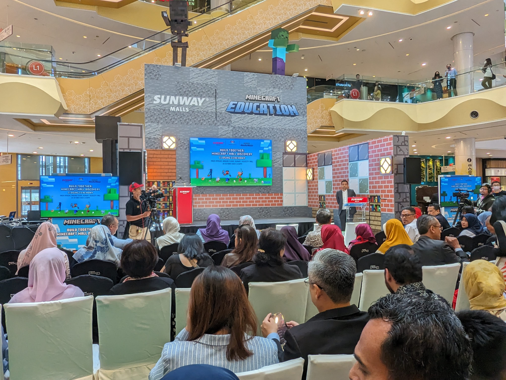
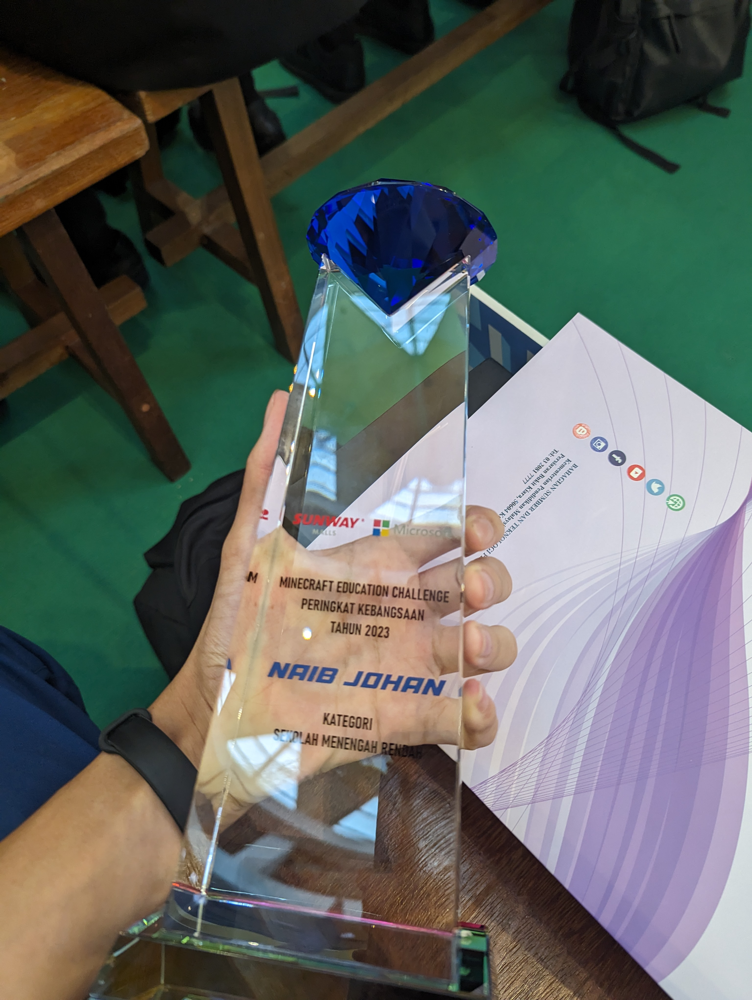
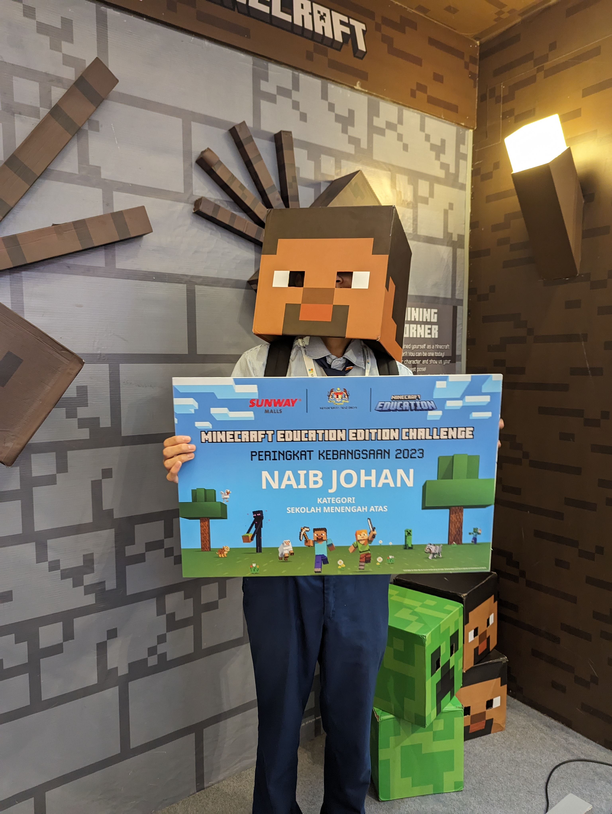

In Japan there is a Minecraft Education Edition contest called the Minecraft Cup, and similar events exist overseas; in Malaysia there is an event called MEC (Minecraft Education Challenge). I participated in [MEC 2023](https://mcedumy.com/mec-2023) and finished as runner-up.

## A Minecraft Cup in Malaysia!?

Works that passed the preliminary review were selected for the final competition on the day, and the event was held at a venue provided by sponsor Sunway Malls&#xA;

&#xA;Officials from the Ministry of Education came to give greetings in person, and for a first-time event it was very well-supported and well-executed.

&#xA;I also received a huge trophy.

&#xA;I took a photo holding the "NAIB JOHAN (Runner-up)" board.

## In 2025...

So, about two years have passed since then, and now I'm helping to run the Minecraft Cup in Japan. It's clear that information education and digital making education are being recognized as important overseas, especially in Asia, and I think Minecraft is really useful for these purposes.

From my own participation I felt that, compared to Japan, the level of the entries wasn't particularly high, and most participants came from urban areas, so I felt there was a regional disparity (although Malaysia is a very large country, so narrowing that gap is extremely difficult).

Currently the Minecraft Cup is limited to Japan and the number of applicants from overseas blocks isn't that large, but I think expanding overseas in the future could be an option.
