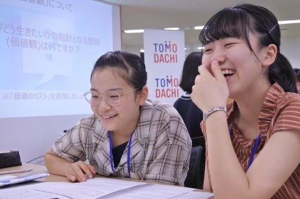
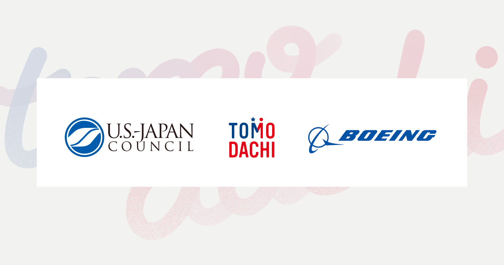
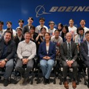

We developed, as a team, a piece of software called TomoMeet to foster real-life connections at event venues.

This seminar consisted of a hackathon (closer to an ideathon) held in September, followed by a three-month refinement period.

I haven't had many experiences building something with a team formed on the spot, and it was a lot of fun.

[第15回 TOMODACHI Boeing Entrepreneurship Seminar 開始](https://prtimes.jp/main/html/rd/p/000000019.000015739.html)

米日カウンシル (U.S.-Japan Council)のプレスリリース（2025年6月12日 14時00分）第15回 TOMODACHI Boeing Entrepreneurship Seminar 開始

[TOMODACHI Boeing Entrepreneurship Seminar | 活動 | Code for Japan](https://www.code4japan.org/activity/tomodachi)

TOMODACHIプログラムは次世代リーダーの育成を目指したプログラムです。

[TOMODACHI Boeing Entrepreneurship Seminar 2025 最終発表会](https://usjapantomodachi.org/ja/2026/01/42454/)

2025年12月7日、TOMODACHI Boeing Entrepreneurship Seminar 2025の最終発表会がボーイングジャパン本社オフィスで開催されました。本プログラムは全国の高等学校・専門学校・高専・大学・大学院の学...

Also, at the final presentation session, our team received the Presentation Award.
