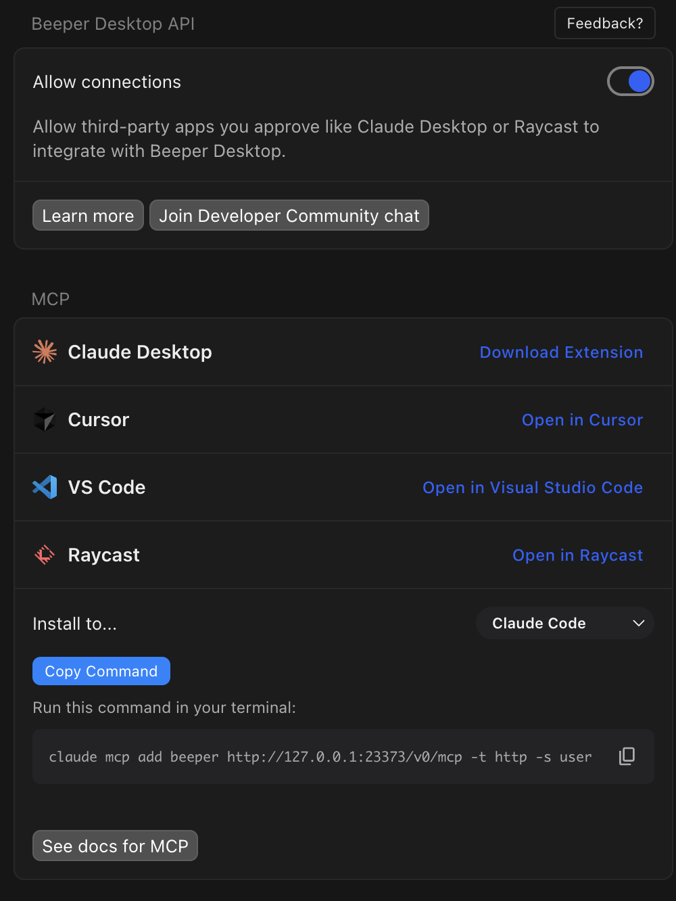

Beeper is just plain useful.

<https://www.beeper.com/>

Lately I've been interacting with a lot of people, but messages are split across different apps and it's not uncommon to miss things. Having native apps helps, of course, but some services like Messenger are only available as web apps and rely solely on browser notifications, which makes the experience much worse compared to a smartphone.

With Beeper, you can aggregate messages from multiple platforms into a single app with a nice UI, so I've found it extremely handy.

And today (6/23), the official announcement added LINE support, so finally my messaging will be consolidated in Beeper

<https://blog.beeper.com/2026/06/23/beeper-june/>

### How data is stored

To be honest, given the nature of the app, it feels unavoidable to entrust data to Beeper, but since privacy is a concern I looked into it.

#### Stored in the cloud

This option provides the better experience, with smooth synchronization across devices. However, you should be aware that your data will be stored on servers provided by Beeper and viewed there. (That said, once you're chatting on Instagram, I feel the data is already in Meta's hands, so I personally use the cloud.)

#### Local option

If you want to manage your data yourself or don't want to put it on the cloud, some apps offer an option to save locally. There's no device-to-device sync, but in terms of where the data resides this may feel more reassuring.

### Pricing

The app is basically free to use, but there are paid subscriptions. You can connect up to three accounts (apps) for free, which is probably enough for most people (e.g., Instagram + LINE + Messenger).
The Plus subscription allows 10 accounts, and PlusPlus offers unlimited accounts. There are other feature differences as well, so check the details.

### It apparently has an API

&#xA;MCP and a Desktop API are available, so you can aggregate messages across multiple services and have AI perform tasks on them. Handy.
