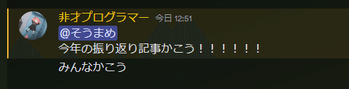
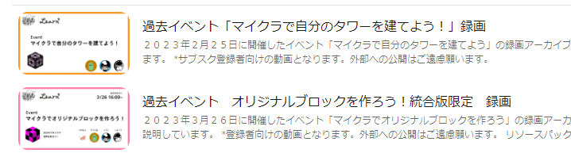
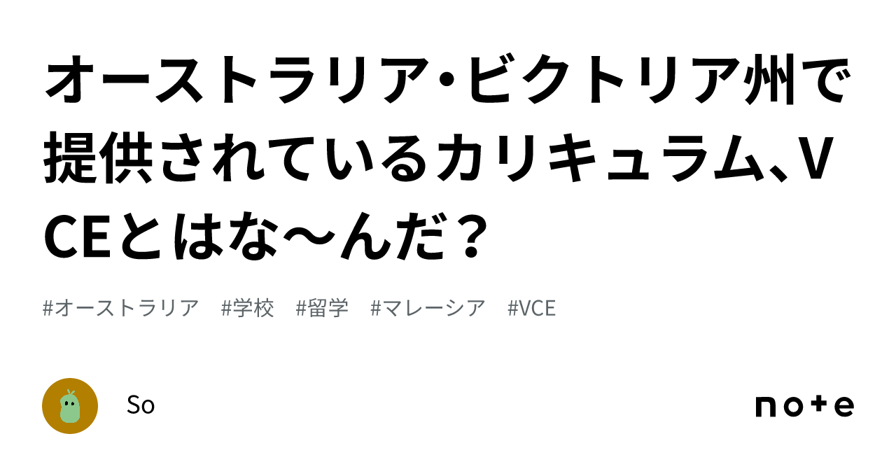
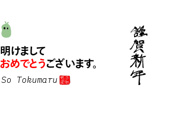

# Looking Back Only at My Failures in 2023!

> For those thinking “This is just your opinion, right?” — yes, that's right. This post is mainly about personal experiences and impressions. Also, to keep things concise, I’ve omitted some detailed explanations. If something concerns you, please look into it yourself and feel free to DM me with questions.

Ah—so the year is finally ending—what a long yet short year it has been, I wanted to say—but **in my Discord community, “mamee”**, **I received a mention like this.**

_Write an end-of-year reflection post!!!!!!
Everyone write one_

So, I decided to **look back at what happened this year**, but rather than doing a formal “I did X activity!” promotional post, I thought it’d be more fun to reflect on a few things that went wrong for me this year—events where I **failed** (because the method was poor or circumstances were bad, and the goal wasn't achieved). Since other people’s misfortunes are delicious, please enjoy.

## 1: Planned to make money with a Learn+ subscription but couldn’t keep it going 😭

Last year, as a student ambassador for a business contest called IDEACTIVE JAPAN PROJECT (which felt more like a hackathon), I had the chance to do marketing aimed at elementary school kids and ran events using Minecraft. Seeing so many elementary students happily playing Minecraft gave me a spark. **I thought, let’s start a business targeting them!**

### Learn+ — It wasn’t that nobody came

So, I started a service called **Learn+**, nominally to provide learning content exclusively to participants. The idea was basically **like an online salon**, offering **exclusive content and videos** to members. At first, I assumed no one would join, but surprisingly **a few people registered even though there was no content yet.**
From there I tried to provide content, **but** since this wasn’t run as a company, and the people operating it were only students with Learn+ not being anyone’s main job, the priority gradually dropped. **Within a few months after starting, events and content offerings stopped.** It gradually faded out. 😭\*\*
\*\*

_Past online events were held, for example._

### Consistency matters!

In the end, **it’s hardly active now**, so it’s currently [**open for free**](https://nas.io/o). Also, the members who were there have since joined my community, so I’m not charging money for anything anymore, but 😭 through this activity I did expand my network, so although it didn’t meet the original goal, **I still gained a lot.**

### New doubts arose…?

Also, after trying it out, I began to **question charging people for learning content.** Education businesses exist on that model, but if you enclose people who don’t know anything and make it hard to access information unless they pay, wouldn’t that eventually prevent those who can’t or don’t pay from accessing quality content and create an **education gap**? I worried about that.
But **Japan is capitalist now. Money is everything**, so that’s probably the inevitable outcome. Running it for free would require donations or government subsidies, which raises the bar a lot. Improving the quality of public education is probably the most realistic solution, but that would still take a long time…

Unfortunately, the current reality is that the **wealthy living in urban areas like Tokyo and Osaka** are geographically and financially advantaged and therefore **more likely to receive better education.**
I keep thinking every day whether there might be a better way. 🤔

[そうまめ (@So_to9) on X](https://twitter.com/So_to9/status/1738891386987176023?s=20)

学ぶという行為にお金は払うべきなのかな？ 営利目的で教育を提供するという考えは、格差を生みかねないなとは思うが、その一方で日本は資本主義=お金がすべて、お金がないと生きていけないと思うから、悩む。

I’ve thought a lot about this issue and have posted about it on Twitter several times. (Please follow me…)

## 2: Failed the selection for Mitou Junior 😭

Mitou Junior is the junior version of the [**IPA Mitou Program**](https://www.ipa.go.jp/jinzai/mitou/about.html), a talent development program by the Information-technology Promotion Agency (IPA), an independent administrative agency under the Ministry of Economy, Trade and Industry. It’s a support program for elementary, middle, and high school student creators under 24 years old.
I went with friends to see the presentation event for Mitou Junior 2022, and one of them said, “This might be surprisingly easy to get into?” I thought maybe I could do it too, so I applied.

I’ve prepared the application documents, so feel free to take a look. I’ll leave comments to myself out of it…

<https://docs.google.com/document/d/1voGnXL_GH8a3Vn6rddswLZHRmvQijToDSZiTa-1LOiY/edit?usp=drivesdk>

### I failed the first (document) screening

The result was **rejected at the document screening. Total wipeout!!** 😭
**By the way, the friend who said “it might be doable” got in** (seriously impressive lol). **I was pretty shocked.** 😭 It’s sad not to be recognized. To be honest, I was jealous of that friend for about a week after I failed.

[そうまめ (@So_to9) on X](https://twitter.com/So_to9/status/1651960460848291842?t=lnpjB2wrcDxIf82muFc5BA\&s=19)

ううぅ...落ちた...

### But even when you fail, you get feedback!?

Surprisingly, Mitou Junior provides feedback even if you fail the selection (which might be rare), so you can learn what they thought. The gist of the feedback I received was that it “didn’t resonate,” meaning my application apparently didn’t even catch their attention. 😭 Maybe it did get looked at, but from how I read the message, that’s how it felt.

### Outstanding skills

**I was pretty frustrated** about failing, so I thought about what the successful applicants had that I didn’t. In reality, what they produced had **a clear reason for wanting to realize their idea** and **exceptional learning ability and knowledge** to make that idea a reality. They seemed like people who could drop everything else and devote themselves to that field.
I lacked a **clear reason**, and although I had various interests, I didn’t have skills that could be called “exceptional,” and I knew that about myself. They must have seen through that. Sorry.
I don’t have the same **technical prowess** as they do, but seeing how amazing they were made me change my thinking from “students should just study at school” to recognizing that **honoring your passions early and pursuing them is not a bad thing** — it might even make you the kind of person the world increasingly needs. So okay! I’ll work harder!

…That said, there’s still a good chance that something you submit as a rough idea could be accepted, so if you’re curious, give it a shot. Even if you think “I can’t do it,” others might see great potential in you.

## 3: Tried to go to a college abroad but got rejected by every school because of my curriculum 😭

This was the most tragic thing that happened recently. 😭

I have been studying abroad in Malaysia since my first year of junior high school, and Malaysia has an educational stage called a “college” (roughly equivalent to a junior college in Japan), where you study to smooth the transition from high school graduation to university (called pre-u or foundation).
Colleges also offer diploma courses where you can focus on specialized fields.

[マレーシア大学・大学院留学ガイド | マレーシア留学チャンネル](https://www.m-ryugaku.com/univ_college#:~:text=%E3%81%A1%E3%81%AA%E3%81%BF%E3%81%AB%E3%80%81%E3%83%9E%E3%83%AC%E3%83%BC%E3%82%B7%E3%82%A2%E3%81%AE%E3%80%8C%E3%82%AB%E3%83%AC%E3%83%83%E3%82%B8%E3%80%8D,%E3%81%A6%E3%81%84%E3%82%8B%E5%A0%B4%E5%90%88%E3%82%82%E3%81%82%E3%82%8A%E3%81%BE%E3%81%99%E3%80%82)

Normally, you can move to college and study at Year 10 (equivalent to the first year of high school), but **I was rejected by every school.** Huh? 😭

### Why was I rejected?

I explain the details in another article, but basically the Australian Victoria curriculum I was taking (VCE) had a rule change **from 2021** that assumes students will **go directly to university without going to college**, which made my intended path incompatible. **It differed from the route I had planned.** 😭

[オーストラリア・ビクトリア州で提供されているカリキュラム、VCEとはな〜んだ？｜So Tokumaru](https://note.com/soto9/n/n235084017b66)

私は中学1年生からマレーシアにあるPeninsula International School Australiaに通っている現在Year11の高校生なのですが、そこで学習しているオーストラリア、ビクトリア州のカリキュラム「VCE」について結構ややこしく、自分の中でも情報を整理したかったので、書いておきます。 VCEとは まず、前提として、VCEというのは、オーストラリアのメルボルンのあることで有名なビクトリア州が提供している教育修了書(certificate)です。 Victorian Certificate of Education - Wikipedia e

Because of that, **I had to finish the Australian-style education I was doing after all.** What that means is, even though I’ve only been learning English for four years, I now have to compete for university scores on the same footing as native Australian English speakers. 😭 (By the way, other curricula like IGCSE or IB are adopted worldwide and are probably easier for Japanese students.)
This is the biggest mistake I made while studying abroad. How did I not notice this… **even my school teachers didn’t know.** It’s sad. Please be careful when studying abroad. 😭

### But it’s not all bad!

But please don’t look at this and think, “Ha ha! You who went abroad were dumb! Japan is the best! I’ll never go abroad!” The experiences you can have here will be useful in the future, and you’ll gain perspectives you wouldn’t get by staying in Japan. In fact, my personality has become **much more active** since coming to Malaysia (according to myself). Environment matters.

## Conclusion

So, I picked out just a few of my **failures** this year—what did you think? **Most people in the world think “failure = bad,”** and people tend to hide their failures because they worry about status and how others judge them. Maybe this article felt refreshing in that respect…?

I made lots of mistakes that I can’t even fit into this article, but I feel like each failure has increased my chances of success. I’ve grown by learning from failures. I hope that in 2024 you all not only stay safe but also **fail a lot, learn a lot, and have the most exciting year ever!!!** 😂😂😂

### Goals for next year

Next year… as I mentioned earlier, getting good grades in high school is going to be quite tough, so I’ll focus on that while also using occasional breaks to expand my network. Making connections matters! I can’t achieve anything alone.

I’m full of anxiety, but I look forward to your support this year as well.

Soumame

_Happy New Year._

😭😭😭😭😭😭😭😭😭😭😭😭😭😭😭😭😭😭😭😭😭😭😭😭😭😭😭😭😭😭😭😭😭😭😭😭😭😭😭😭😭😭😭😭😭😭😭

### 　
