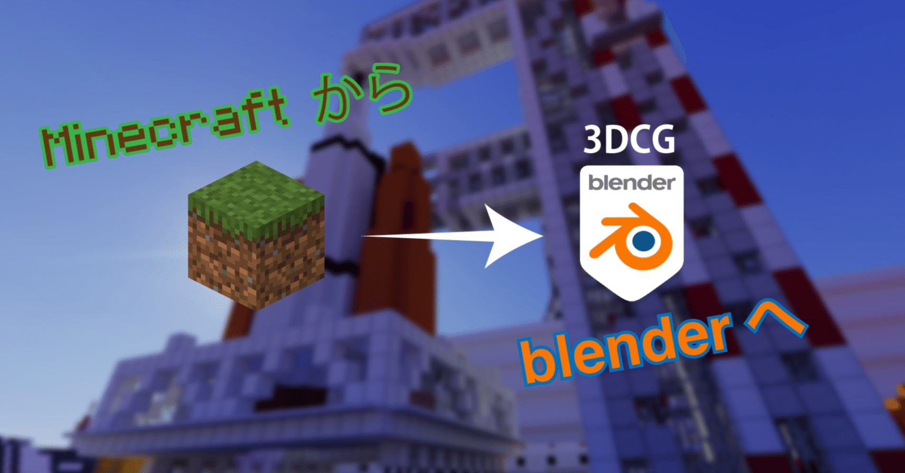
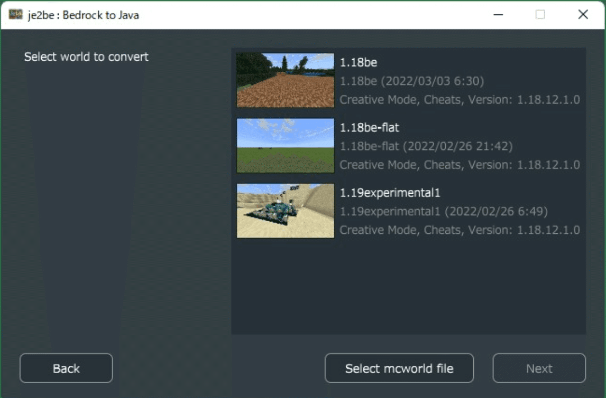
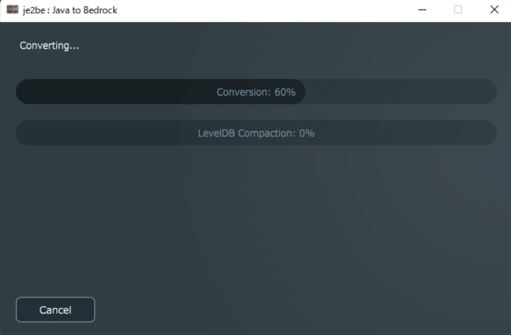
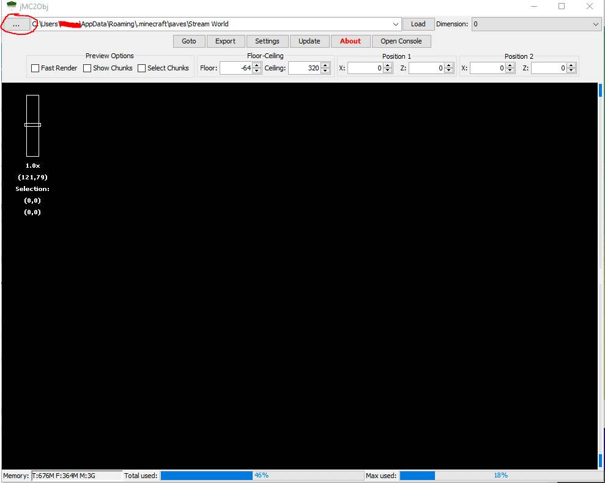
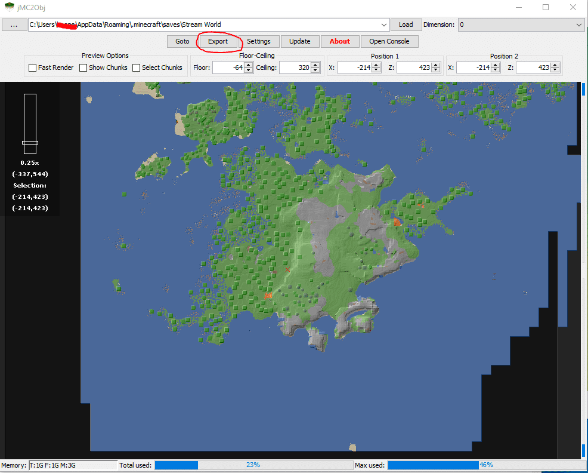
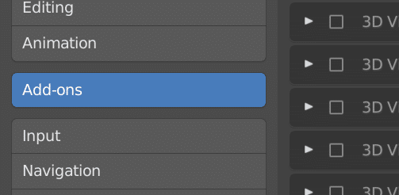
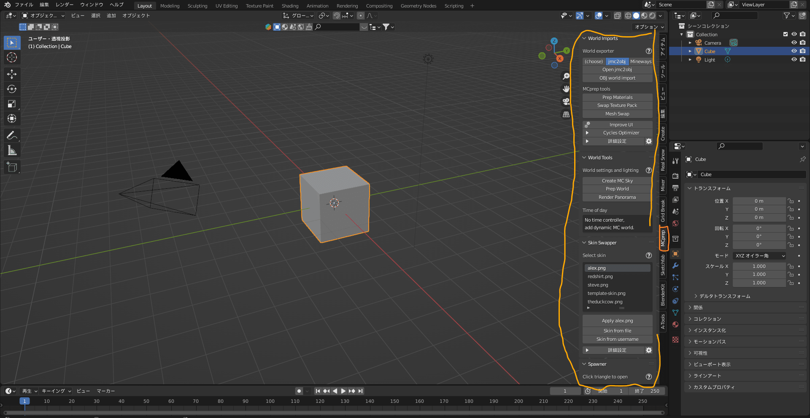
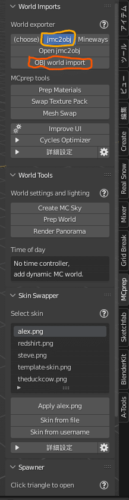
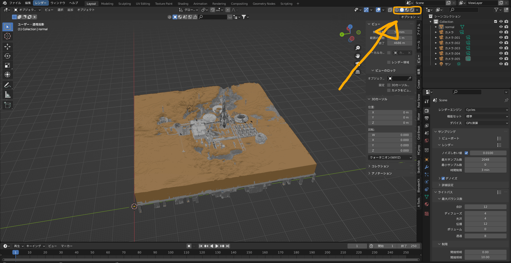
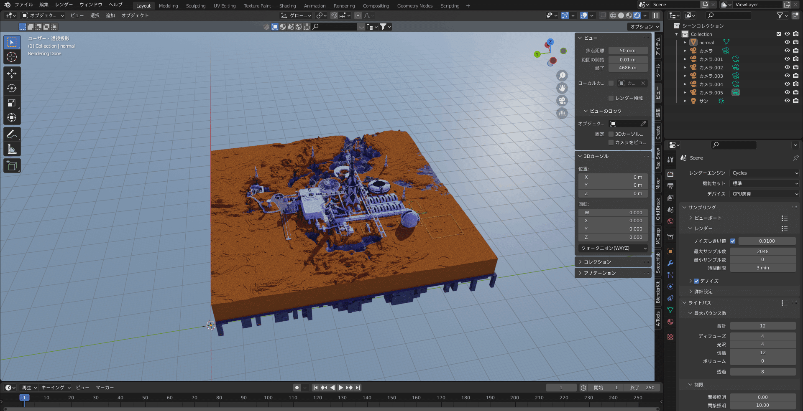

# 【Bedrock & Java】Convert a Minecraft World to 3D for Free!

This topic gets asked quite often, so I’m putting it together here on note. For Bedrock (the "統合版"), you need a process that converts it to Java along the way, so you must own both versions if you’re converting from Bedrock.

### What you need

- Minecraft Java Edition
- A device that can run apps (PC/Mac, etc.)
- A Java runtime environment

If you don’t have these, please install them.

If you’re converting from Bedrock, you need Minecraft Bedrock Edition (統合版) and a PC running Windows 10 or later.

### Step 1 - Prepare the world

(You probably already have a world if you came here to make one 3D…)
If you just want to try things out, feel free to generate a random world for testing.

If you’re using Education Edition, you need to unpack the MCpack & change the file extension to extract the file called a DB file, then replace it with the Bedrock version’s DB file. **If you’re not sure what you’re doing, I recommend not touching the DB files. You could corrupt your Minecraft world.**

### Step 2 (Bedrock only) - Convert the world to the Java edition

Use a dedicated app to convert the world. The first tool I’ll introduce is "je2be", which is free. The second option is the paid Universal Minecraft Tool. Here I’ll explain the procedure using the first tool, je2be.

<https://apps.microsoft.com/store/detail/je2be/9PC9MFX9QCXS?hl=ja-jp&gl=jp>

<https://www.universalminecrafttool.com/>

Install and open the app, click "From Bedrock to Java" and you’ll see a list of worlds like this.

_Selection screen_

From the displayed worlds, choose the one you want and start the conversion.

_Converting_

When conversion finishes, a dialog will prompt you to save in Java format — save it wherever you like.

> People often lose track of where they saved it, so it’s a good idea to save it in the saves folder (C:\Users(username)\AppData\Roaming.minecraft\saves).

Once saving is complete, the conversion process is done. Easy, right? (taunt)

### Step 3 - Convert the world into a 3D format

Now for the main part. Here we’ll use the tool jmc2obj to export the Minecraft world into 3D. Download it from the link below:

<https://github.com/jmc2obj/j-mc-2-obj/releases>

> The usage instructions for jmc2obj are quoted from <https://github.com/jmc2obj/j-mc-2-obj/wiki/Getting-started> (in English)

1. Place the downloaded folder wherever you like.
2. Open the file named "jMc2Obj-\[version].jar".
3. Click the \[...] button shown in the image, and select the folder that contains the Java-format world you saved earlier (if you saved it in saves, you probably don’t need to change settings).
4. Click the \[∨] in the directory field and choose the world you want to load.
5. Then click \[Load] next to it to open the world.

_Quoted from&#x20;_*<https://github.com/jmc2obj/j-mc-2-obj/wiki/Getting-started>*

When the world loads correctly, it will look like the image below. The steps are:

1. Drag to select a region, then click \[Export] to open the export settings. (Recommended settings: set offset to "Center", and check "Create a separate object for each material".)
   There are many other settings; I’ll skip them here. Google them yourself.
2. Click \[export] in the settings window to begin exporting. Export time varies depending on the selected area and export settings.
3. When the export is finished, a save dialog will appear. Choose a location to save. The export saves as OBJ and MTL files, and the textures are saved in a tex folder (part of the textures are saved in the tex files).

_Tada! This alone is amazing!_

### Step 4 - Import the 3D-converted world into Blender

Here we’ll import the data you just created into Blender, a free 3D software.

> Wait… you’ve never used Blender? Sorry, explaining it would take all day. Really. I’ll explain how to import, but be prepared.

To import the data, use an add-on called MCprep. This lets you import without manually setting up materials.

<https://theduckcow.com/free-download/>

From the link above, choose MCprep and download it. Then add it to Blender as an add-on.

_Add-on_

<https://styly.cc/ja/tips/nimi-blender-addon/#Blender>

↑ This link shows how to add it.

After adding, an MCprep tab will appear on the right side of Blender. Use this add-on to automate texture assignment.

Click \[jmc2obj], then click \[import OBJ] to import the file.

_Click the MCprep button to open this_

_Click here_

If the world loads successfully, you’re done. Click the sphere button in the top right to switch to Rendered view and take a look.

_From left: Wireframe, Solid Shading, Material Preview, Rendered View — it gets progressively prettier. What happens if you press it…?_

_Whoa!! So beautiful!!_

Now just add lights like lamps or suns and position a camera to finish.

Good work!

### Promotion for the team I run: 逸般人

A creative group made up of crazy elementary, middle, and high school students 💥
We work on themes like Minecraft, 3DCG, video, and education.
🏆 Winner of the Minecraft Cup 2021 Impress Award 🏆

<https://outstndrs.start.page/>
