> This article is a continuation written with reference to [[en/notes/revise-mitou-jr|Review of Mitou Junior]]. It's also being written as an Advent Calendar entry.

<iframe src="https://adventar.org/calendars/11697/embed" width="620" height="362" frameborder="0" loading="lazy"></iframe>

It's been exactly one year since I completed the creator support program "[[ja/accomplishments/mitoujr-2024|Mitou Junior 2024]]."

<https://jr.mitou.org>

I was just biking home from university and remembered I wanted to write this article but hadn't, so I decided to bike along in the freezing cold, grimacing from the wind, record myself with Google Recorder, transcribe it with an LLM, and write the blog. Needless to say, some passersby gave me a double-take.

However, maybe because of the cold, the raw content I got was a bit disjointed (the transcription itself was accurate), so I ended up tidying and rewriting it a bit. Here’s a very rough summary of what I gained and learned through Mitou Junior, my career path, what went well, and what didn't.

[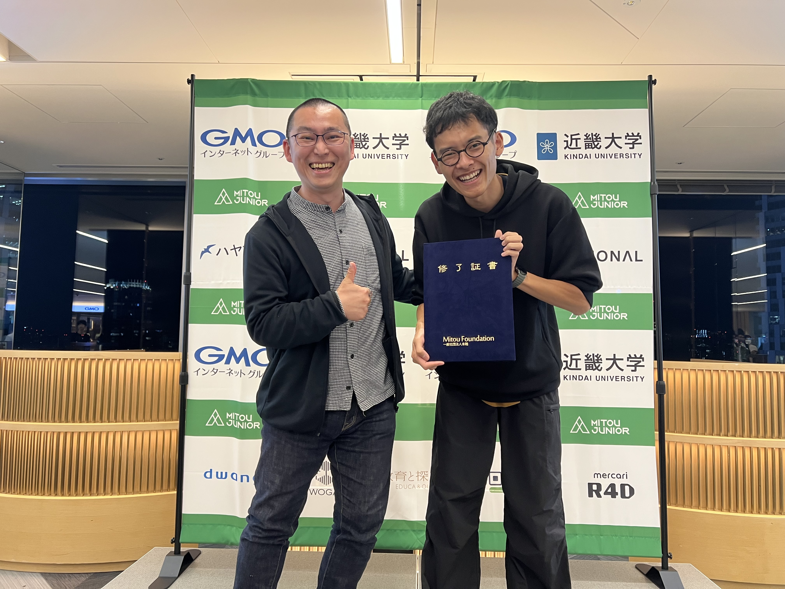](../../media/2e20a0aeeb9d6428d309db8398184b0f06c75b81dc6c31a6808840043e5bb3e5.jpg)

&#xA;By the way, this is a recent two-shot photo with my mentor, Nishio-san. I had no photo from my own成果報告会 because I was broadcasting from Malaysia, so at the 2025成果報告会 I took a two-shot with my mentor Nishio-san from this year's presentation. He's grinning ear-to-ear. Oh, and the certificate he's holding is not mine.

## What I worked on in Mitou Junior

### TutoriaLLM

During my Mitou Junior period I developed TutoriaLLM, a tool to set up programming learning environments using LLMs.

<https://jr.mitou.org/projects/2024/tutoriallm>

I talked a lot about the details during the presentation, so I'll omit them here.

[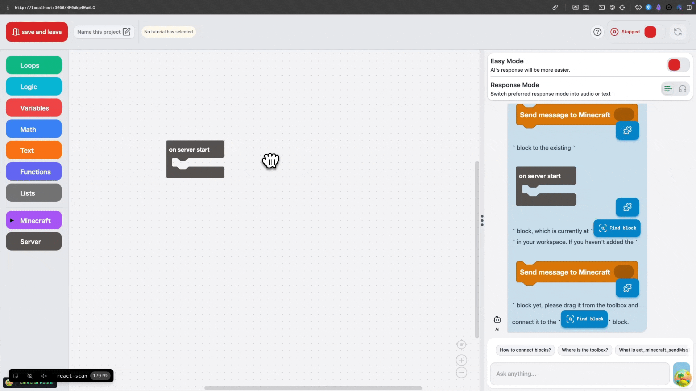](../../media/1f7dd94641c26139b2e20f230fd2503634f68aeea578b74f0a52691623b34085.gif)

&#xA;It was my first serious web app, but with the help of AI I implemented it to a usable stage and was recognized as a Mitou Junior Super Creator. I was also able to submit it to later competitions and even win awards.

### One year later

A year after the announcement I said I planned to release a product and let many people use it, but I faced various difficulties and ultimately development stopped.

> I'm building this with help from people around the world, so I'll keep going until the people around me stop supporting it. The software itself is open source, but I also intend to consider commercial uses and eventually deploy the app in real-world environments and keep it running. - [[ja/notes/revise-mitou-jr|Review of Mitou Junior]]

There were many causes, but the biggest was the rapid advancement of technology, which sapped my motivation.

At the time, AI had trouble visually recognizing block positions, so we used a technique that converted blocks into text data and had the model read that. But a year later, AI can recognize images directly, understand code from them, and even output code. Some models can annotate images or add text and output slides as images. The technical approach I had worked so hard to build became obsolete in an instant due to AI progress, and my work disappeared.

[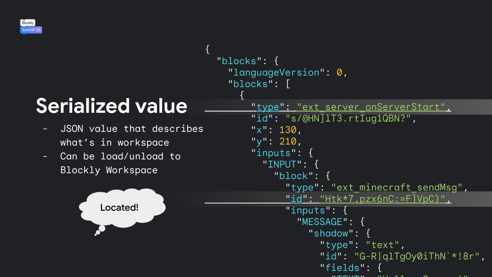](../../media/a1268ac34650a91abaedb1cc2fa51b03dd68de8674c267c0300ea4667cc1d5b0.png)

For a moment there was talk of deploying this as an educational platform to teach how to use AI, and I even had a tentative inquiry from someone overseas, but there are already many such platforms in the world and a lot of competition, so I didn't feel very motivated.

Moreover, there was an announcement that software similar to TutoriaLLM was being developed by the Scratch Foundation.

<https://scratchfoundation.org/blog/coming-soon-your-creative-learning-assistant>

I realized that what I'd built might be globally competitive, but at the same time I was made aware that something that no one had done before was no longer unique.

A single student beginner trying to keep up maintenance against groups of extremely knowledgeable people and the rapid evolution of AI (LLMs) is unrealistic. I lost motivation and eventually stopped.

The project is currently sitting idle on GitHub, but I'm still interested, and if I decide to get it running again I'll update it.

### Who I met mattered more than what I made

So, I didn't exactly produce adult-level outcomes in STEM education, and what I made was nearly unfinished, but it was still a valuable experience. This is the important part.

The greatest thing I gained from Mitou Junior wasn't money or technology, but connections with people.

Although the artifact I made became outdated, it allowed me to meet many people around the world. Most importantly, it made me seriously think about "what I truly want to do."

I presented my work at the Blockly Summit,

[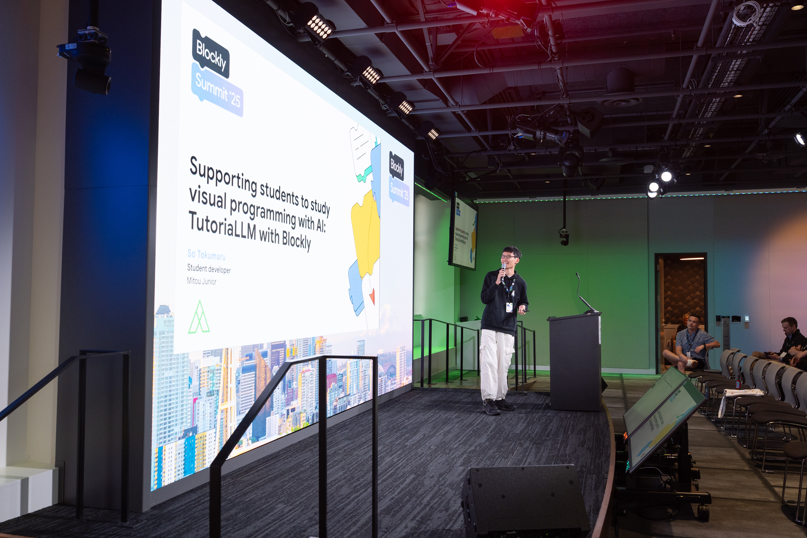](../../media/bb5eecb81ef2adf174ff3989795a292c0499cb5b6b6c9e542c196e0fbaec9f02.jpg)

[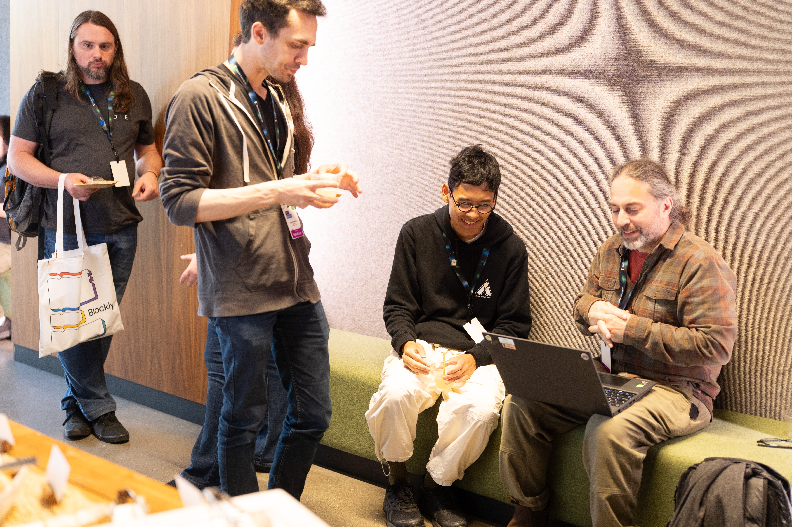](../../media/bab70fe065a0ca50a3ed1d452f474bcbd7e61a8b946fe3c2eb9d9ec906ceabf4.jpg)

[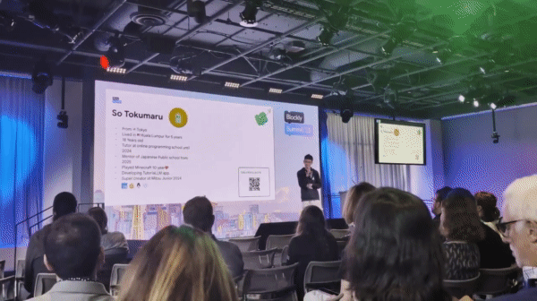](../../media/0f3aab5c32cd4c455be6b802c66131d1c47cca36a0d40b4bd97a5242463e3e77.gif)

I even got to go to DEF CON, a fun gathering of hackers,

[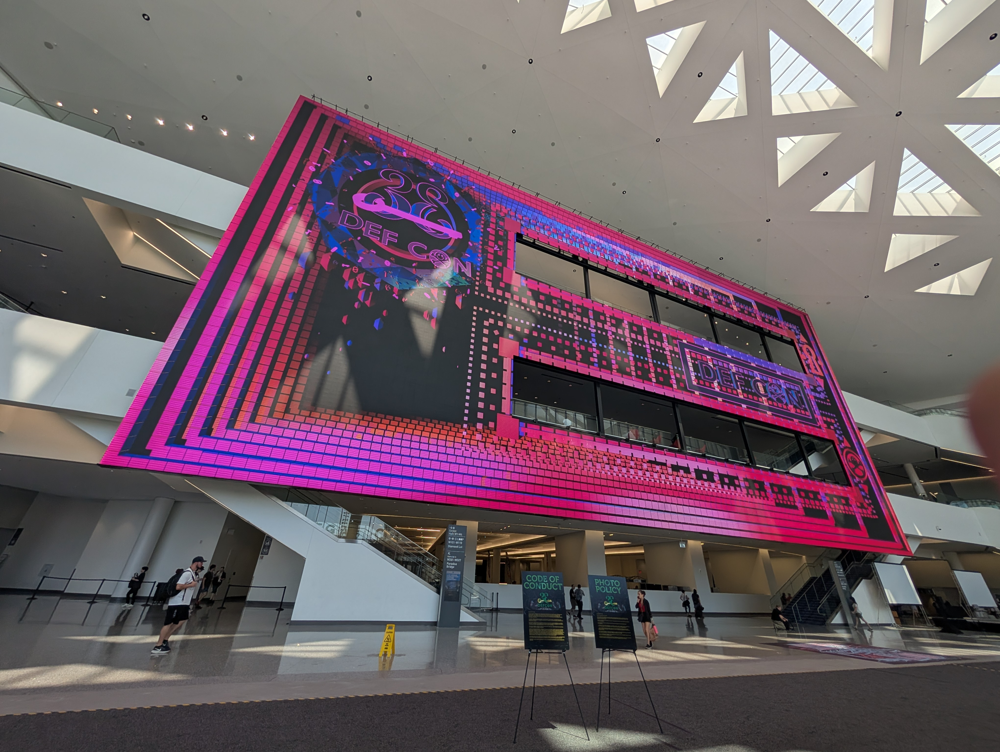](../../media/ba9dc20cb2f78622399e452fce94449f4413ccb2458af95c7e03337a497297e0.jpg)

I had only been programming for about a year, and in hindsight I think people recognized my process and attitude — they were essentially saying "you worked hard" — rather than purely judging my technical skill.

By showing that process to many people, I was able to connect with new people. There are many kind adults in the world who will support someone trying hard (although of course there are also many who won't).

In particular, the Blockly Summit was huge for me. At the time, Blockly was a block-programming framework developed by Google's CS education team (development moved to the Raspberry Pi Foundation in 2025), and it gathered block-programming enthusiasts from around the world, including people deeply involved with Scratch.

Until then I had privately thought "maybe what I'm making is great," but actually showing it to people, getting feedback, and talking to others taught me a lot. I realized that what I was building was surprisingly strong even within that group, and that if I did it properly it could have the power to change the world a little.

I also saw the power of building things as a team. Compared to me working alone, they were groups of people devoting a few percent – no, maybe a large fraction – of their lives to this work. I learned that getting people with the same vision together to build something is important. The world is often shaped by creations that begin with a small, highly motivated group. Of course many people around them contribute, and their cooperation is indispensable, but it's the few very driven people making decisions.

I also realized how important it is to share what you build. Many people (myself included) wait to show their work until it's finished, but in this fast-changing world that strategy often fails. Showing your work to many people (not all of whom will be kind) increases the chances of finding good opportunities.

I think this is common across Mitou Junior, [[ja/accomplishments/teens-apps-awards|Apps Koshien]], and the Blockly Summit. I'm nervous presenting and often forget everything I planned to say when I get stage fright, but you still have to present, and with some ingenuity you can communicate even when nervous. Connecting with people this way raises awareness of you and can lead to new opportunities. It certainly had an impact on my life.

## Career path

So next is the story about my career path. I agonized a lot about it.

> After finishing school, I worried a lot about what path to take. Having seen various worlds, I used to assume "I'll just go to university," but I questioned whether that was necessary for me. (In the end, I'm considering attending university.) - [[ja/notes/revise-mitou-jr|Review of Mitou Junior]]

I said that last year and decided to go to university after graduating. I had several options beforehand, and I enrolled in [[ja/works/keio|Keio University Faculty of Environment and Information Studies (SFC)]], which many Mitou Junior alumni attend.

[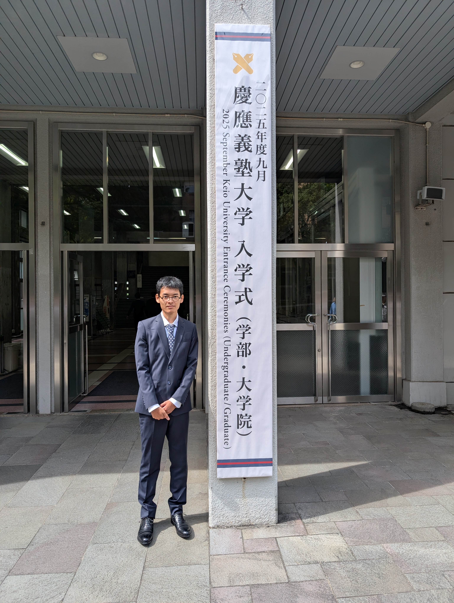](../../media/2200029008361bbca66f6f2d1c80f2a0a4eff7842e9eff541fb628a4fb62e939.jpg)

&#x20;(The entrance ceremony in a suit I'm not used to wearing)

### Why I chose SFC

There were several reasons:

- It's easy to study across disciplines
- You can take classes in English to some extent
- I know a lot of people there
- Mitou Junior alumni receive some preferential treatment (my admission method wasn't explicitly privileged, but I think it helped a bit)
- I met the admission requirements

Regarding preferential treatment for Mitou Junior alumni, Ukai-san wrote about this in this year's Advent Calendar, so check that out:

<https://note.com/ukkaripon/n/n16034b59b4f8>

Meeting the admission requirements was a big factor.

I graduated from [[ja/works/pisa|an international school in Malaysia]], which follows an Australian curriculum in Malaysia. That background can make it hard to be accepted by Japanese universities — national universities were basically out of the question. Japanese university admission requirements aren't always accommodating to such backgrounds... there are relatively few universities you can apply to from there. It was a blind spot for me. SFC was very flexible, which I appreciated (separate from the typical returnee admissions, there's a GIGA admission route that accepts many international students).

People often say returnees have an easy time with admissions and are "winners in life," but outside of Keio, I had no eligibility or my grades were poor and I got rejected everywhere, so I wasn't a winner at all. The people boasting about it are just those who always score 100 on school tests...

Being a returnee is becoming less of an advantage (Keio is also moving to reduce or abolish returnee admissions next year), so people studying abroad should be careful. For me, going abroad mainly gave me language skills and survival ability, and it was actually a disadvantage for Japanese university admissions.

But I'm happy I got into the school I wanted. Even if I hadn't, I planned to pursue my interests anyway, but it's great that going to SFC expands what I can do.

I was also accepted to an Australian university. Since I took exams overseas and got in, I considered going abroad, but tuition is expensive and living at home to attend SFC would let me dedicate more time to academics, so I chose SFC. Having an environment where I can focus on my studies is truly a blessing.

## What I'm most committed to now

After starting university, my life changed significantly. Unlike during Mitou Junior, I decided not to ~~slack off in class and code on the side~~ neglect my studies and to study seriously. Up to high school I thought once my career path was set I could treat everything else as extracurriculars, but university is a place to take action and gain opportunities, so I plan to focus on that for these four years.

Of course some people enroll in university and then immerse themselves in their own projects. Some talk about a four-year moratorium. My school is quite well-known in Japan and Asia, and some people enter just for the name. For me, who doesn't plan to seriously hunt for jobs (and doubt I'd succeed if I tried), the brand isn't everything — I care more about what I do there and who I meet.

### University classes

I want to keep options open — for example, attending grad school overseas — and I can leverage my English, so I'll keep getting good grades.

A few years ago I couldn't concentrate when classes were boring, but university is wonderful: I can study what I actually want to learn, so that problem doesn't happen. The professors at SFC are all interesting; it's a great place.

There are English courses too, and depending on the instructor you can take classes in English while staying in Japan, so I should be able to keep up my English (though I still need to study on my own).

### Playing around and finding my world

In Japan people tell university students to "play a lot," and I used to think "what's the point of just playing?" But maybe there's truth in it depending on how you interpret it. For me, "playing" often means taking interesting university classes or copying what others in research groups are doing and extending it for fun. That sounds like study, but it's fun, so it's play. It's not that I'm achieving something unprecedented, but my range of interests keeps expanding, which is enjoyable.

[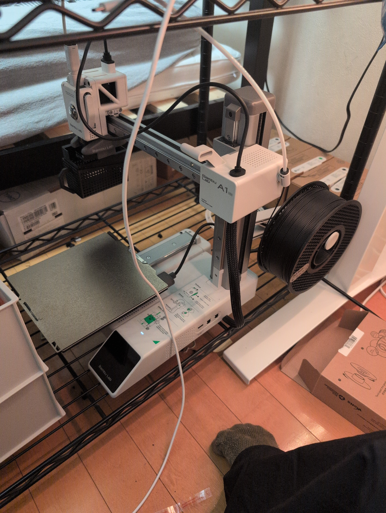](../../media/9b10eee4780d08a48ff2d9218f144d55839dbffbf70fbc112f511b15f110c0e8.jpg)

&#xA;Lately I've been getting into the [[en/misc/bambu-a1-mini| 3D printer]], hardware, and how the internet works (e.g., [[ja/misc/world-wide-web|WWW]]), areas I hadn't touched before. Starting these on my own feels harder than making web apps because of the initial investment, but being at university and hearing from various people made me interested and got me hands-on. It's good to take initiative, but sometimes classes and hearing about things from others spur motivation more.

[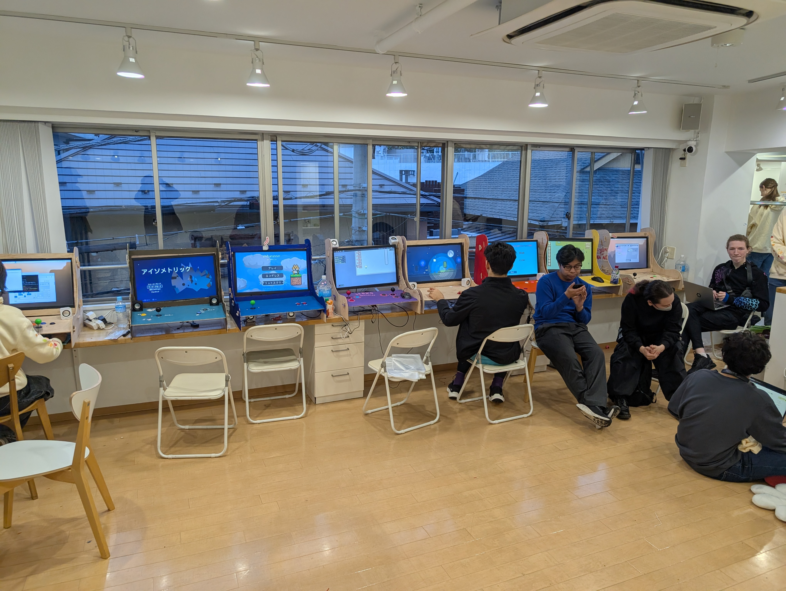](../../media/831c5448c6280c7bbb394f9cfddd055ce6a5479b836d972e593c8726cc065c4f.jpg)

&#xA;(Recently Hack Club held a game exhibition in Tokyo and I went to see it)

In the end, I think I find things I like by being influenced by people around me. I realized that my interests often start as play, grow, and reach areas no one else has explored.

[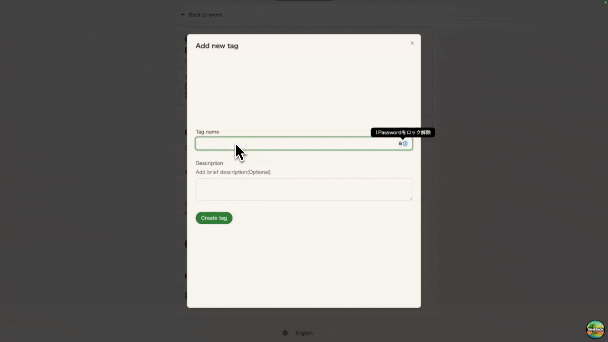](../../media/3e5ec659e4f68357fb8aa234c206f1ebcbdcb8beee32380ac90dc924783f12fa.gif)

&#xA;(I built a web app at a hackathon)

I used to be the kid who groaned when my parents told me to study, but once I started treating everything as play and got hands-on, it all became fun. I'm grateful to be in an environment where I can do what I love. Big thanks to everyone who supported me!

> Huh? That's not play? Do more games?
> ...So I recently took back the Windows PC I'd lent to my family, bought a wheel, and plan to play racing games. So yes, I'm playing games properly (?). If you want to play together, join my Discord server!

<https://discord.gg/vJtKTWKmt5>

## Songs I listened to today

<iframe src="https://www.youtube.com/embed/W88_jjgo7fE?si=_sBA23KNWkk5AhC4" title="YouTube video player" frameborder="0" allow="accelerometer; autoplay; clipboard-write; encrypted-media; gyroscope; picture-in-picture; web-share" referrerpolicy="strict-origin-when-cross-origin" allowfullscreen></iframe>

_I had another flash of inspiration_

<iframe src="https://www.youtube.com/embed/xvH0hNzMjhg?si=eM6WzS_Y3tpBJ-Hq" title="YouTube video player" frameborder="0" allow="accelerometer; autoplay; clipboard-write; encrypted-media; gyroscope; picture-in-picture; web-share" referrerpolicy="strict-origin-when-cross-origin" allowfullscreen></iframe>

_I wonder if the place beyond the darkness shines colorfully... probably not?_

<iframe src="https://www.youtube.com/embed/EByRaEg-RAE?si=sxGG7gQeKQxnXSNi" title="YouTube video player" frameborder="0" allow="accelerometer; autoplay; clipboard-write; encrypted-media; gyroscope; picture-in-picture; web-share" referrerpolicy="strict-origin-when-cross-origin" allowfullscreen></iframe>

_I steer toward an uncertain future that the world cannot yet know_

## Recent goals

After finishing Mitou Junior my short-term goal was to get into university, but once I started university I began to think about why I'm alive. I'm 19 now, and since I don't know when I'll die, I want to have some idea of what to do with my life.

My parents gave birth to me and I was born into this world without any inherent meaning. There may be no preassigned meaning, but deciding what to do gives me motivation, and just thinking about it gives me a reason to live.

I considered following my father's generation's path — graduate, get a job, retire — but in this AI era, doing that would break me or leave me unable to keep up with change. So I decided I'll probably spend my life continually worrying about how to live.

### Recent thoughts

While scribbling [[ja/notes/why-human-move|Why Humans Move — rough notes]] I thought: if you treat many humans as a single entity and imagine the whole Earth (or beyond) as a living being with a will, then a human's goal might simply be "to survive." But rather than being an idle element, I want to function as a "part that makes its best effort for the survival of humanity as a collective intelligence." If I live according to that principle, that might be good enough for now.

In my final year as a teenager, I hope 2026 will be enjoyable. Thank you for your support.
