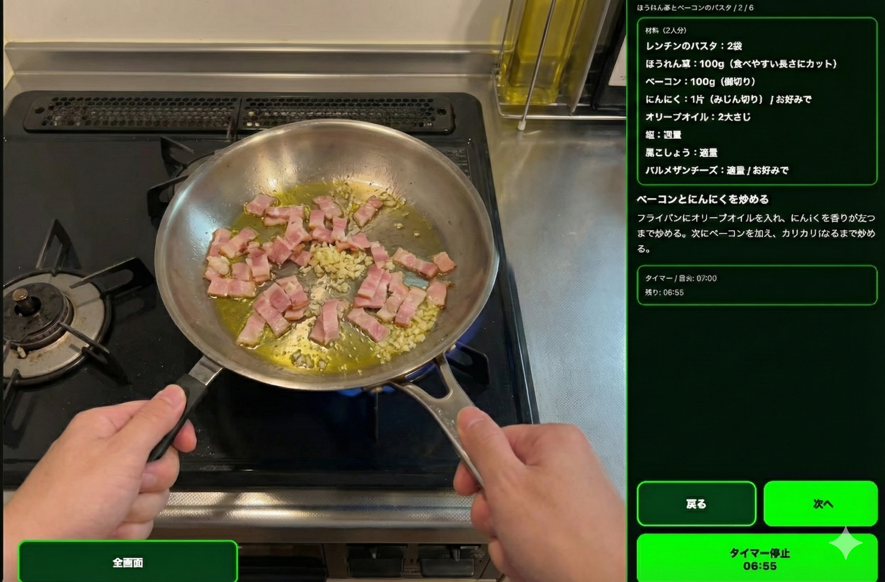

<blockquote class="twitter-tweet">
Today I built a teleprompter app that can stylishly display Google Slides speaker notes for the Inmo Air 3 — Android-powered glasses I bought in Shenzhen from <a href="https://twitter.com/inmoxreality?ref_src=twsrc%5Etfw">@inmoxreality</a>. It's fun and seems immediately practical. (In reality it's floating in mid-air with AR glasses and looks freaking cool, but it's painful that there's no way to show this) <a href="https://t.co/lEd14WBgBW">pic.twitter.com/lEd14WBgBW</a>
&mdash; Yu Ukai (@ukkaripon) <a href="https://twitter.com/ukkaripon/status/2010702060107464846?ref_src=twsrc%5Etfw">January 12, 2026</a></blockquote> 

Today I got to try out the inmo XR — Android-powered XR glasses — that Ukai (familiar from Mitou Junior) had, and I thought up a product that might be useful with them.

## Exploring the potential of inmo XR

I also own [XREAL One](http://xreal.com) lenses, so I wondered if it could do similar things. Basically I tend to use XREAL like a mobile monitor, so I honestly didn't feel much need to build apps specifically for these devices. Making a dedicated UI or hunting down APIs is a hassle.

However, actually trying the device showed me that being cable-free and running standalone is a huge advantage. It expands what developers can do, and I feel we'll see more devices like this going forward. Unlike XREAL's approach, it's very thin and unobtrusive (though there's still some oddness), and judging by the thinness and performance of the glasses themselves, I wondered if it's an upper-tier alternative to [Even Realities](https://www.evenrealities.com/).

(For Even G1, I recommend the introduction by 電電猫猫:)
<https://note.com/electrical_cat/n/ncbff77528ada>

I don't know if inmo XR is the absolute best (I've only compared it to XREAL), but it feels like it's reached a level that's practically usable. Some issues remain: the area around the ears gets absurdly hot under heavy load, and—typical of many Chinese devices—the Play Store doesn't work and related services are unavailable. Maybe there are ways to work around that.

The display itself is interesting. XREAL uses something like a birdbath optical system with a triangular semi-reflective mirror placed right where the eye would be, but inmo XR uses a different method: some mysterious technology delivers images to the eye in an ultra-thin form. How to describe it... a mirror embedded in a very thin lens a few millimeters thick, letting you see an image projected from the side... (I lack the vocabulary).

Because it's Android, it needed an input method equivalent to a mouse. inmo XR offers a touchpad-like device and a ring-shaped device you wear on your finger (which also acts like a touchpad).

## Weaknesses of current wearable devices

Separately, I recognized problems common to inmo XR and other devices.

Most high-function XR glasses are heavy, and at least for me they're unbearable for daily use. There are slim, purpose-focused ones like Even G1/G2, but full-HD displays or built-in Android make devices heavier and tiring on the eyes. Also, at about 0.7 vision, I need insert lenses; some say contact lenses would solve it, but inserting foreign objects into your eyes daily is scary. Still, maybe humans will need to adapt to the machines a bit.

From a developer's perspective, the high-performance devices are great, but they're exhausting for regular use.

That said, I feel these issues will be resolved relatively quickly as the technology miniaturizes.

## What to build

We decided to make something quick in one day (hackathon style), so we largely ignored inmo XR's biggest strengths: Android running on-device and available device APIs. Instead, we focused on its highly transparent display that works like a HUD and the freedom from cables around the ears, which expands usable scenarios.

Recently with XREAL I ran into a problem... oh right.

So I built an AI app to help with cooking.&#xA;

&#xA;_(Illustration by Gemini)_

The idea is simple. Tell the AI what you have at home or what you'd like to make, and the AI creates a "recipe.json" (lol), then the system follows that. inmo XR tends to render black as transparent (similar to XREAL but even more transparent), so we took advantage of that.

Previously, a prototype at this level that could be used as a real product would have taken at least a week, but with LLM coding tools (like Cursor), it can be done in a day—or half a day.

What people need now is the skill to supervise the AI: to watch if it's likely to work, whether it will complete successfully, monitor its actions, decide when to interrupt and correct it, and so on.

[XR AI料理アシスタント](https://xr-ai-recipe-assistant.vercel.app/)

It's just a quick build, so please try it out (I'm paying for the LLM, so I'll stop it if I can't afford it).

## Design decisions

Text can be a bit hard to read on XR, so I made the buttons huge. They look ridiculous on a PC, but surprisingly the size is just right on XR.

At first the buttons were dark, but the darker they are the more transparent they become (same as a movie theater projector), so I changed the button color to green so they work in bright environments. Green turned out to be the most visible. Maybe there's a reason movie HUDs are green.

I also needed to reduce the number of buttons. The demo has several buttons, but ultimately control should be possible with head movements (e.g., nodding for the next page). You don't want to touch a touchpad with hands covered in raw meat while cooking. So to eliminate buttons later, I limited the maximum number of buttons to four and added voice input for text fields.

## Other things I want to build

If glasses become extremely capable with a wide field of view, it would be great if they could recognize real objects and render UI based on their spatial relationships.

You can already do this with approaches like Vision Pro that ingest video using a chip, but glasses in a lightweight form factor would likely be more socially acceptable (at least more than Vision Pro) and cheaper.

## Trying it while cooking

If Ukai is around he'll lend me the inmo XR, but since I don't have one at home I tried cooking using XREAL and my phone instead. Colors change noticeably, and you have to run a cable from your ear to a PC or phone, so practicality is limited.

> I'll try using it the next time I cook, and if it seems workable I'll add an update
