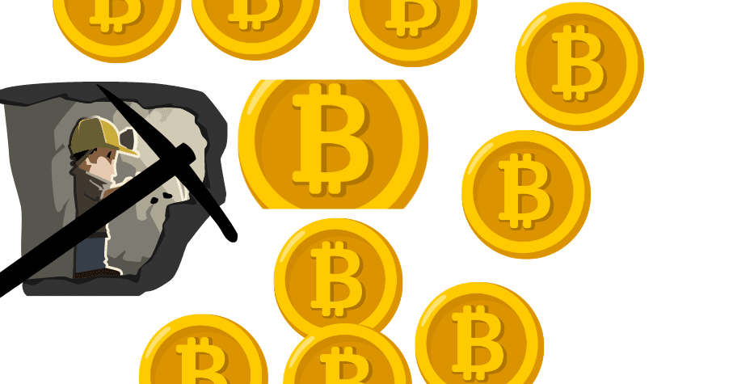
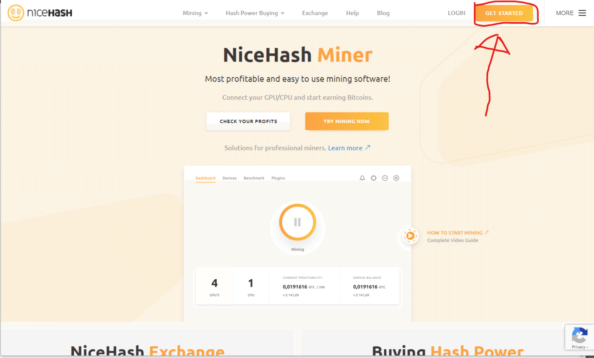
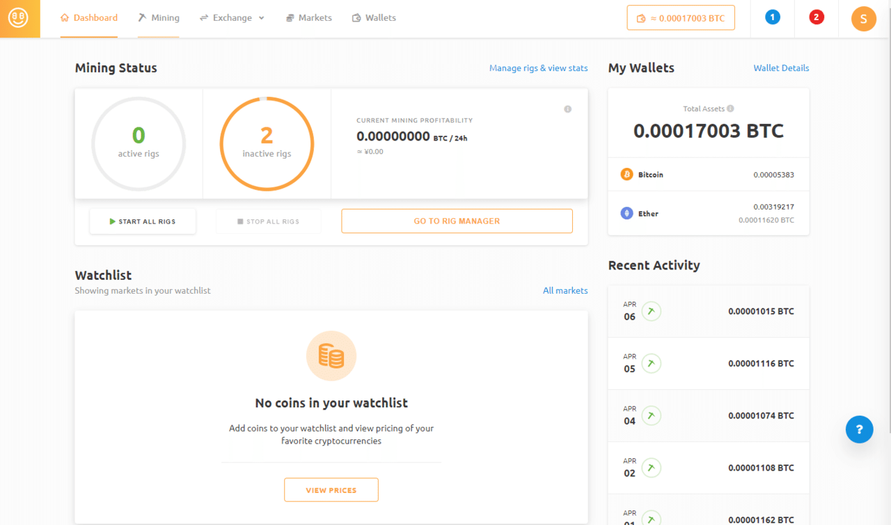
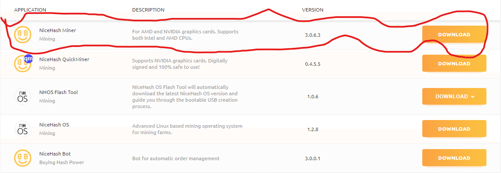
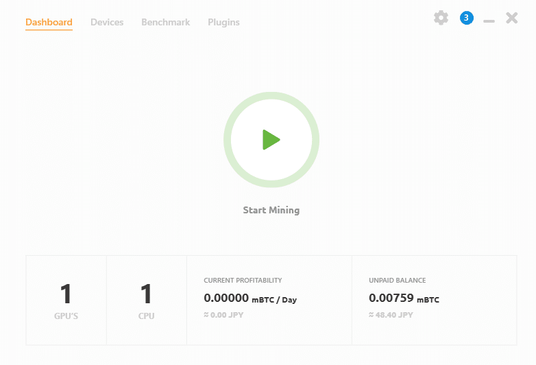
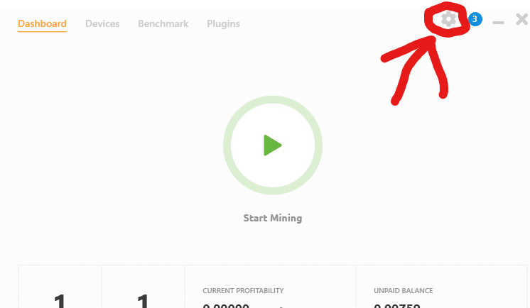
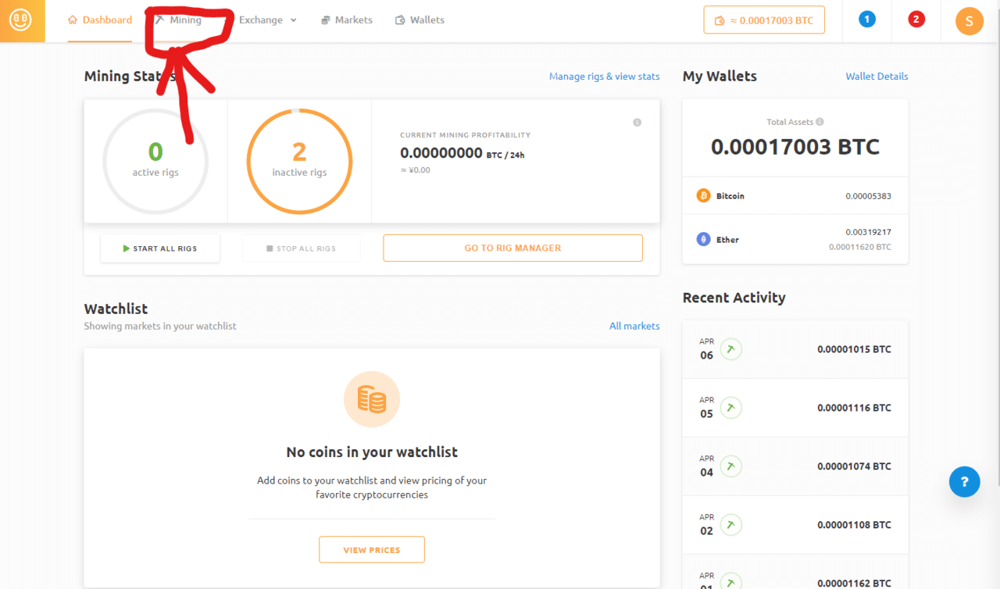
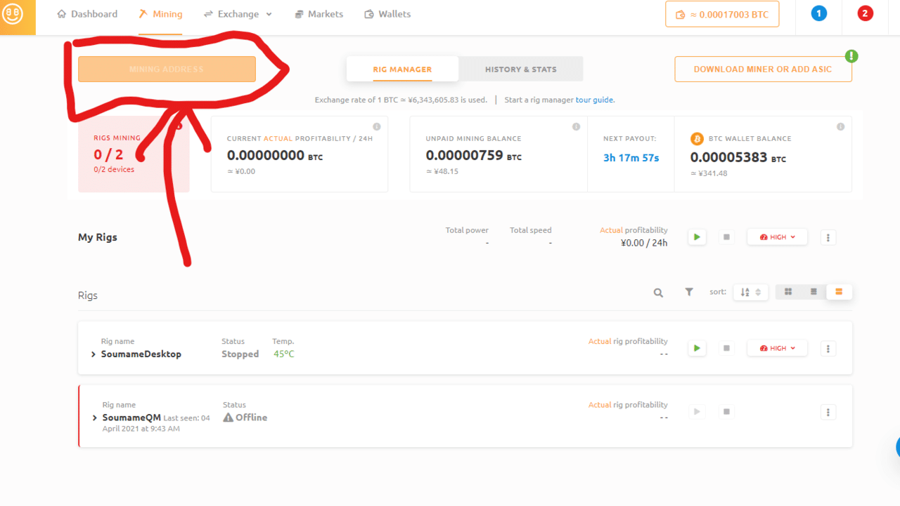

# How to Mine with Nicehash

Here's a quick explanation.

## **What You Need**

> 1. A computer

> 2. An email address

## Creating a Nicehash Account

First, go to the official Nicehash website via the link below:

[NiceHash - Leading Cryptocurrency Platform for Mining and Trading](https://www.nicehash.com/)

Click **GET STARTED**.

Follow the steps to enter your email and password.

If you can reach a screen like this dashboard, you've succeeded!

## Downloading and Starting the Software

**Your account has been created! Now, we will download the software to your computer and start mining!**

Follow the link above to download **Nicehash Miner**. It should probably be at the top. If you have an NVIDIA GPU, you can also use Quickminer (this won't be explained here; if you're unsure, please download Nicehash Miner).

Once downloaded, install it following the instructions. All settings should be fine with the defaults.

If the download completes and you log in, and you can reach a screen like this, you've succeeded.

Enter your wallet address. Click the gear button to input your wallet address.

You can view your wallet address by clicking the orange button located in the Mining tab of the dashboard.

Now you can use Nicehash.

By pressing the start button displayed on the software (the one that looks like a YouTube play button), it will start mining automatically.
