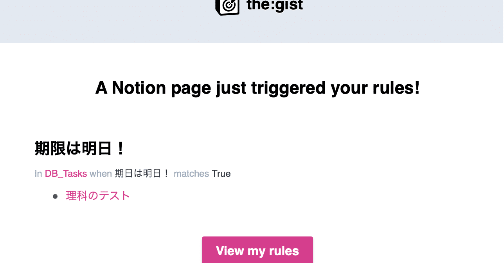
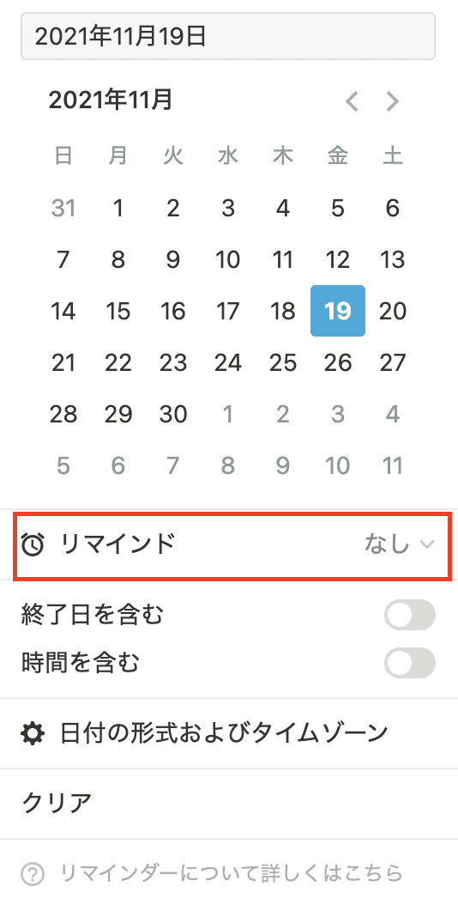
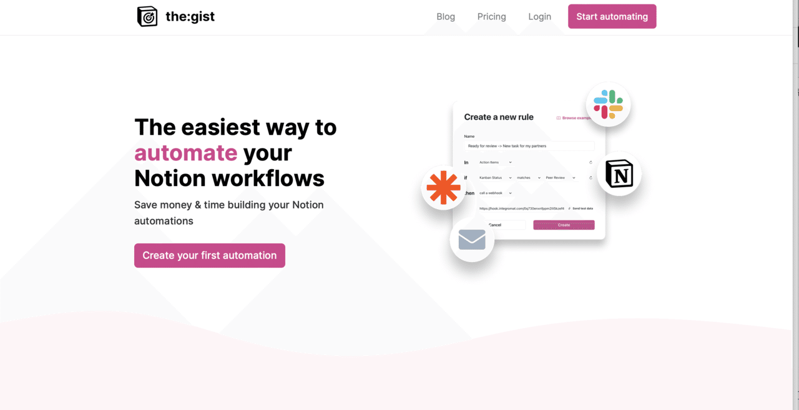
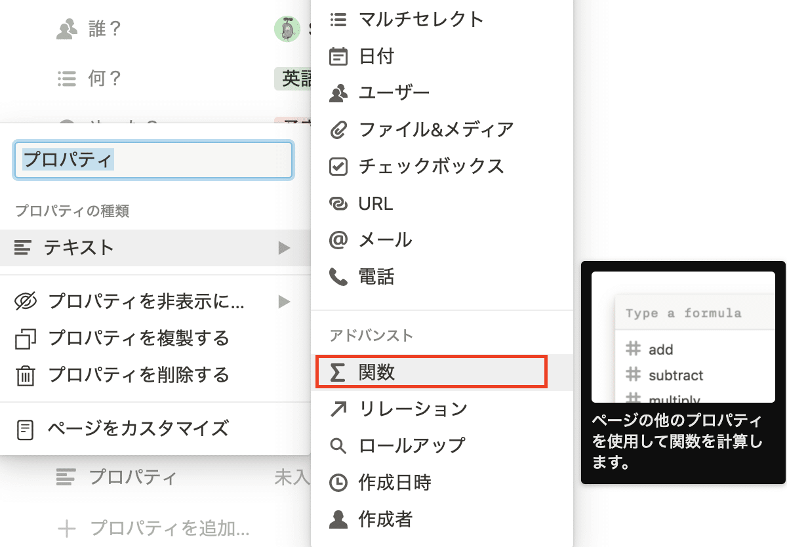
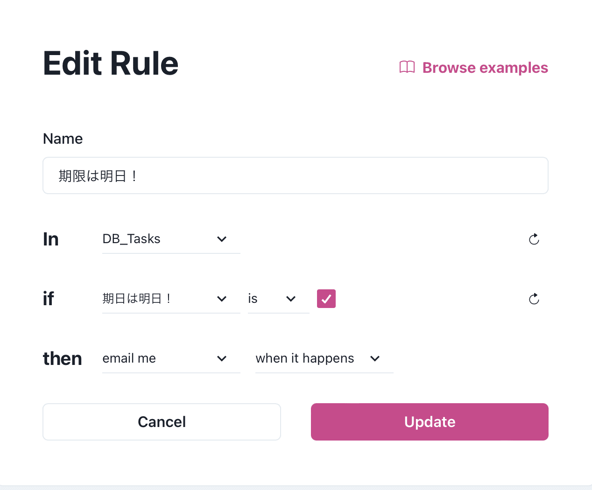
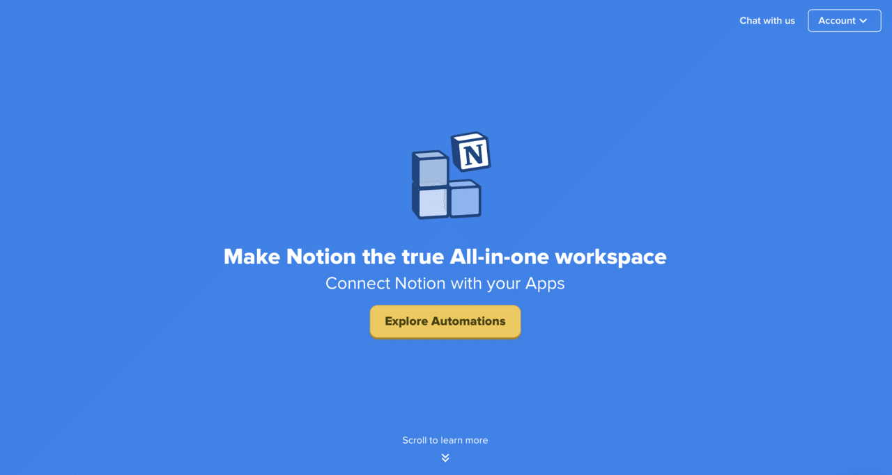

# How to Create Automated Notifications for Free Using Functions in Notion

[](../../media/712aa7039abfdffd62009424bdec9e0a77e889c0f6967fab8491992c92c89b8d.png)

Notion is convenient, isn't it? I also migrated from Trello and find it very useful, but there is one thing that is **disappointing.**

## No notifications even when the time comes...

A few days after I started using it, I realized that **reminders don’t come.**

Unlike Trello, Notion does not **automatically remind** you when you set a time; you need to either type **/remind** or toggle a switch when setting it up from the calendar property.

[](../../media/35e5d55f28992efc7e18dc033731e616d99166d1a0b0eed73bd62dc22958a6a0.png)

"Oh, it's just a toggle," you might be thinking!

**This feature can be quite tricky**; if you forget to toggle it while jotting down notes, **you won’t receive any notifications when the due date arrives.** This is incredibly inconvenient.

So, I decided to **rely on external tools** to overcome this inconvenience.

## the:gist

By using **"**__[the gist](https://www.thegist.so)__**,"** you can create **automated reminders for free.** This app is a service that detects **specific events** and sends notifications.

[](../../media/063aa3212cb795aaf24806a8ce8bc4449cf84ac106827f1d99d5a3b8903d06bb.png)

> **"the:gist"**
> Price: Freemium (only the first one is free)
> Function: Detects events in Notion

## Let's Set Up "the:gist!"

the:gist is a handy software, but it requires **a little setup** to use as a reminder. Since I couldn’t find it on other websites, I decided to write it here.

## Notion Settings

As mentioned earlier, the gist is an app that **responds to specific actions**, so we need to initiate a specific action in Notion when the time comes. For this, we will use **a calendar and a formula (Formula).**

This time, we will remind **one day before the due date**, so we will calculate the remaining days with the **datebetween property** and send a notification with **the gist** when there is one day left.

First, **select the formula from the property.**

[](../../media/d8d809c109c6b44ba0451b22d7748dd02b81a527ba03f517c744046b228116db.png)

Then, input the datebetween command into the created property. **In the "date?" part, enter the name of the calendar property you are using.**

```
dateBetween(prop("date?"), now(), "days")
```

This way, you can **calculate the remaining days.**

Next, set it up so that when the remaining days equal one, it **triggers an action.**

Just like before, add another formula property and **copy and paste the following.** **In place of (remaining days), enter the name of the datebetween property you created earlier.**

```
if(prop("Remaining Days") < 1, "yes", "no") == "yes"
```

This way, a check will be marked when the remaining days are one!

## **Setting Up on the Gist Side**

Once you've done this, there is **just a little more to go!**

First, link **[the gist](https://app.thegist.so/)** following the steps (it will do it automatically). There’s no need to explain how to do this.

[](../../media/dde9b4d7fd79b4ef90d39b29a4e0682b138043236ef1432ccd74a6727e7d8d55.png)

> **Name:** Reminder name
> **In:** Database name
> **if:** Condition to be detected. Set the checkbox property name to be ✅
> **then:** Action when detected. **Here, we set it to notify via email when the check is marked.**

If you input as above, you should receive notifications via Email. Great job!

## There’s an Even Easier Way...

**Actually, there’s another external tool called "**__[Notion Automations](https://notion-automations.com/calendar/)__**"** that allows **two-way synchronization with Google Calendar.** It’s more user-friendly than "the gist." However, it’s priced at 500 yen per month, which might seem a bit too much for personal use.

[](../../media/9acb22fed0d78dabdfdf355933d36035b72c71c73cfb55e34de5458e866db672.png)

> **"Notion Automations"**
> Price: five dollars (500 yen per month)
> Function: Two-way calendar synchronization
