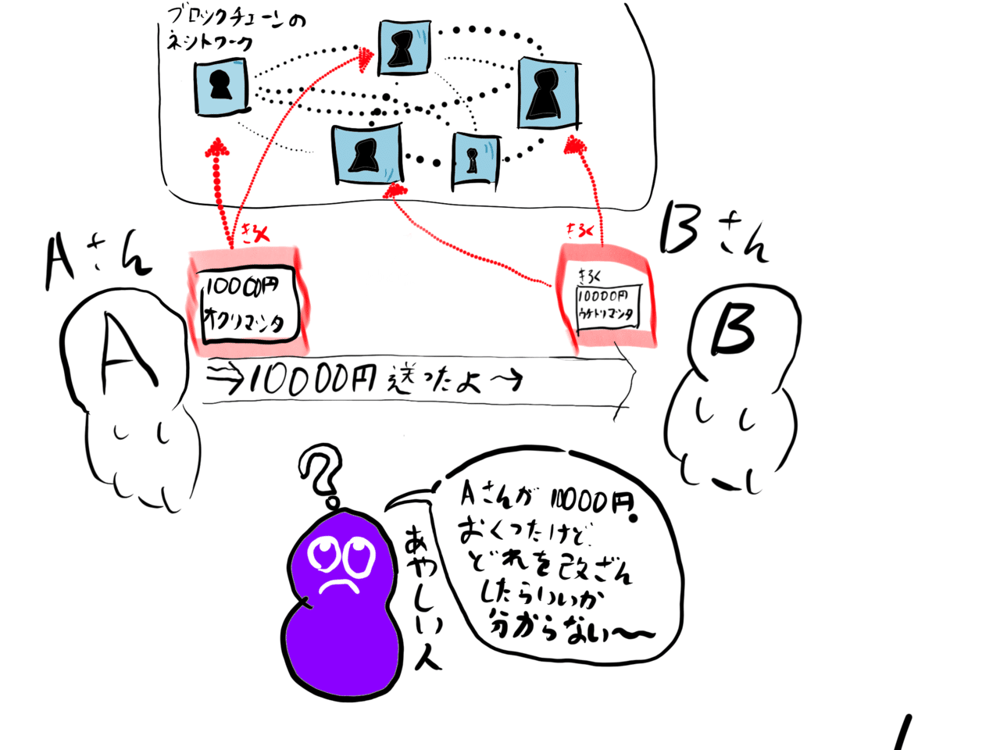
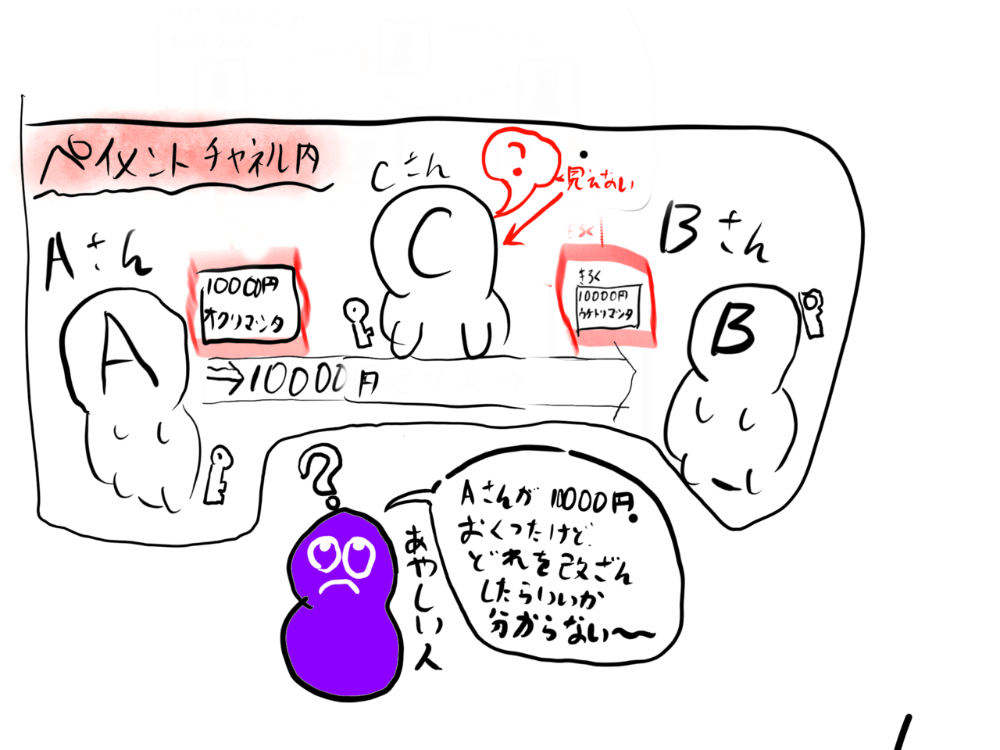

# How to Conduct Bitcoin Transactions Without Using Blockchain (Off-Chain)

> This article is a re-upload of an article I wrote a while ago.

When people hear the term cryptocurrency, many likely think of blockchain. Recently, I researched transactions that do not use blockchain, and I have summarized my findings.

## What is Blockchain?

Blockchain can be simply explained in the real world as...

It looks something like this.

First, person A conducts a transaction with person B.

Since the transaction was carried out correctly, it must be recorded.

The records kept are very important; if stolen, it would be disastrous. Therefore, we decide to store these transaction records in several safes located all around the world.

The safes are made of reinforced glass, so everyone can see them.

This makes it difficult to tamper with the transaction records. And they all lived happily ever after.

...This use of blockchain is referred to as on-chain.

Huh? If there's on, then there must be off too?

It's okay. There definitely is.

## What is Off-Chain?

Now, let's get to the main topic: what is off-chain?

Off-chain refers to methods of conducting transactions without the use of the blockchain I just described.

Records are stored in an internal database. This means that in terms of security, it is overwhelmingly inferior. However, the speed of transactions is significantly improved, going from 10 to 20 minutes to just a few seconds.

Even so, doing nothing is still dangerous, so encryption technology is incorporated. A payment channel is created, and in that room are persons A, B, and C. All of them hold keys, and a transaction cannot be completed without all three present. When this payment channel is initiated, person A has 10,000 yen, and person B has 10,000 yen, and when the transaction is completed, the internal distribution ratio changes. For instance, person A could end up with 0 yen, and person B with 20,000 yen. Finally, by uploading this distribution ratio to the blockchain, the transaction fees are minimal, and money can be sent quickly.

## Example Application of Off-Chain #1

In exchanges, countless transactions are conducted every second. Since the value of cryptocurrencies fluctuates quickly, it is safer to conduct transactions as fast as possible. Additionally, data uploaded to the blockchain is difficult to delete, so if personal information is mistakenly uploaded, there is no turning back. Therefore, cryptocurrency exchanges seem to have decided to upload only the final result to the blockchain.

## Example Application of Off-Chain #2

Recently, I have been using something called a Lightning Wallet, which also utilizes off-chain technology. You might think it’s just a name with "lightning" in it, but I believe it's entirely different. Unlike wallets that record each transaction, this only records the final result. This is more convenient for sending small amounts of money.

The advantages of off-chain transactions are lower fees and faster sending times.

On-chain transactions require payment to the miners who created the blockchain, which incurs fees.

However, being simply off-chain poses risks of tampering, so security is maintained through encryption technology.
