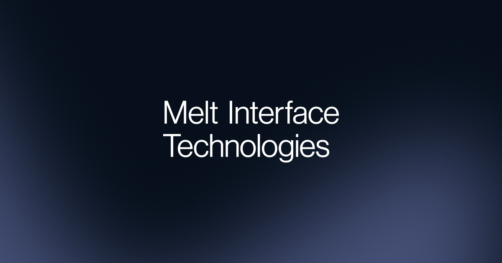

> [[en/works/diver-x|Diver-X]] has changed its company name to Melt Interface Technologies

## What we do

Our core business remains the same as [[en/works/diver-x|Diver-X]], but we have become a company that builds interfaces connecting people and machines on a broader scale, not limited to HID devices.

[Melt Interface Technologies Inc.](https://melt-interface-technologies.com/)

Melt Interface Technologiesは、人間とコンピュータの“接点”にこそ、体験と生産性を左右する大きな可能性が宿ると考えています。私たちは、人間の力を最大限に引き出す革新的なインターフェースを創り続けます。

I'm helping as a part-time worker while attending [[en/works/keio|University]].

### Products I'm involved with

I continue to develop software under the Melt Interface brand, mainly things like Melt Studio, which is used to control the Melt Mouse.
<https://www.melt-interface.com/melt-mouse>
