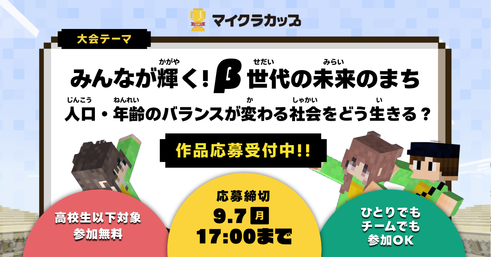

[[ja/misc/minecraftcup|Minecraftカップ]]は、小学生から高校生以下の子どもたちを対象に、教育版マインクラフト（Minecraft Education）を使ってテーマに沿った作品を作り、全国・海外から応募して競い合う日本で開催しているデジタルものづくりコンテストです。

友人数人とともにマインクラフトの技術力や考える力などを競うコンペティションで、ファイナリスト＆インプレス子供とIT賞を受賞しました。

<iframe src="https://www.youtube.com/embed/GiaGSsDVwUw?si=b9FD9Jvkyo5KrTY3" title="YouTube video player" frameborder="0" allow="accelerometer; autoplay; clipboard-write; encrypted-media; gyroscope; picture-in-picture; web-share" referrerpolicy="strict-origin-when-cross-origin" allowfullscreen></iframe>

ファイナリストということで、取材していただいたりもしています。

[Minecraftカップ全国大会コミュニティで「Minecraftカップ入賞者から聞いてみよう」をテーマにオンライン交流会を行いました | Minecraftカップ(マイクラカップ)](https://minecraftcup.com/2185/)

FacebookグループのMinecraftカップ全国大会コミュニティで、 11月29日に昨年度のファイナリスト チーム逸般人 （いっぱんじん）のメンバーをゲストに、オンライン交流会を行いました。 ▼当日の流れ（20:00から1時間ほど開催

マイクラカップを通した出場は自分にとって大きな転換点だと思っています。特に、2024年の[[ja/accomplishments/mitoujr-2024|未踏ジュニア]]のきっかけはここから来ていると言っても過言ではありません。パンデミックで自宅から出られず、友達と参加したという小さなきっかけだったのです😆

２０２５年現在は、卒業生？として運営主体である[[ja/works/dmcouncil|デジタルものづくり協議会(DMCouncil)]]で色々お手伝いもしています。関東付近で開催されるイベント等で手伝っていたり、顔を出していたりしているので、ぜひ探してみてください。
