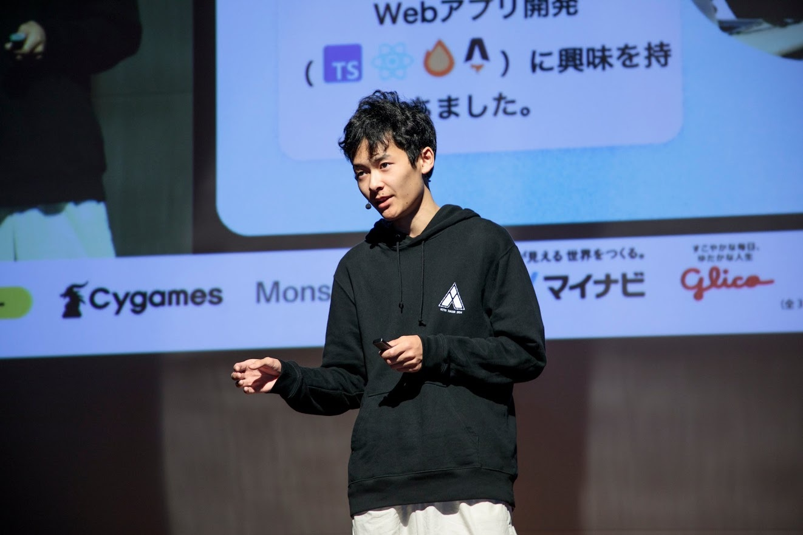
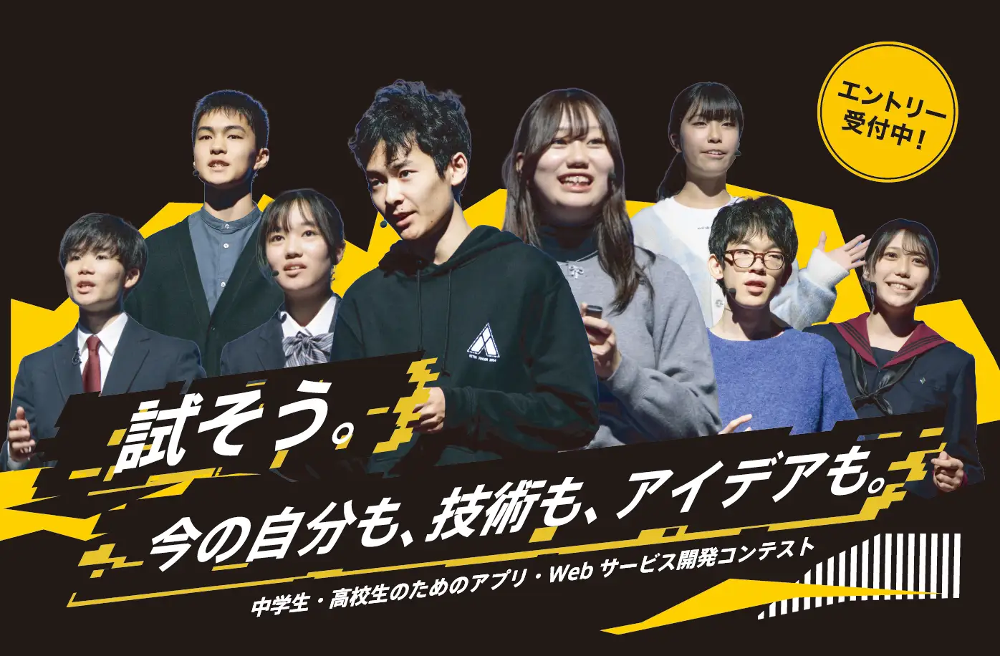

## アプリ甲子園とは

> 「アプリ甲子園」は、次世代を担う若手クリエーターの発掘と健全な育成支援を目的として、2011 年より開催しているアプリ開発コンテストです。

> 決勝大会では、開発部門で勝ち残った小中高生アプリ開発者が一堂に会して、公開プレゼンテーションを行います。
> 過去の大会では、様々な分野で活躍する審査員がアプリの企画力を審査、
> その後、端末上で実際にアプリを操作したり、ソースコードを確認しながら実装力を採点し、優秀な作品を選出。

> 毎年、未来のスターが大会から生まれています。

## 成果

&#xA;アプリ甲子園って決勝大会では、プレゼン暗記しないといけないんですよね（少なくとも 2024 年はそうだった）。自分暗記めちゃめちゃ苦手なので、正直いって最悪でした。
まあ結果として優勝したのですが、個人的にはプレゼン全然覚えられなくて、パフォーマンスを十分に引き出せず、ちょっと苦い経験になりました。プレゼン自体の流れは覚えられるわけですが、一句ずつ覚えるのが無理なんです。
自分は、限られた時間で伝えたい事を伝え切るのが他人と比べて苦手だと思っているので、基本的に、プレゼンの時は毎回原稿を書いて、読みながら全てプレゼンするようにしています。事前にじっくり考えて、伝えるための言葉を選んで、自分が納得いった伝え方をできるように心がけているわけです。なので、原稿に書いていない言葉をその場で考えながら喋るのは、あんまりやりたくないんです。（伝わるけど、変な言い回ししちゃったり、伝わりにくくなる気がするので）

アプリ甲子園以外でプレゼン丸暗記する必要が生じたことが今まで１度もなかったので、まあこれはこれで経験だな、と思っています。

## 成果

「TutoriaLLM」は、AI との対話を通じて子どもたちがプログラミングを学べるサービスで、高度な技術力とシンプルな UI が評価されました。技術チャレンジ点では 100 点を獲得しています。

> プログラミングスクールで講師をしていた際に必要性を感じて開発したサービスとのことで、「教える」という新しい視点からの開発であること、非常に高度な技術を使いながらシンプルな UI に徹した技術力の高さが評価されました。
> 『TutoriaLLM』は技術チャレンジ点で脅威の 100 点をたたき出し、技術賞も受賞しています。 - [アプリブ](https://app-liv.jp/articles/153341/#:~:text=%E3%81%A8%E6%80%9D%E3%81%84%E3%81%BE%E3%81%99%E3%80%82-,AI%E9%96%8B%E7%99%BA%E9%83%A8%E9%96%80%E3%81%AE%E5%84%AA%E5%8B%9D%E3%81%AF%E3%80%81%E5%B0%8F%E4%B8%AD%E5%AD%A6%E7%94%9F%E3%81%AE%E3%81%9F%E3%82%81,%E3%82%82%E5%8F%97%E8%B3%9E%E3%81%97%E3%81%A6%E3%81%84%E3%81%BE%E3%81%99%E3%80%82\&text=%E3%82%82%E3%81%A8%E3%82%82%E3%81%A8%E3%81%AF%E9%9B%A3%E3%81%97%E3%81%84UI%E3%81%A7,%E5%AE%9F%E8%A3%85%E3%81%A7%E3%81%8D%E3%82%8B%E3%82%88%E3%81%86%E9%A0%91%E5%BC%B5%E3%82%8A%E3%81%BE%E3%81%99%E3%80%82)

次年度(2025)の写真の真ん中に載りました。やったね。&#xA;

