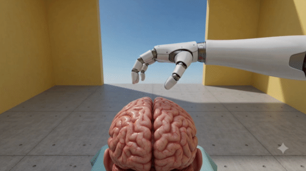

夢から覚めた瞬間、まだ記憶があって、寝ぼけながらも覚えていることをボイスメモで記録として作成していたらしい。あとで見返したら謎文章すぎて気持ち悪いなあと思いつつも、普段の自分ではかけないような内容だったのでここに書き記しておく。

## 本文（原文ママ

病院に行って開頭手術をした
自分のどこが悪かったのか知らないけど、病院行って頭を開けて、そこに電気を与えながら自分の脳活動が有利かつ優れたものになるように電気刺激を用いて調整するという手術を行った。
これを言われた通りの炎を想像すると、それが視界に移るから、それをやり続けるだけでいいと言われた。映像が本当に妙に綺麗に繋がっていておかしいと思いそうだった。しかし、映像を2つくらい見たところで、ものすごい疲労感が出てきて。結局途中でやめてしまった。それは大丈夫？

ちょっと日本語が崩壊しているのは面白いので寝言録音とかやってみようかな
