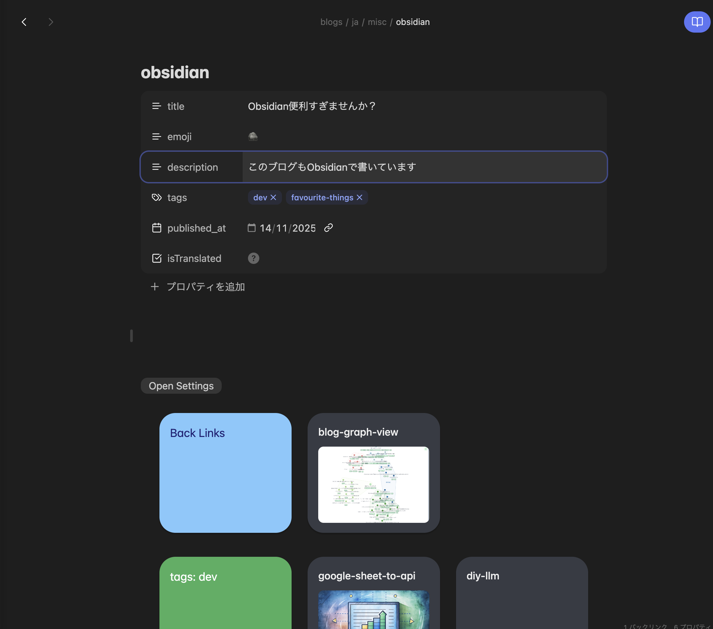

&#xA;Obsidianが便利すぎます。

## Obsidianってなに

- 基本機能はNotionと同じで、[[ja/tech/markdown|Markdown]]を使って記述する
- Notionは、階層でデータを保存していくイメージで、Obsidianでは、記事間のリンクなどでデータを構造化するイメージ
- Notionのほうがぶっちゃけ機能は豊富なんだけど、Obsidianはローカル動作する&明らかにNotionより軽量
  - Notionの機能を使いこなせない&特定の機能とかAPIが欲しい自分にとってピッタリだった
- 見た目とか、挙動とかを、コミュニティが開発したテーマやプラグインで制御できる
