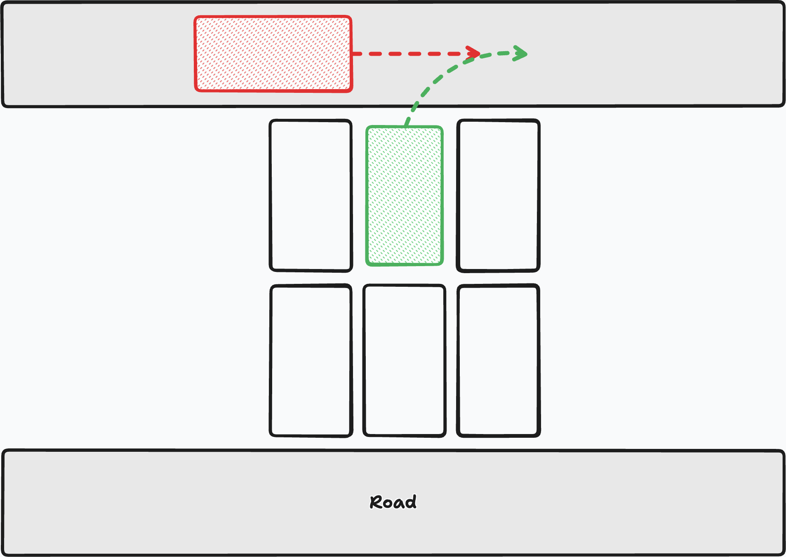
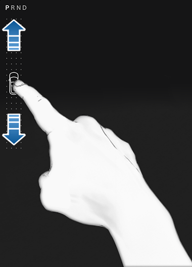
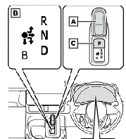
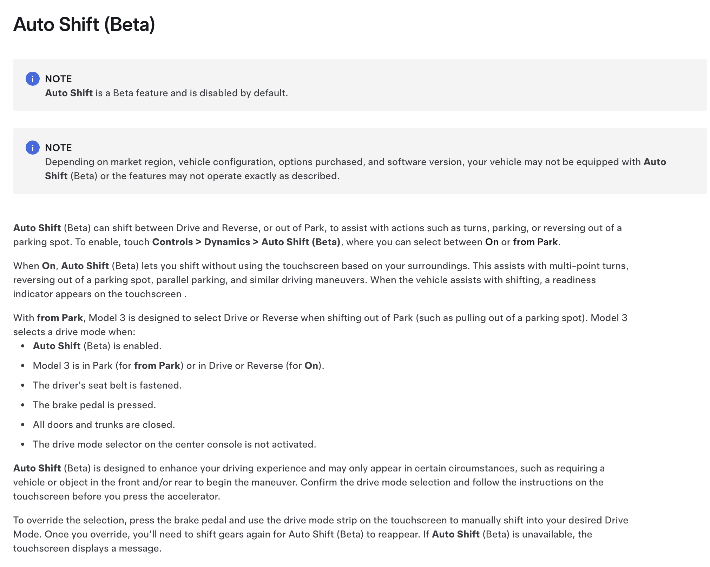

今日、Teslaを運転しようとして車に乗って、いつも通り前に発進しようとしたら、後ろ向きに走り出してめちゃめちゃ焦った。

Teslaには、**オートシフト**という機能があって、ブレーキを踏んだら自動でシフトを切り替えてくれるんだよね。物理シフトレバーが元々付いておらず、シフト切り替えが割と不便なので、ブレーキペダルを踏むだけで自動的にドライブに入るっていうのは結構良い体験。周囲の障害物や状況を元にどちらに進むべきかを判断して動くものだ。

ってことで日常的に使って割と慣れてきたのだが、今日、問題は起きた。スーパーの駐車場で前に行こうとブレーキペダルを踏んで、アクセルを踏んだら後ろに…進んだのだ！！

ガチで焦った。普通に前に行くつもりでアクセルを踏んでいたので、もし後ろに車がいたら普通に突っ込んでいた…。マジで怖かった。

ちなみにこの車は自分の家族の所有物な上に新車（先月納車）なので、マジで傷付けたら終わる。

改めて状況を整理すると、当時、駐車場はめちゃめちゃスカスカで、周りに1台もいないが、前に走行中の車がいるような状況だった。

この瞬間ブレーキを踏んだことで、きっとシステムは、「ああ、前に車がいて、後ろが空いているから、きっと後ろに行くのだろう…」と判断したのだろう。甘い！！！甘すぎる。後ろは普通に駐車スペースで、下には車止めがあるんだよ…。

また、気づかなかったのには他にも理由がある。普通だったら車はピーピーいったり、リバースに入れた時だけの音が鳴るはずだ。しかし、テスラは、前に行く時と後ろに行く時でほとんど同じような「ポポッ」みたいな音が鳴る。若干違ったはずだけど、注意して聞かないと気づかないような音だ。もっと「ピー！！」とか鳴らしてよ！！

加えて、画面上でインジケーターが占める割合は非常に小さく、一度目を留めて確認しないと分からないレベルだ。前の車だったら手で触ってわかったんだけどな。

Tesla

こんな小さい車インジケーターだけで分かる？色すらついていないよ。

モーター制御だし、物理的なシフトノブを付けるくらいならモニター上で選択させた方がパーツ数は減るし、あとから変えがきくという点では良いのかもしれない。ただ、ユーザーに対して明確に提供している情報が視覚を通してのみとなっている上に、その視覚情報もめちゃめちゃ気づきにくいとなると、誤発信の危険性は非常に高くなると思う。普通にプリウスミサイル（高齢者やプリウスに慣れていないドライバーがプリウスの分かりにくいエレクトロシフトマチックを誤って操作する誤発進の略称）よりも危険な気がする。

Toyota

だって、現在の選択しているシフトの状態が触覚で判断できないのに加えて、テスラはそのシフト操作を省略させることができるわけだし。せめて操作を人間にやらせていれば、テスラの場合は前に進むときは前にスワイプしないといけないので。

まあ機能としては便利だし、自分も使っちゃっていたけど、これ、人間が意図している方向と完全に一致してくれないといけないので、1回のミスが致命的な被害を引き起こすことになってしまう。

また、このシステムは空間そのものではなく、条件的に認識しているのだろう。FSDのように、いろんな状況を加味していれば、こんなことにはならない気もする。今だけなのだろうか。

気になって改めてマニュアルに目を通す。よくマニュアルを見てほしい。

Tesla owner's manual

…”Beta”と書いてある。初めて見たとき、「なんかベータって書いてあって先進的だなあ」程度（笑）に思っていたのだが、開発者目線でこの意味を考えてみよう。きっと開発者は「うーん、これ、完璧には動いてくれないけど割と便利だから、とりあえずベータって書いてリリースするか！」と思っていたのだろう。

これ、リリースから数年経っている機能らしく、それでも今なおこのようなご判断が続いているとなると、テスラも本腰を入れて開発しているわけではないんだろうなあ。これをもっと賢くする前にFSD側に上位互換を実装した方が良いと考えているのかもしれない。

とりあえず、しばらくはこの機能をオフにしようと思う。便利だよ？この機能はめちゃめちゃ便利だと思うし、廃止しろとは言わない。

巷ではテスラの先進的な見た目を高く評価する人もいるけど、ぶっちゃけコストカットしまくっているだけなのと、FSDを使うのが前提のような感じなので、いろいろ対策する方法があるにも関わらずミニマルなデザインを重視してそれすらも省いているテスラのインターフェースは、人間のミスを抑えるという点では**最悪のインターフェース**なのかもしれない。自分の場合、今回のようなミスがあったので、当面は安全対策として、手動シフトにして、画面をスワイプする操作を挟もうと思う。（現在のソフトウェアではそれ以上の対策のしようがない）

でも割と、私たち…というか自分もこういう人間のミスを誘発するインターフェースを作っているから、人のことは言えない。車のように、ひとつのミスが重大な結果（誰かを死なせたり、自分が死んでしまったり、あるいは重大な損害を及ぼす）を招く可能性が高いものの場合は尚更だ。工学って難しいね。（何の話だっけ）
