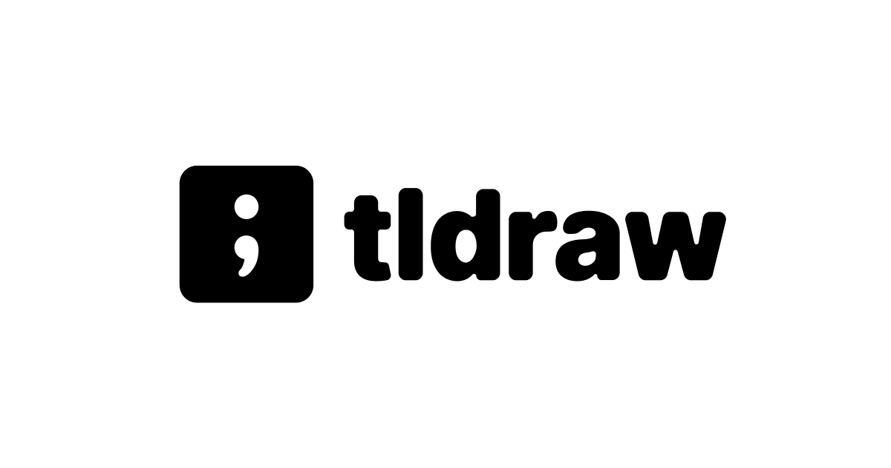

[tldraw](https://www.tldraw.com/)

A free and instant collaborative whiteboarding tool.

Miro を使うほどでもないし、適当にみんなでブレストしたりできる無料のやつないかな〜って言うので見つけたやつ。

[[ja/misc/websocket|Websocket]]?のような技術を使って、クライアント間をつないでくれるので、みんなでワイワイ編集できる（この辺の技術はすごいよなーと思う）

excalidraw という似たようなのもある。この辺は結構探したら多そうな気はする。
