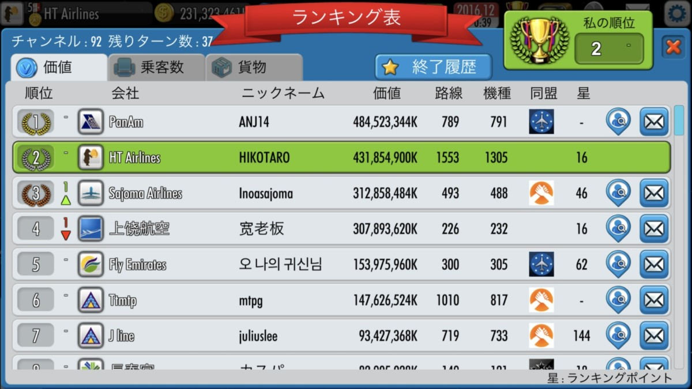
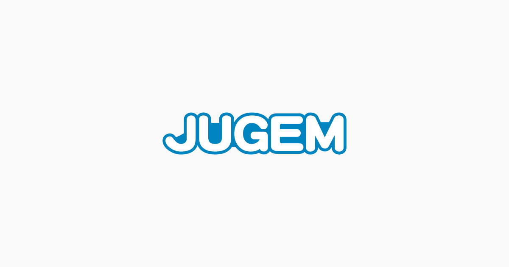

**※この記事は執筆中ですので今後内容が変わる可能性があります。**

いろいろな記事を読んで、やってみて、一番うまくいった例を紹介します。難しい言葉が多いので初心者は wiki とかを見てください。

## 1 ターン目（６０年代）の攻略

1 ターン目（６０年代）の攻略

**開幕した瞬間から販売終了するまで TU104 をできるだけ買い**、707-120 をできるだけリースする。必要であればクレジットを換金するのもあり。
そして、707F を 1 機購入し、超近距離の大都市路線を作り、貨物クエスト２つを 1 ターン目でクリア。余裕があれば追加購入する
（例　ロンドン～パリ、ニューヨーク～ボストン　など）
TU104 が生産終了したら、需要の高い（大都市間の独占路線）路線を 737,727 に置き換え。そして、収入が増えたら DC-8-62 と 707 を中心に買います。

707 はリースのみで、買い直す必要はありません。

リースした 707 は、**会社の価値にはならず**、**不利**になるので、**75 年くらいになったらリースは全て売却します。なお、今後リースは一切使わないでください。**

## 1971

この前買った**TU104 は全て売却**します。ここからは**長距離・貨物メイン**に切り替えます。

ここからは**７０００キロ以上の路線が儲かります**。DC-8 系は座席数が少ないので小さい規模の路線に移動し、東京〜ロンドン規模の路線に 747-100、**繁忙期の純利益が５０万を超えて**いれば東京〜ニューヨークのような**超長距離路線もここで開拓**します。**たまに廃課金勢がいる**のでそういう時は**諦めます**。**諦めないでその人の次**を目指します。**1971 年には DC-10-30F が発売**します。**最強クラスの機体**なので１ターンで 10〜20 機のペースで買います。なぜそんなに急ぐかというと、1972 年から経済状況が悪化し、収入が半分くらいに減るからです。それでも資金に余裕があるなら IL-62M を購入し、今後に備えた路線開設を行います。価値と満足度が低いので多くても 30 機程度にしておきます。

## **1972**

**経済危機が発生して、収益が減ります。ここは最初の難関です。弱い会社**はここで潰れます。**基本的にうまくいけば赤字になることはなく**、月１５万以上は儲かっているはずです。ちなみにここでいう赤字というのは、**減価償却費が総収益を上回っている**ということです。　もしあなたが赤字でも他のプレイヤーはもっと酷いので、きっと放置するだけで順位が上がっていくでしょう。余裕があれば月１機のペースで DC-10-30F を買います。経済レベルが落ちているので儲かりませんが、逆に言えばここが路線開拓のチャンスです。

## 1973

7 月には**経済危機が終了**し、１０月には**L-1011-500 が発売**されます。収益も増え、敵もまた、稼ぎ始めるので、**ここでいかに差をつけるかが重要**です。危機が開けたらすぐさまに１ターン 10\~20 機のペースで**L-1011-500 と DC-10-30F を買います。**

L-1011 は中小都市から大都市または中都市へ、経由便を使用して路線開設します。IL62M で開拓した路線が 100%になったらそれも置き換えます。

**L-1011 で 747 用の大規模路線を確保しておき、747 が登場したら置き換えるという手もありです。**

## 1974

DC-8 の満足度が下がってきたはずなので、**DC8-62 は IL-62M**に、**61 は DC-10 か、大きすぎるのであれば余った機材でやりくり**しましょう。（競合していなければそのまま壊れるまで使っても問題ないです。）DC8-から**IL-62M**にする理由としては、**資金をこれだけに割くことができない**からです。それでも**１路線 4000 ほど儲けられるのには変わりはない**ので、できるだけ**安いもの**にして、**減価償却を抑えます**。

離脱した DC8 たちは、売却するか、もし空いているのであれば新規路線を開拓します。あまり売りすぎると、会社の価値が下がるので注意。

## 1975\~1980

この辺で**400\~500 路線**ほどになっているのがベストです。このタイミングで買った方がいい機材は、**747-200、DC-10-30、L-1011-500、IL-62M**です。小型機に関しては、寿命がきたりしない限りは、**改装するだけ**にしておきます。これ以降はロンドン\~フランクフルトのような**大規模路線が見つからない限り**、短距離路線を開設するのは**やめましょう**。**スロット取得に時間がかかるからです。**

**長距離** - IL62M, L-1011-500 / 747-200
**中距離** - 747-100 / DC-10-30 / L-1011-500
**短距離** - MD-81 / DC-10-30 / 747-100

置き換えについてです。DC-8-61 と DC-8-62 がそろそろ古くなってくるので、**残り 50 週間**を目安に置き換えを始めます。**１ターン５機ずつ**くらいです。**早め早めに手を打っておかないと、墜落する**ので要注意。

貨物に関しては、**搭乗率１００%の 707 を、DC10-30 に置き換え**て、残り**は新規路線開設**に回します。そうでないところは、DC-8-70F に置き換えます。

1980 年 5 月からは、**原油価格が上昇する**ので、ここでも**順位**を**大幅に上げる**ことができます。

## 1980\~1985

L-1011 が約 100 機程度になったら、買うのはやめ、767-200 の登場を待ちます。

この時代の理想の航空機リストです。

747-100 は古くなっているので、747-200 を短距離用に改装し、747-300 を長距離用に回します。

**長距離** - IL62M, L-1011→767 / 747-100→747-300
**中距離** - L-1011→767 / DC-10-30
**短距離** - MD-81 / DC-10-30 / 747-200

**参考**

[エアタイクーンオンライン2wiki](https://ato2jp.wiki.fc2.com/)

エアタイクーンオンライン2は全世界のプレイヤーと対戦し世界中に航空網を作り、利益をあげてゆくオンライン型の航空会社経営シミュレーションゲームです。

[【エアタイクーンオンライン2 】攻略！無課金でもTOP3常連になれる経営方法 | とりひこライフ](https://torihikolife.com/air-tycoon-online2-tips)

航空会社経営ゲームの『エアタイクーンオンライン2 』。 課金無しでもやり方次第で上位に入る事ができて、中々やり

[【ATO2】新規参入～1960年代の経営](https://rapidliner-tips.tumblr.com/post/120598553870/ato2-1960)

要点 1960年の早い時期のチャンネルに参入する、場合によっては今あるチャンネルへの参入を控えるのも手 最初の拠点は北米か欧州がいいのではないか 投資は最大限に 1960年代は1ターン1時間 1963年11月まで、ひたすらTU-104を買い揃えていく 路線開設はメッシュ型で TU-104の生産終了後から、高需要路線の機体をB707-120やDC-8-11に置き換える B727-100QFがリリースさ...

[ATO2 航路開設の際の注意点やポイント](http://simgametips.blogspot.com/2017/02/blog-post_15.html)

長い文章ですが、このポイントに従えば会社はあっという間におおきくなります！ 航路開設の基本 まず、航路は基本的に 独占航路のみ開設 していきます。 特に序盤は、これを徹底していきましょう。ライバルに構うだけ、お金の無駄です。もし ライバルが競合してきた場合は、さっさと撤退...

<https://air-tycoon-online.fandom.com/wiki/Aircraft>

[�ץ쥤�䡼�ι�ά - �������������󥪥�饤�� ����wiki](https://seesaawiki.jp/airtycoononline/d/%A5%D7%A5%EC%A5%A4%A5%E4%A1%BC%A4%CE%B9%B6%CE%AC)

������˵��ܤ��빶ά�ϡ��桼�����γ����󤬤��줾��˹ͤ����ȼ��ι�άˡ�Ǥ��Τǡ������ι�άˡ��100���������Ȥϸ����ޤ��󡣤����ޤǻ������٤��ɤ�褦�ˤ��Ƥ����������кѴ����ι������������Ǻ�...

[M\&A | �������������󥪥�饤��2��ά�֥���](http://ato2game.jugem.jp/?eid=4)

�Ҷ���ҷбĥ��ߥ�֥������������󥪥�饤��2�פι�ά�ȥץ졼�����Ǥ����ܤ��ܤ������档

: )
