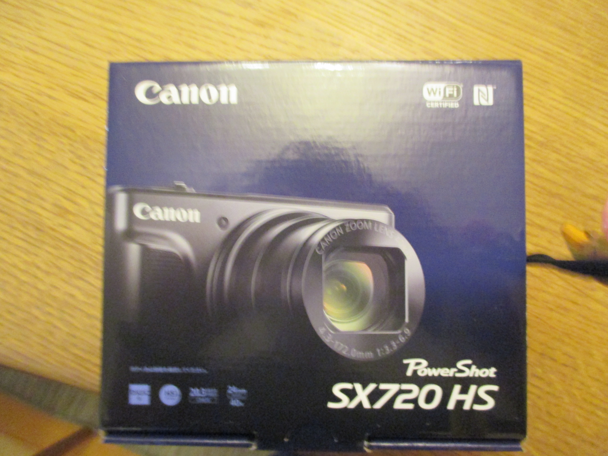
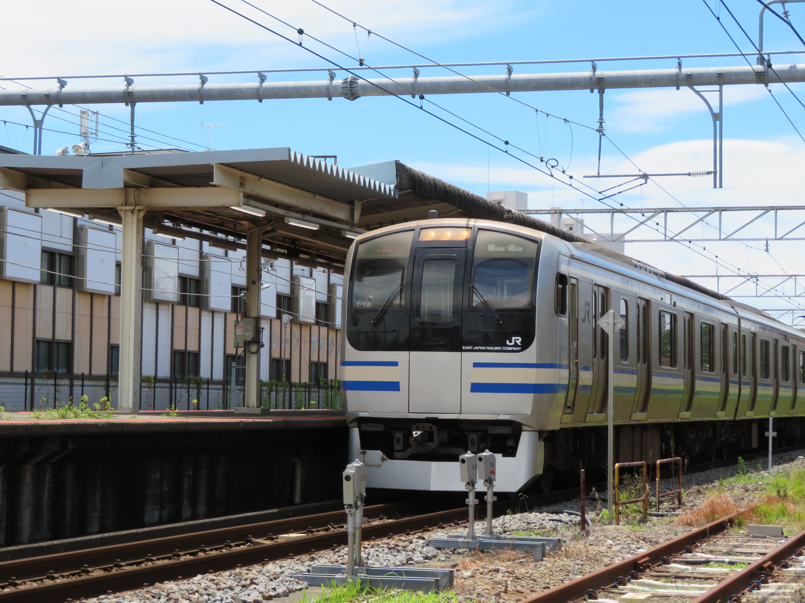
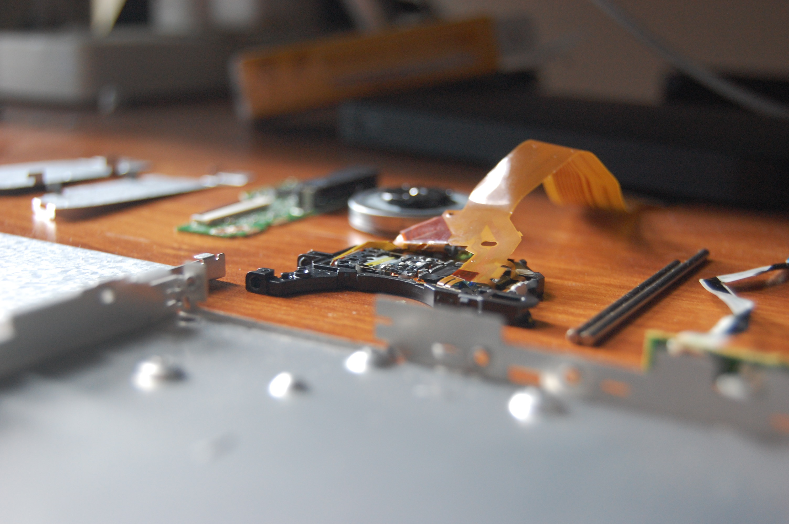
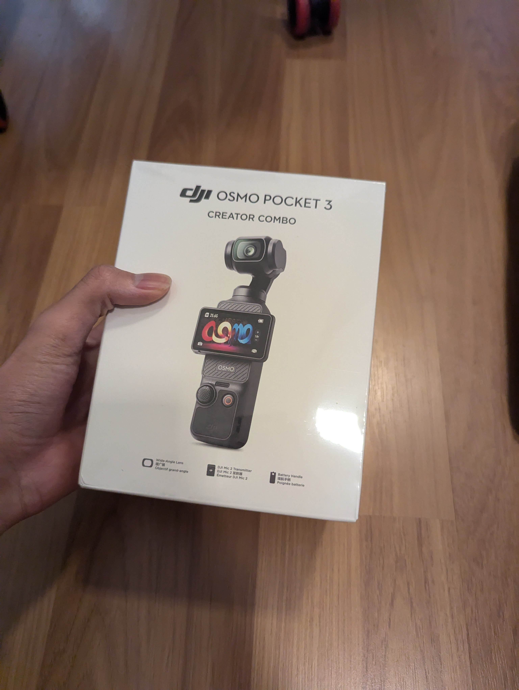
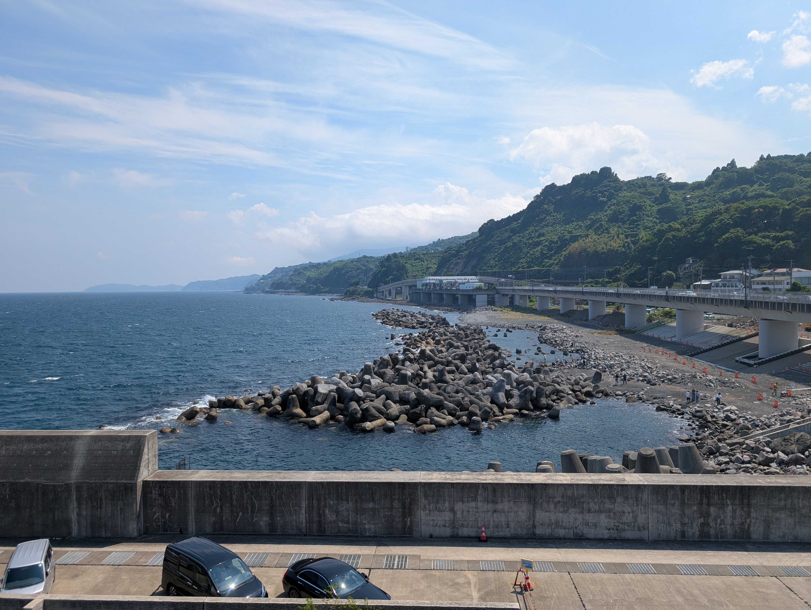
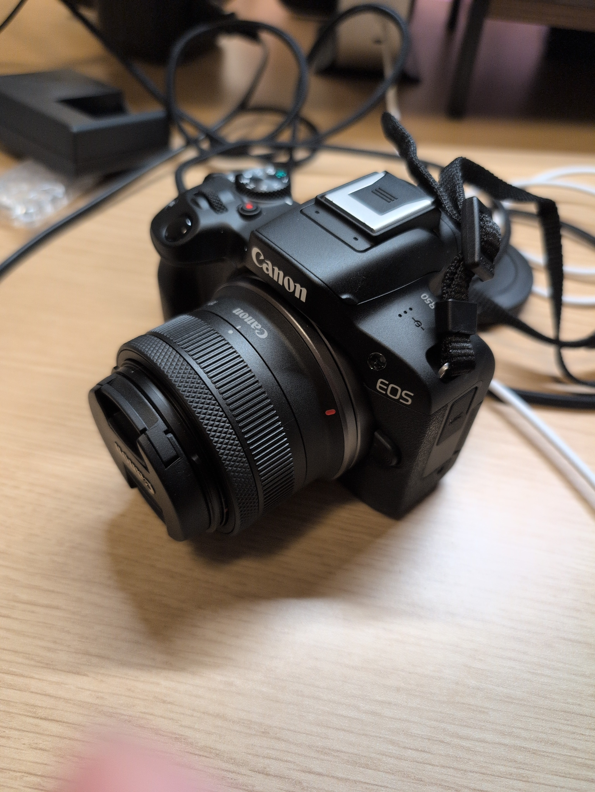
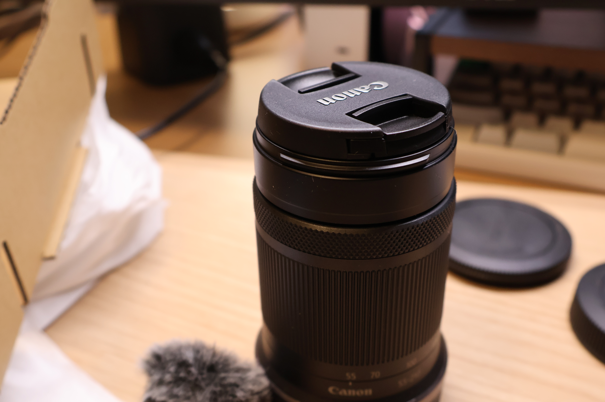
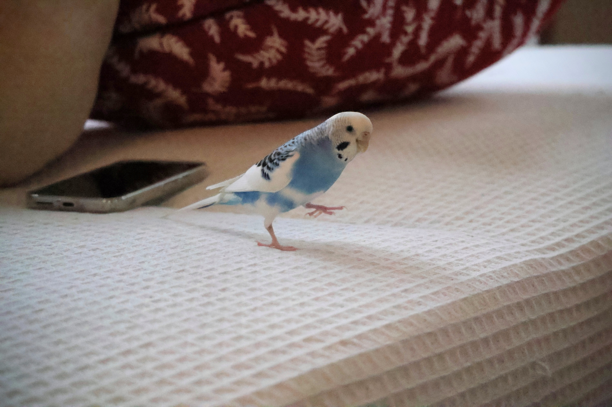

以前[[ja/misc/wishlist-2025-12|欲しいものが買えない]]とか言っていたんだけど、[[ja/works/diver-x|アルバイト]]を始めて、自分のやりたいことをやらせてもらいながら、ぼちぼちお金が貯まってきた。
ということで、カメラを買おうかなと思っている。

え？VR買わないのかって？~~バイト先にBigScreenが置いてあってそれ以外VRだと思えなくなってしまったので当面は買わない~~なんて言えないけど、いぜん売ってしまった過去があるので、先にカメラかなあ。

予算は１５万以内。カメラと言ってもあの、スマホとかのレベルじゃない、いい感じのボケ感と、適度に所有欲を満たしてくれて、性能のせいで撮れないということが起きないものが欲しい。

## 過去に買ったカメラたち

まず、新しいやつを買う前に、過去を振り返る。

### IXY 130

2014年、自分が色々なものにつよい興味と関心を持ち始めた頃、両親から誕生日プレゼントかクリスマスプレゼントで買ってもらったもの（誕生日が12月15日なのでプレゼントがよく「マージ」される）。12000円。8歳の少年に12000円のカメラって、安くない。

シンプルな操作、限定された機能、それでいておもちゃの子供向けカメラと違ってちゃんと撮れるし、光学ズームもある。
いわゆるコンデジで、今のスマホカメラ以下の画質だけど、大事な思い出だ。&#xA;

&#xA;初めて撮った（人に見せられる）写真は、小学3年生の春休みに北海道に旅行に行ったときの写真。飛行機に乗っているときのワクワク感を思い出す。当時は親がJALの特典航空券で連れて行ってくれてたので、飛行機に乗るという体験は、快適で、ワクワクしていた。airasia（東南アジアの国際LCC）に6時間乗って、だんだんお尻の感覚がなくなっていくような苦痛を感じている今とは大違いだ。

当時は今みたいに常にスマホのようなデバイスを身に着けていなかったし自分が意図して画像などの媒体で記録をする方法がこれしかなかった。

### Power shot SX720 HS

&#xA;その後、2019年。さすがに5年使って知恵もついたので、カメラの性能が足りないと感じるようになってきた。
またクリスマスプレゼント兼誕生日プレゼントで、買ってもらったカメラになる。36000円。中学生相手にこの値段のカメラを買ってくれる両親が本当にすごい（当時はあまりお金を稼ぐ大変さを知らなかった）と思う。

&#xA;画質が良くなって撮り鉄に目覚めたかもしれない。時代を感じるE217系。もうこの線路は走っていない。望遠っていいよね。

このカメラは、一度水没させて修理に出した記憶がある。

でも、IXY130程は使わなかったんだよね。
中学生になって、両親にスマホを買ってもらって、それで大体のことは事足りるようになった。はじめてのスマホだったiPhone 7 (auで実質０円スマホみたいなやつ）の性能には驚かされた。3万以上するコンデジとはいえ、今考えると3万程度（エントリークラスに近い）。当時勢いを増してきていたスマホの内蔵カメラといい勝負になってきてしまっていた。
ボケ感はまったくないし、ぶっちゃけ勝っている部分は...
と思ったけど、このカメラに、なんと手のひらサイズで光学40倍ズームという機能があって、それはすごい重宝している。

その後、POCO X3というスマホや、Google Pixel 6などのカメラがたくさん付いてるスマホなどを使い始めて、あんまりカメラ専用機は使わなくなってきていた。

### Nikon D40

ただ、スマホを使っているうちにボケ感が写真の印象を大きく変えると感じるようになって、なんとかしてそれをできるようにする方法はないかなと思うようになった。スマホのAI補正的なやつとか、ポートレートモードは被写体を検出して、強制的にボケ感をつけていたりするけど、やっぱりあの光学的に発生するボケ感とは大きく異なるように感じた。

家の押し入れからは、ほこりをかぶった一眼レフ、Nikon D40が出てきた。昔親が使っていたものだ。

&#xA;DVDドライブをなぜか突然分解したときのやつ
ボケ感がやっぱりいいね。

状態はかなり良くて、すべての機能が完璧に動いた。これもそこそこ触っていて、小さな物体とかを撮っていた。センサーの特性的に、色合いもなんかフィルムっぽい、いわゆる「エモい」（語彙力の欠如）写真になる。とはいえAFはあるけど実質マニュアルだし、暗所撮影は弱い、というか、ノイズがすごい。家から持ち出して取りまくることはあんまりしなかった。設定を頑張っていじって、手をブレないように押さえて、光量を気をつけて、シャッターを押すっていうのも楽しいっちゃ楽しい。

### Osmo Pocket 3

カメラ、というものを意識し始めたのは2024年からかもしれない。
スマホカメラで満足していたんだけど、[[ja/accomplishments/mitoujr-2024|未踏ジュニア]]で自分の作ったものや、話している様子を撮影して、それを世界中に伝える（インターネットに対して）ことになって、スマホカメラに若干の限界を感じるようになってきた。３０分撮影したらスマホは撮影が止まっちゃう。

なので、未踏ジュニアの予算でOsmo Pocket 3を買った。当時、発表会とかをライブストリーミングでやっていたんだけど、その時にこのカメラは活躍してくれたりしていた。今でもこれはかなり活躍していて、どこにでも持っていくので、本体にヒビが入ってしまっている😱

このカメラは本当に手軽に使えて、小さいから、今もよくカバンに入っている。UXが良すぎるんだよね。細かい設定はあまりできないけど、動画がサクッと撮れる。静止画に関しても、場合によってはスマホカメラよりも良いかも？もちろん、広角、望遠はない（広角にするアタッチメントはある）し、最近のPixelみたいな存在しない物体が見えるくらい強力なAI補正などは存在しない。

### Pixel 9 Pro

最早カメラ専用機ではなく、スマホでも十分撮りたいものが撮れる時代になったと感じたのはPixel 9からだろうか。
高校を卒業して初めて自腹で買ったスマホ。

Pixel 9 Proは相当レベルが高くて、HDR機能がすごく気に入ってる。撮った写真の明るさ情報が、スマホのプレビューでも表示されるんだよね。

&#xA;最近小田原に行った時のやつ。HDR表示に対応したデバイスを使うと、画像の一部分明るくなるはず。

ぶっちゃけ近距離ならこれでいいと思うし、結構満足している。撮りたいと思ったときにさっと撮れるのが良い。設定できる項目が多くないし、全部おまかせだけど、たくさん撮って、編集せずに、たくさんネットにあげるほうな時代には、このほうがよかったりする。

## もっと良い写真が撮りたい

で、今のでも十分良いんだけど、静止画に関してはもっと良い写真が撮りたいと思うことが時々ある。周りの人がカメラを持っていて、撮らせてもらうと、やっぱりスマホのカメラと比べても全然違うんだよね。

１年くらいこれは迷い続けていて、カメラを買うお金のつもりで１５万円くらいは一応確保してあった。

自分はよく親に金遣いが荒いと言われたり、贅沢をしているとよく言われるし、うちの家族は趣味に何十万もお金をかける人がいない。継続するような趣味や娯楽がちょっとばかり少ない家なのかもしれない。いや、自分があまり見てこなかっただけかもしれないけど。とにかく、そういう人が家にいなかったので、買い渋っていた。いや、ほかにも理由はあるけど。

べつにそれ自体は生きていくのになくてもよくて、お金にならないと思われていても、それは人生を豊かにしてくれることもあると自分はまだ思っているからなあ。

なので、とりあえずカメラを買おうかなーと思っている。要するに、物欲。そしてカメラはPay to Winの要素が大きいと思っているので、やっぱりレンズ交換式のカメラが欲しい。

### 初めてのカメラ選定

カメラの知識は浅いから、入門機がいいかなと思った。
ただ、カメラに触れる機会は、先述のように、友達のSONY α7IVとか、[[ja/works/dmcouncil|イベントの時とか人手が足りなくて]]つかったBlackMagicのやつとか、あとはROS R5（だったかな？）とか、[[ja/works/keio|大学]]で借りたEOS R6 Mark II とか使っていた。つまり、先に高いものに触れてしまったんだよね。なので、安い入門機を店頭で触るとその差を強く意識してしまう。

そのせいで自分で買うカメラを選ぶときにもすごく悩んでしまう。実家ぐらしなのでわりとバイト代を貯めていくことができるけど、とはいえ貯めているお金の都合上キットレンズ含めて15万くらいが限界だと思っている。

それで探すと、

- Nikon Z50
- EOS R50
- Nikon Zfc
- Sony a6400
  といった感じになった。
  他にも色々あるけど、評判とバランス、コスパ的に言うとこのへんなのかな。

でもこの中で、EOS R50は飛び抜けてコスパが良く感じる。店頭でも触ったけどAFの速度は上位機種に近いし、なおかつ発売も新しい。個人的にはNikonのメカっぽい感じのほうが好みだったけど、カバンの後ろに放り込んで、いつでも持っていけるような手軽さという点で言うと結局EOS R50かなという感じになった。これで、IXY, Power shot, EOSというブランドの順で買っていくことになった。違うメーカーも気になっていたけど結局Canonに落ち着くのかもしれない。

## カメラを買いに行く

始めはAmazonで買えばいいかなーと思考停止していたんだけど、まだ１９歳でカードの上限が１０万から上がらないから支払いができないのと、家電量販店でセールの情報を見たので、そこに買いに行くことにした。そもそもAmazonの安い出品は大体マーケットプレイス経由で、保証周りが怪しそうだったので、こういうときは家電量販店はつよいなと感じた。

キットレンズ２本入り（ズームレンズ、望遠）のものにした。

家電量販店での価格は約12.5万円。レンズ２本でこれは安い気がする。キャッシュバック入れたらもうちょっと安い。Amazonのマーケットプレイスはさすがにやめて、最近あまり行ってなかった家電量販店に足を運んだ。

ポイントとか、周辺のカメラ用品とかを合わせて買うかどうかとかを決めるのに数時間かかった。

家に帰ってニコニコで開封した時の様子

<iframe width="540" height="960" class="short-video"
 src="https://www.youtube.com/embed/aPxdIrruxHA" title="EOS R50 Unboxing 📸" frameborder="0" allow="accelerometer; autoplay; clipboard-write; encrypted-media; gyroscope; picture-in-picture; web-share" referrerpolicy="strict-origin-when-cross-origin" allowfullscreen></iframe>

本体はすごく小型で、Powershotと同じくらい。

&#xA;このサイズでどこまでの写真が撮れるかは今後自分が知ることになると思う

&#xA;記念すべき1枚目（正確に言うとこの前に3枚撮ったけどSDカードをフォーマットしたので消えた）

&#xA;雨の日の午前中、薄暗い室内でトコトコ走るインコ。 f5.0, 1/1600s 55.00mm ISO20000。
思っていたほどノイズは乗ってない。
インコの走る速度、なかなか速い（普通に人の歩行速度と同じくらいで歩くこともある）ので、シャッタースピードを相当上げないと撮れない。

このカメラを買ったけど、どうなるのか、まだ分からない。でも、やっぱりこういう買い物って楽しいよね！
