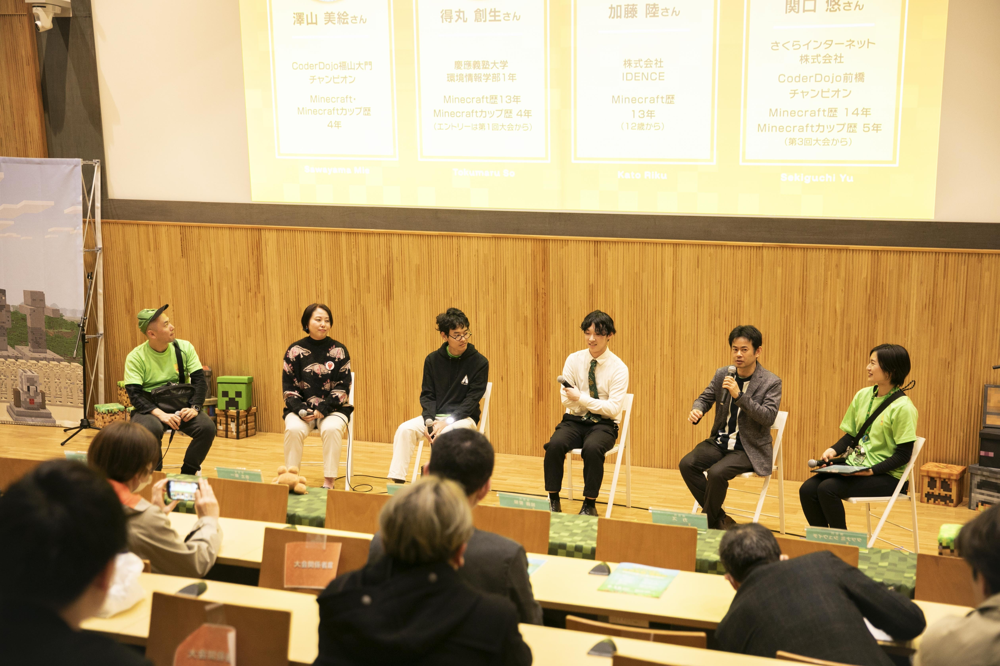
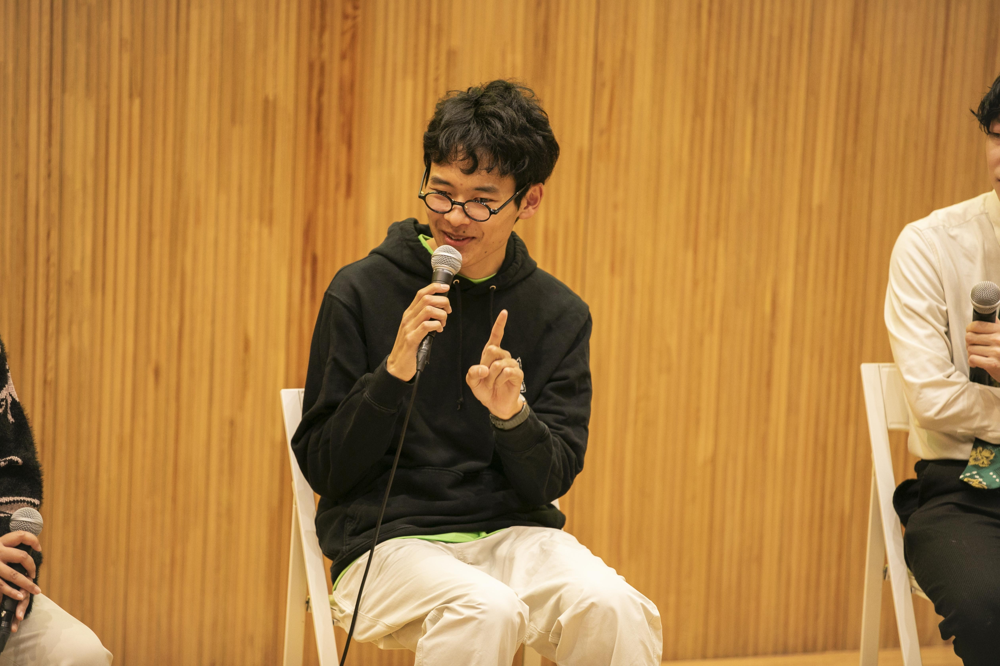
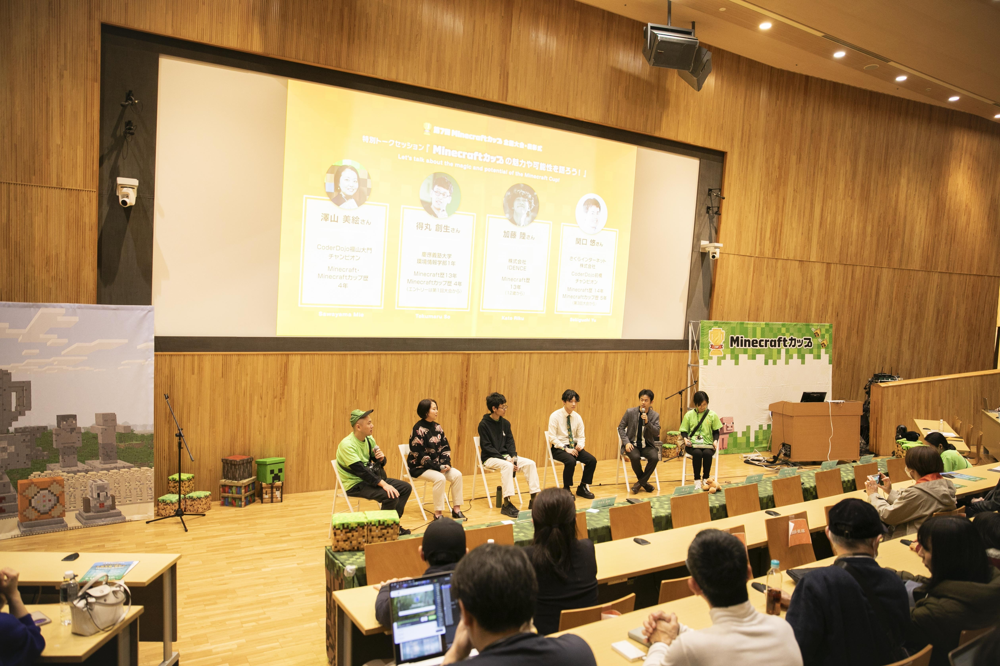
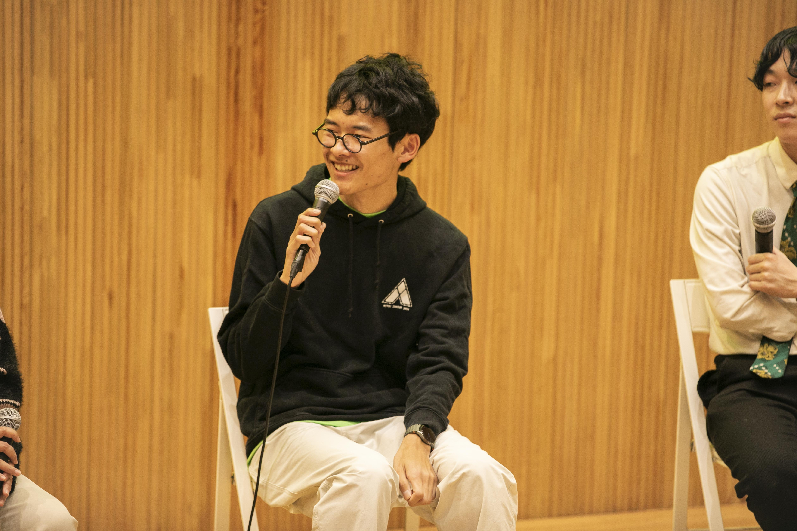
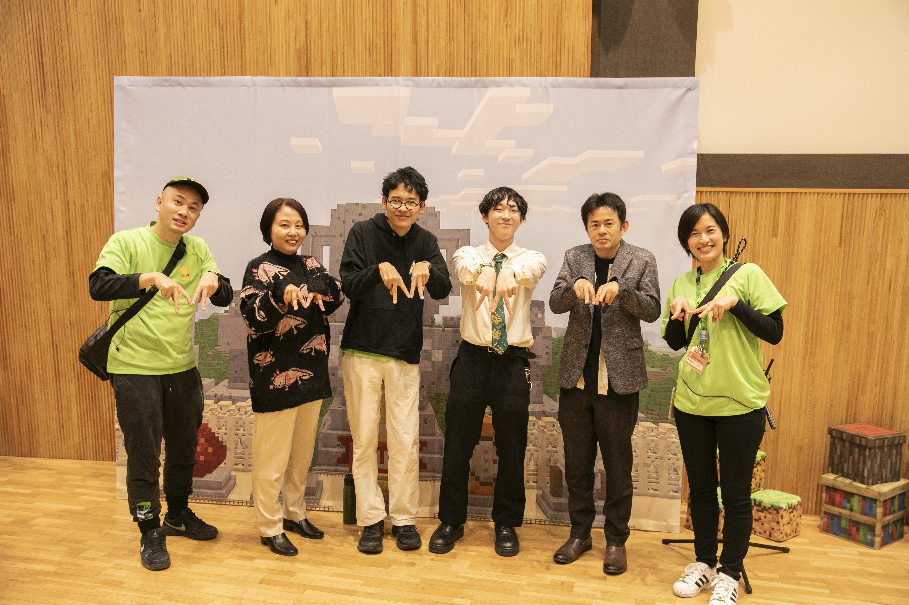

## マイクラカップでトークセッションに出ました

先日東京大学(情報学環、福武ホール)で開催された[第7回Minecraftカップ](https://minecraftcup.com/)のトークセッションに登壇し、「マイクラからの学びと創造の力」をテーマに、マイクラを通して得たものについて議論しました。

### マイクラカップとは

> [[en/misc/minecraftcup|Minecraftカップ]]は、小学生から高校生以下の子どもたちを対象に、教育版マインクラフト（Minecraft Education）を使ってテーマに沿った作品を作り、全国・海外から応募して競い合う日本で開催しているデジタルものづくりコンテストです。

<iframe width="560" height="315" src="https://www.youtube.com/embed/YLvSMQJ5ts4?si=eLEb6pMmD0r2ifQN" title="YouTube video player" frameborder="0" allow="accelerometer; autoplay; clipboard-write; encrypted-media; gyroscope; picture-in-picture; web-share" referrerpolicy="strict-origin-when-cross-origin" allowfullscreen></iframe>

<https://www.youtube.com/live/YLvSMQJ5ts4?si=N6HOi4Ih0_-dYf0G&t=15685>

### トークセッションの概要

&#xA;左から、運営事務局の土井さん、CoderDojo福山大門のチャンピオンである澤山さん、過去出場者である私、株式会社IDENCEの加藤さん、さくらインターネット/CoderDojo前橋チャンピオンである関口さん、そして一番右が運営事務局の栗原さん、という並びです。

私は過去にマイクラカップに３回参加しており、[[ja/accomplishments/minecraftcup-2023|第5回Minecraftカップ(2023)]]で奨励賞受賞、[[ja/accomplishments/minecraftcup-2021| 第3回Minecraftカップ(2021)]]で全国大会出場&受賞といった感じで、それからどうなったか？みたいなことを喋っていました。

トークセッションに出たよ！というお知らせと併せて、自分とマイクラカップの関係や、マイクラ（特にマイクラカップ）で得たものなどをここで書き残しておこうと思います。

本セッション時点でのマイクラカップが関連したざっくり肩書きとしては、マイクラカップで受賞後、[[ja/works/keio|慶應義塾大学環境情報学部(SFC)]]に入学したソフトウェアエンジニア、となります。ソフトウェアエンジニアと言っても最近はもうAIにコードを書かせる時代なので、もはやこういった肩書きも消えそうですが。

ここ数ヶ月はマイクラカップ([[ja/works/dmcouncil|デジタルものづくり協議会]])でアルバイトとしても来ていたので、ゲストとして話しつつも、実は裏側でも手伝っていました。トークセッションの際、パーカーの隙間からスタッフが着ているマイクラカップTシャツがチラチラ見えています。

前日ワクワクしすぎたせいで4時間睡眠&運営のお手伝いを不慣れな中やっていたため、また、スケジュールの合間のトークセッションということでちょっと緊張していました。また、トークセッションって、プレゼンなどと違って内容が決まっていないので、新鮮な機会でした。こんな貴重な体験をさせていただけるとは...

## 私とマイクラカップの関わり

&#xA;マイクラカップで受賞したのは[[ja/accomplishments/minecraftcup-2021|2021年]]になります。また、最終的に受賞に至らなかった回([[ja/accomplishments/minecraftcup-2023|2023年]])や、作品は作ったけど提出までできなかった回(2019年)などもあります。うまくいくときも、うまくいかない時もあります。マイクラカップ（まちづくり部門は）基本的にチームで出場するのですが、揉めたり、連携がうまく取れなかったり、最終的にモチベーションがなくなったりで、私のチームでうまくいったのは2021年だけなんですよね。

<https://minecraftcup.com>

### どんなチームだったか？

技術面が上手な人、デザインとか設計が強い人、マイクラにとどまらず広く浅くの知識を持っている人、みたいな感じで集まっていて、それこそ運営母体の名前にもある「デジタルものづくり」が好きな人たちでチームは構成していました。

また、学校に行っていなかったり、みんなが「普通」だと思うことができなかったり、逆に何かすごい才能を持っていたりするような凸凹のあるような人たちでした。ちなみに自分はもともと不登校気味な感じでした。

で、これが悪いか？というとそうでもなくって、2021年のマイクラカップはコロナでオンライン授業だったり、そもそも学校がなかったりで自由な時間があったので、それが追い風となってチーム全員大喜びでマイクラでデジタルものづくりを楽しめたんですよね。

また、初めは指導者がいなかったという点も特徴かなと思っています。友達とゲームで遊んでいたところがきっかけにだんだんチームができてきたような感じだったので、別にプログラミング教室とか全く行ってないし、誰かに強制されたわけでもなく、ただゲームが好きな友達とマイクラをやっていたら、こういう場所があって、そこに飛び込んだら、親切な大人がたくさんいて、成長できたという...両親はマイクラをやらせようとしてたわけではなかったけど、かといって全否定していたわけでもありませんでした。よく「ゲームは1日30分」みたいな香川県の条例みたいなことを言ってはいたけれど、親なりにどういった方法が良いのかというのを悩んでいた感じで、結果として、自分の知的好奇心を満たせる環境になっていたんですよね。それは運が良かったなと思っています。

## マイクラカップの効果

で、そのあとどうなったかというところですが、現在は信じられないことに大学生をやっています。[[ja/works/keio|慶應義塾大学環境情報学部(SFC)]]というところで、学校苦手だった自分が皆勤賞レベルで通うことができているという場所になります。楽しいです。
一般的なお勉強（いわゆる高校までの授業）が比較的苦手だった自分ですが、好きなことなら無限にできる自信がありました。最近はそういった個性も認められてきているということで大学受験などでも活用することができます。（慶應ではAO入試と呼ぶ）大学って本当に素晴らしいところで、自分の好きなことや興味あることばっかり学び、突き詰めることができます。

### マイクラカップ後の経過

また、マイクラカップ以降のおもな経過としてですが

- [[ja/works/yago.inc|プログラミング教室でのアルバイト]]から始まり
- その後、プログラミング教育を通して知った課題などをもとに[[ja/accomplishments/mitoujr-2024|応募し、採択された未踏ジュニア]]と、そこで作った時ものを出して受賞した[[ja/accomplishments/teens-apps-awards|アプリ甲子園2024]]
- その後入学した[[ja/works/keio|慶應義塾大学環境情報学部(SFC)]]
  という流れになっています。

自分は、マイクラカップがきっかけとなって得たものがこういうかたちになっているというのは、とても良い結果だと思っています。もちろんマイクラカップが全てではないし、それ以外でもいろいろな人に出会っているわけですが、1つの要素としてそれがあるのは間違いないかなと思っています。

&#xA;現在はマイクラカップの出場対象年齢を超えているので、今度はそういった輪をもっと世界中に広げていく活動もできたらなと思っています。大学とかでちょっと忙しかったり、自分のやりたいこともあるので常にいるわけではありませんが、できる範囲でお手伝いしていきます！東京をベースに動いていて、たまにイベントとかで出没するので、よかったらぜひ声をかけてください〜。
