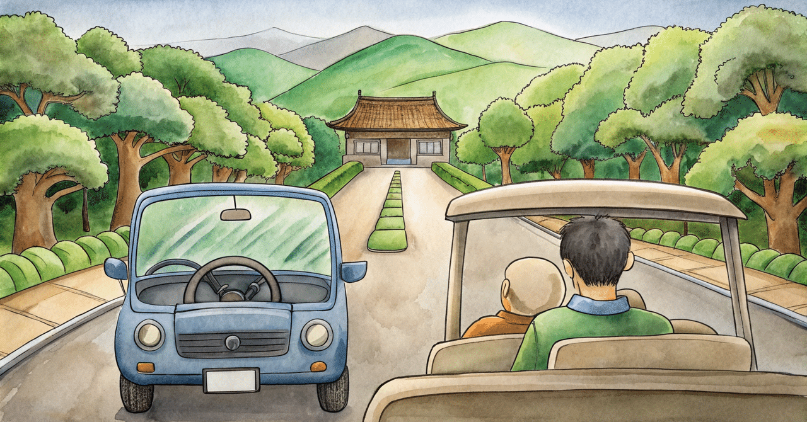
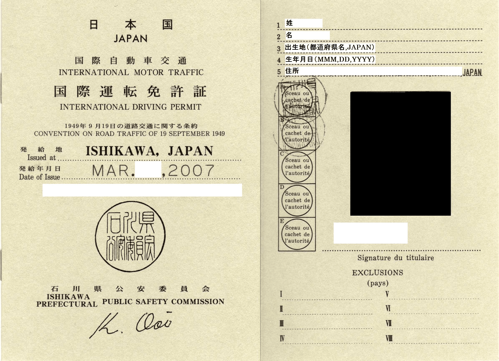
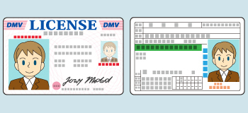
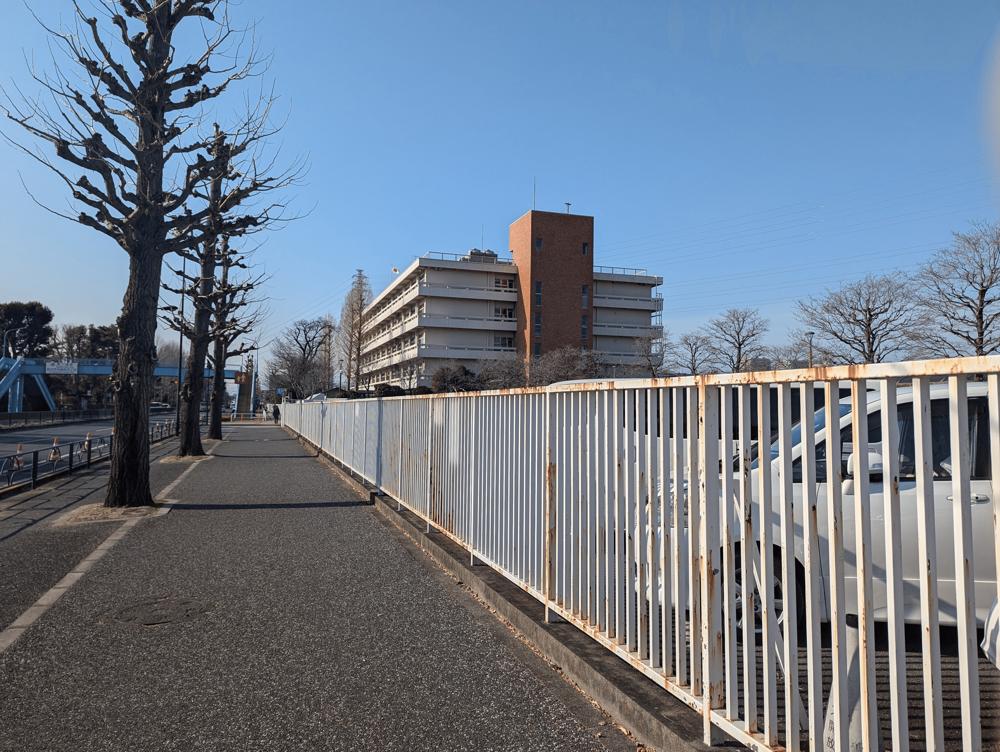
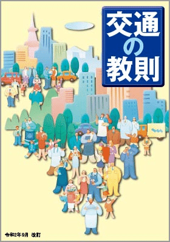
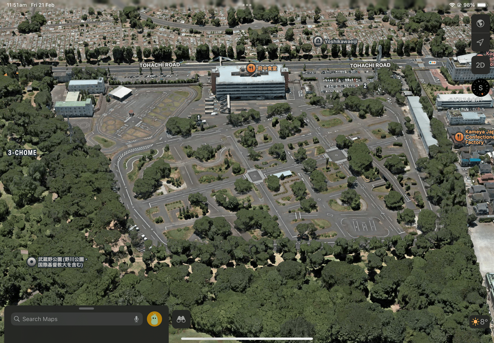
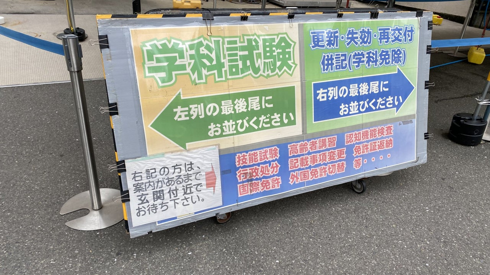
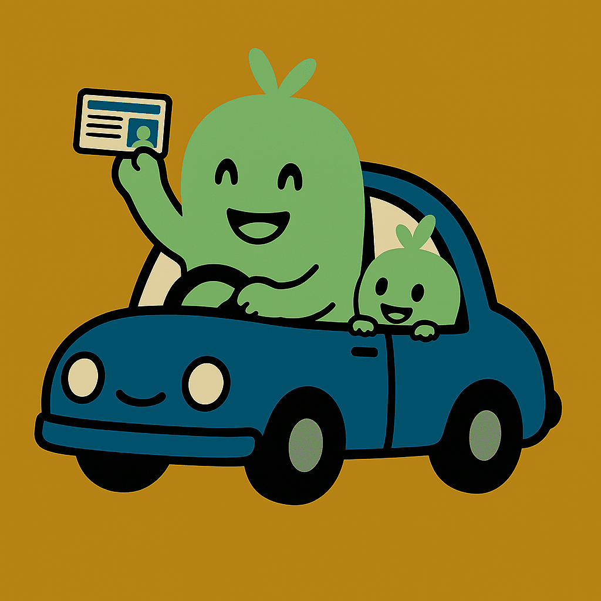
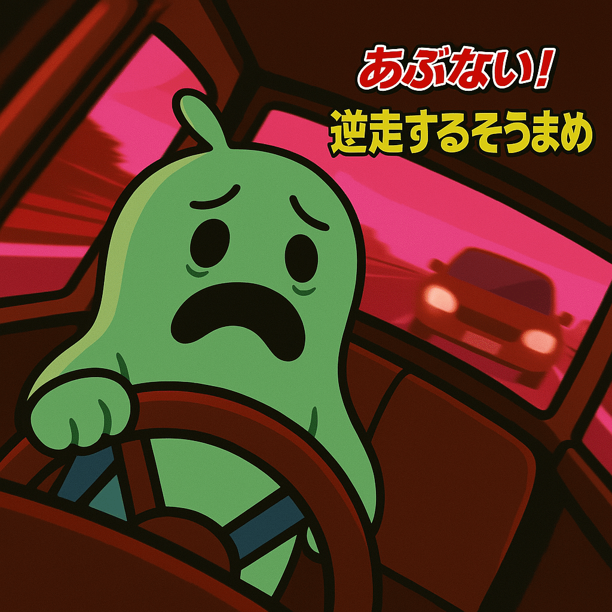

# 【外免切り替え】マレーシアの免許を日本の免許に書き換えてみた

こんにちは、18歳のそうまめです。
5年ほどマレーシアに住んでいましたが、1月末をもって日本に帰国して、外国の免許を日本の免許に書き換えて、日本で車を運転することができたので、ここに書き記しておきます。

> 2025年3月現在、外国人の免許切り替えの申請が増えており、外免切り替えのルールも変わっているそうなので、最新情報は警視庁・各都道府県警察のページをご確認ください。本ページの情報はあくまでも個人的な視点に基づいたものです。間違っていると思われる場合はご連絡いただけると幸いです。

## はじめに

### 外免切り替えとは？

簡単に言ってしまえば、外国で取得した免許を、日本の免許に書き換えることができる制度です。このような制度は世界中にあります。
2025年3月時点の日本においては、外免切り替えには３つの方法があります。「知識確認、技能確認を免除する国等（29か国等）」、「技能確認を免除する国等」、「その他の国」です。

[外国で取得した運転免許証を日本の運転免許証に切り替えるには 警視庁](https://www.keishicho.metro.tokyo.lg.jp/menkyo/menkyo/kokugai/kokugai05.html)

### 対象国等について

基本的にほとんどの国の免許の書き換えが可能ですが、一部の国では、すべての試験が免除されます。大半はアメリカ・ヨーロッパ、オーストラリアなどの欧米諸国となっており、アジア・アフリカ等の国は試験（学科・技能）を受ける必要があるみたいです。

私がいたマレーシアは免除国ではなかったので、全ての試験を受ける必要があります。どういう基準でこれを決めているかはわかりませんが、マレーシアなどのアジアの国は、欧米諸国よりも事故率が高かったりする（実際、マレーシアはめちゃめちゃ危ない方だと思います…）ので、追加で試験を受ける必要があるみたいですね。

### 私の場合（マレーシア）

私は17歳の時にマレーシアで免許を取って、18歳の時に日本に戻ってきて免許を取るという感じでした。

[マレーシアで免許取ってみた｜So Tokumaru](https://note.com/soto9/n/n52d25b33f6b7)

こんにちは。17歳のそうまめです。先日（と言ってもだいぶ前ですが）、マレーシアで免許を取ることができたので、どうやって取ったかここに書き記しておきます。初めに言っておきますが、マレーシアでは17歳から普通自動車免許が取れますので、そこは承知の上で読んでください。 私の知人からマレーシアでの免許の取り方について、質問がありましたので自分の個人的な感想や体験をまとめています。 申し込み まずはどこの自動車教習所で習うかを決める必要があるのですが、私はMetro Driving Academyというところにしました。知人から紹介されたものなのであまりよく考えずに選びましたが、ここ

詳細は省きますが、マレーシアでは、結構簡単に、そして安く免許を取ることができるので、それを日本で変換すれば、コスパ良く免許が取れるよね、ってことでやった感じです。マレーシアでは、教習所によりますが4\~6万円程度で免許が取れ、30万円ほどする日本と比べると破格の安さとなっています。後述の安全性の問題などがあるため、一概にお勧めできるとはいえませんが、海外で学んで免許を取るという経験はとても面白かったです。

### すでに日本で免許を持っていた（失効した）場合はどうなる？

私のように日本で新規取得する場合は０からやるわけですが、すでに日本で持っていて、海外に渡航している間に失効したケースなどでは、国に関係なく、簡単な検査のみで免許を復活させられるみたいです
本記事では言及していないので、代わりに別記事を紹介します：

[マレーシアの運転免許証から日本の運転免許証に切り替えた｜きんちゃん/Kinchan](https://note.com/kinchan1110/n/nb51b0d9650f1)

昨日（2020年9月16日）、神奈川県警察運転免許センターにて、マレーシアの運転免許証から日本の運転免許証に切り替えの手続きを行い、無事、日本の運転免許証を手にすることができました。 神奈川県警察/外国の運転免許から日本の運転免許への切替手続について 外国の運転免許から日本の運転免許への切替手続について掲載しています。（神奈川県警察） www\.police.pref.kanagawa.jp 実際には、神奈川県警察運転免許センターに記載してある必要書類等だけでは不備であったため、必要書類を揃え、再び、神奈川県警察運転免許センター（以下、運転免許セン

### 国際免許では運転できないの？

海外の免許を利用して日本で運転する別の方法として国際免許があります。こちらは短期（だいたい1年くらいだったかな）の利用を想定したもので、観光で日本に来る方などはこちらを使うべきです。免許センターにも行かなくて済むので、基本的にはこちらを選択するべきだと思います。
ただ、私の場合、マレーシア内で初心者（Pライセンス）扱いでしたので、国際免許を取ることはできませんでした。

_[国際免許](https://ja.wikipedia.org/wiki/%E5%9B%BD%E9%9A%9B%E9%81%8B%E8%BB%A2%E5%85%8D%E8%A8%B1%E8%A8%BC)_

外免切り替えは、あくまでも、日本に住んで車を運転する際に行うものです。最近では、観光客が面白半分で受けているという話も散見されますが…運転するだけなら、国際免許の方をお勧めします…（まあ日本の免許が欲しい気持ちもわかるけどね）

## 書類の準備切り替えの準備は日本に帰国する前から始めました。一部の書類は日本での取得が難しいため、取得国にて書類を取得する必要があるからです。

### 準備した書類の例

持っている免許の交付国によって提出する必要のある書類はかなり違ってきます（詳しくは警察ホームページでご確認ください）。私の場合、免許本体、免許の翻訳文、住民票（本籍地の確認）、保険証（現住所の確認）、パスポート（渡航国の確認等）、卒業証書、学費の納付、学校の在籍証明などのその国にいたことの追加の証明（後述）などや、ドライビングレコードを持っていきました。

### 免許の翻訳文

免許の翻訳文の作成は、JAFやジップラスなどの指定の機関で取り扱っています。私はJAFに作成してもらったのですが、JAFは海外からの申請は受け付けておらず（申請サイトにアクセス制限がかかっている）、日本国国内からの申請のみ受け付けているので、家族や知人に頼んでもらう必要がありそうです（VPNを使えばいけるかもしれませんが…保証は無いです）。それが難しいようであれば、日本帰国後に行う必要があります。

[運転免許証の翻訳文](https://jaf.or.jp/common/visitor-procedures)

JAFが発行する各種運転免許証の翻訳文についてご案内しています。JAFは外国の運転免許証の日本の免許証への切り替えまたは翻訳文添付による国内での運転、もしくは日本の運転免許証で台湾で運転したい方に向けた翻訳文を発行しています。

[ZIPLUSの外免切替](https://ziplus.jp/switching_license/)

ジップラスでは外国運転免許から日本運転免許への切替に必要な外国免許証の「日本語翻訳文」、「技能確認対策動画」、翻訳文発行と実践的な試験対策が一度にできる「外免切替安心パッケージ」の3つのサービスで外国運転免許の切替のサポートを行います。

私の場合、家族に頼んで申請してから１週間くらいで翻訳文がメールで送られてきました。メールの番号をコンビニに行ってプリントすることで、警察に提出できる状態の文書ができます。

### 滞在国証明は注意が必要

取得からの年月はしっかりとチェックされるため、事前にその国に所定の期間（2024年時点で通算３ヶ月とされています）滞在していることを証明する書類が必要です。

パスポートだけあれば良いのでは？と思うかもしれませんが、マレーシアみたいに国境に自動化ゲートを設置している国だと、スタンプが基本的には省略されてしまい、証明が出来なくなるため、その際は可能な限り参考となる書類を集めて持っていくことをお勧めします。準備中は気づかなかったのですが、申請時に警察の方に指摘されて気づきました。

<figure name="46ba9c14-9052-4821-98db-ee282b95ea21" id="46ba9c14-9052-4821-98db-ee282b95ea21">

> **（日本の場合）
> 　パスポートの証印欄へのスタンプ（証印）は省略されます。**
>
> \*\*　スタンプ（証印）を希望される方は、自動化ゲートの通過後、出国手続時には航空機への搭乗前、帰国（上陸審査）手続時には税関検査前までに、各審査場事務室の職員にお申し付けください。\*\*

<figcaption>[https://www.moj.go.jp/isa/immigration/resources/nyuukokukanri01_00111.html](https://www.moj.go.jp/isa/immigration/resources/nyuukokukanri01_00111.html)</figcaption>

</figure>

### ドライビングレコードにも注意が必要

また、一部の国ではドライビングレコードや、その他の書類を追加書類として提出する必要があります。欧米の国の場合はわかりませんが、マレーシアなどの場合はドライビングレコードが必要になります。ドライビングレコードはマレーシア本国でしか取得できないため、気をつける必要がありそうです。マレーシアの場合は、JPJ（道路局）に行って手数料を少し払ったら発行してもらえました。

### 外国籍の場合は在留カードも

また、外国籍の方は在留カードも必要になります。在留カードを持っていないという人を見かけましたが…在留カードは常に携帯する必要があり、持っていない場合は罰金や懲役が規定されているのですが、どうなったのでしょうか…

## 予約

_府中運転免許試験場_

全ての書類をマレーシアで準備したのち、日本に帰国してすぐに手続きを始めました。先述の通り受験者がとても多く、試験にはすごく長い時間がかかるそうなので、早め早めに受けておこうと思ったからです。昔はもっと人が少なくて、なんなら当日に試験を受けられた、という方も見かけたことがあるのですが、そうは行かないみたいですね。

今はオンラインで予約ができるのですが（2025年3月現在）、私が受けた1月ごろはまだそれができず、免許センターに行く必要がありました。私が受験したときは、東京に住んでいる場合は府中試験場と鮫洲試験場が利用できることになっていました。朝寒い中試験場に並ぶのは結構辛いです。1時間くらい待って、無事に予約が取れました。ただ、この時点でも待ち期間が発生すると言われ、1月23日に行ったのですが、学科試験の受験は一番早くて2月21日だと言われました。長い。

<figure name="d9e1bd5c-ac65-4d58-b666-f6e77943fe40" id="d9e1bd5c-ac65-4d58-b666-f6e77943fe40">

> 2025年3月現在、予約はオンラインで行えるようです

<figcaption>[https://www.keishicho.metro.tokyo.lg.jp/menkyo/menkyo/kokugai/kokugai05.html](https://www.keishicho.metro.tokyo.lg.jp/menkyo/menkyo/kokugai/kokugai05.html)</figcaption>

</figure>

また、私はマレーシアでも初心者で、多分日本では仮免レベルの運転技術なので（どのような場合でも運転技術を過信してはいけないが）、なおさら気をつける必要があります。警察の方にも「しっかり勉強しておいてね」と言われました。

## 学科試験

### 本を読んで勉強する

正直言って本を読むのは嫌いなのですが、車を運転する以上、そのための知識はなくてはいけません。

_[交通の教則](https://www.jtsa.or.jp/about/teaching.html)_

[交通安全のための図書、CD、教材 - 一般財団法人 全日本交通安全協会](https://www.jtsa.or.jp/about/teaching.html)

全日本交通安全協会のページなどでは、「交通の教則」や「交通教本」のような教習所などでもらえる本を有償（100\~300円くらい）で販売しているので、そちらから本を取り寄せることにしました。一応家にも古いバージョンがあったんですが、数年前と今ではルールが変わっている（例えば、電動キックボードとかが該当する、特定小型原付のルールなどが新設されていたりします）ので、新しいものを取り寄せました。

### 受験

…という感じにしっかり勉強をして受験に行ったのですが、びっくりするほど試験問題は簡単でした。日本の試験は難しいと聞いていたのですが、外免切り替えの試験はとても簡単になっています。１０問程度のコンピューター試験で、「赤いランプに、右方向の青い矢印がついている場合、右折していいですか？」みたいな問題が出てくる感じです。変な引っ掛け問題とかはなく、本当に必要最低限の試験なんだなって感じでした。満点だったのですが、警察の方も、あ、お疲れ様ですという感じだったので、多分日本語がわかる人だったらほぼ100%通ると思います。

### 次の試験の予約

学科試験に合格したら、次は技能試験の予約となりますが、ここで奇跡が起きました。なんと２週間後に試験が受けられると言われたのです。警察官の方によると、これは相当ラッキーな方で、通常は４ヶ月待ちになっているとのことでした。技能試験は知識確認と比べて難易度が高く、何度やっても落ちる人は落ちます。技能試験は１回2000円程度で受けることができ、１から教習所に通って免許を取るより圧倒的に安いため、再試験を受ける人が多く、そのために長い待ち期間が発生しているそうです。

## 技能試験の練習

ということで試験まで２週間という短い期間しかないため、練習することにしたのですが、ここでトラブル発生。練習するところがないのです。教習所通いではないし、自宅に広大な敷地があるというわけでもないので、練習できるのは、貸しコースくらいしかないわけです。ただ、東京には一般の人、それも無免許の人が利用できる貸しコースはほとんどありません。

### 免許センターまで行って練習をしたい！

そうなると、東京都内では実質練習場所が免許センターのコース開放（毎週末に警察がコースを開放していることがあります）となるので、急いで免許センターに電話をかけました。

しかし、電話に出ない！みんな同じことを考えているので、電話がいつになってもつながりません。どうやら届出教習所（コースを持っていない、先生と車だけの教習所）が実施する教習などもここを利用するようで、予約を取るだけでも大変なようです。

1時間くらい電話をかけ続けたら、ようやく電話に出てくれました。
話を聞いたところ、自家用車と指導員（取得から3年以上経った免許所持者）を連れていくことで練習できるとのことでした。私の場合、家に車（車体サイズも規定に収まるサイズでした）があり、家族が免許を持っているので、条件は揃っています。幸いなことに、技能試験前に練習する予約を取ることができました。

### マレーシアとの違い

マレーシアと比べ、とにかく道路が狭いと思いました。あと交差点の勝手が若干違うのもちょっと慣れるのに時間がかかりそうです。大きな通りであっても自転車や歩行者のことも常に考慮しないといけない（マレーシアはあんまりいない）ですし、交通のシステム自体が違います。また、私がいたマレーシアでは左側通行だったので、そこまで違和感は感じませんでしたが、右側通行の国の場合はさらに大変かもしれません。

あと、マレーシアでは結構車が壊れるので、運転前にボンネット開けてエンジンオイル、ブレーキオイル等の確認、ドライブベルトのたわみとかを確認したり、車両に凹みがないか確認したり、ライトの灯火確認とかもするんですが、日本ではしないんですね。車検制度のおかげなんでしょうか。

### 練習内容

父親の車に同乗してもらい、練習を行いました。会場には外国の方も多く、やっぱり外免切り替えの練習をできる場所は限られているみたいです。
私はマレーシアでも運転歴が浅く、試験に合格できるか怪しかったので、ひたすらクランクとS字カーブを練習しました。

_衛星写真を使って事前にコースを把握_

注意して運転したんですが、１回小さい植木の小枝に車を当ててしまい、ちょっと傷が出来てしまいました。お父さん、ごめんね。

練習時間はあまり長くなく、1時間ほどとなってしまい、これが最初で最後の練習となりました。たった1時間の練習でペーパードライバーが日本の難しい試験を突破しろだなんて無理がある気もしますが…

## 技能試験

### 内容と難易度

2025年3月時点では、クランク、S字カーブを含む、免許センター内のコースの周回(1200メートル程度)となっていました。坂道発進、踏切、切り返しなどは省略されているみたいです。まあこの辺はどこの国でもやるので、省かれているのでしょうか。（私がいたマレーシアは鉄道が少なく、踏切が全然ないのでやりませんでしたが…）

日本の普通の免許試験を受けたことがないので、難易度は分かりませんが、かなり難しく、同乗する人も警察の方なので、いわゆる「一発試験」と同じ採点基準となります。ただ基準は厳し目とはいえ、内容はほぼ仮免試験のレベルなので、そこまで激ムズでは無いのかな？初心者でもちゃんと練習すればできるものだと思います。マレーシアのJPJ（道路局の人）を隣に乗せるよりも緊張感があります。そこまで威圧感はないんだけど…見る目が厳しいです。
態度すら採点基準に入っているんじゃないかと思って、終始ペコペコし続けていました（）

忙しいなか数十人の試験を行っているわけですし、すごく大変なお仕事だと思いました…

### 試験の様子

試験は４つくらいの車両に分かれて行いました。試験中は飲食は禁止、携帯等も使用禁止なので、気をつけましょう。

[『【運命の日】日本の運転免許へ書き換え（テスト編）』](https://ameblo.jp/youki-888/entry-12759505559.html)

こんにちは。 昨日の最後の講習が終わり、遂にやってきた「テスト」の時。 マレーシアの免許の有効期限内に行わないといけないので、この一発しかチャンスはありま…

2年くらい前に受験した方は２つの車両だったそうなので、受験者が増えたことがわかりますね。

受験者と試験官の方、次の受験者の三人で車に乗り、コースを周回します。コースは日によって違い、その場で試験官が指示してきます。日本語がわかる場合はそこまで難しくありません。

### 試験に落ちた

練習から約１週間後に、１回目の試験を受けました。

結果は不合格でした。
まずクランクのところで縁石に乗り上げてしまい、（これ自体は減点にならないっぽい？）その後に後退する際、後方の直接目視による確認を怠ったということで減点されました。さらに、その後の交差点進入時に左右を適切に確認できていないという理由でも減点され、結果として合格点を下回り、不合格になったそうです。「惜しいね〜後ちょっとだよ、ちゃんとここ覚えたら、次回行けるはず！」と言ってもらえましたが、あまりにもショックでやる気を失いました。今までクランクで乗り上げたことなんてなかったんだけどな…

緊張もありましたが、やっぱりそもそもの運転スキルが未熟だなぁと思いました。ただ、受験料は2000円くらいだし、また次受ければいいさと気を取り直して次回の予約に向かいます。

### 試験に落ちたら次の予約をすぐに取る

落ちた時、次回の予約は４ヶ月くらい先になる（混雑のため）と言われていたので、6月くらいかな〜と思っていたのですが、運が良いことに次の週に取ることができました。たまたま空いていたみたいです。ただ、次の週となると、練習はできません。どうしようか悩みに悩みましたが、受験料2000円なので、回数受けた方が良いと判断しました。車体感覚さえ気をつければ次回合格できる…はず！

自分の場合はたまたま試験がすぐ受けられたのでよかったのですが、通常は試験に落ちるたびに長い期間待つことになるので、かなり面倒なことになります。実際、何度やっても合格できない人もいると聞いたのですが、そのような場合、何年も受け続けるのでしょうか…🤔

### ２回目にして合格

とはいえ前回減点された理由はわかっていたので、あとはそこに気をつければ良いはず。練習する機会はなかったので、注意点を書き記したノートを読んで、イメトレをして試験に臨みます。まあ車体の感覚をうまく意識して、クランクでミスらなければ合格できるはずです。

試験の結果は、合格でした。嬉しいというより、ホッとしました。警察の方もよくできていましたと言っていたので、前回のポイントをしっかり復習した甲斐があったと思います。

## 免許交付

免許の交付は多分日本国内で取得した際の交付手順と同じような感じになるかと思います。

_手放し運転はやめましょう_

試験合格後、受付にて料金等を支払い、指定した受け取り時刻で準備が出来次第受け取る形となります。基本的に即日で交付されます。
外国籍の場合は本籍欄に国名が記録される形になりますが、日本人が取得し、日本に籍がある場合は普通の免許と同じく本籍の住所が記録されます。免許も全く日本のものと同じです。

初心運転者扱いだったため、ちゃんと若葉マークを車につける必要があります。

## 交付後の練習

一応免許が取れたとはいえ、マレーシアで運転している時とは環境が大きく違い、下手したら日本の仮免レベルの車体感覚で運転していると私は思いました。両親もそう思っているようで、取得から２、３週間の間は隣に両親を乗せたりして運転の練習をしていました。

_親子でドライブ_

### 車体感覚の練習

私が住んでいる世田谷区という場所は非常に狭い道路が多く、電柱などにも無数の傷跡がついています。家の周辺も、コンパクトカーでようやく通れたりするような道や、特定の場所でしかすれ違いができないような道路（一通レベルの狭さなのに、対面通行となっている）があるので、両親にそのような場所の運転法を教えてもらうことにしました。近くに住んでいる人しか通らないような狭い道では、通行の優先順位などをしっかり頭に留めておかないとスムーズに通行できなくなってしまいます。いや、道路狭すぎでしょ！！！

### 周囲の確認等

日本では周囲の確認も必須of必須です。日本という国の道路はマレーシアと比べ非常に狭いのにも関わらず、自転車やバイク、時にはキックボードが四方八方から突っ込んできます。特に子供、免許を持っていない人が運転する自転車やキックボードは後方はおろか、左右すら確認せず車道に突っ込んでくることもあるので、運転していてヒヤヒヤします。また、路駐スペースなどが無いので、人をおろしたりするときに停車する際や、発進する際は特に気を使います。一度、私が停車して家族を下ろした後に、右後方から追い越してきた車の確認を怠って発進しようとした時は、その車にぶつかりそうになってしまい、ヒヤッとしました。後方の死角確認を怠ることは事故の原因になるので、運転するときは常に行うように心がけていたし、コース内で練習しているときはいつもやっていました、しかし、実際の道路に出てみるとそれよりも情報量が圧倒的に多く、油断すると忘れてしまいそうになります。ミラーだけでなく、直接目視による死角の確認、ちゃんとしたほうが良いです。

## 保険について

あと、忘れがちですが自動車保険も見直す必要があります。
今まで両親が運転していた車は本人と配偶者に限定された保険だったので、これを家族全員が運転な可能なもの+20歳以下のドライバーを対象にするように保険のプランを変更する必要がありました。やはり20歳未満のドライバーは相対的に事故率が高く、保険料がすごく上がると言われたので、そこは覚悟しておく必要がありそうです。実際どれくらい上がるかとかは、料金シミュレーションしてみるとわかりやすいです。

## 外免切り替えについて個人的に思うこと

という感じで、海外で取得したての免許を日本で書き換えるということをしたわけですが、取得後もずっとヒヤヒヤしながら運転しています。実際にネットで外国人が運転することに対する批判などもされているわけですし、自分も実質外国人のようなものなのであんまり免許の制度に対して口出しできる身分でも無いような気もしますが…あ、そういえば選挙権って18歳からですね、じゃあ自分も関係者なので、日本の制度に口出ししても問題ないですね。

### 現行の制度は維持でいい気がするが、目的外の取得はやめてほしい

実際あまり見かけませんでしたが、ネットニュースなどでは一部の人が一時的な滞在にも関わらず免許を取得している人がいるとされています。真偽は不明ですが、運転するだけであれば国際免許で良いわけですし、本当に急いでいる人が取れなくなるので、やめて欲しいですね。

私はずっと日本にいるので良いのですが、中には仕事をするために片道切符で遥々と日本にやってきて、免許をとりにきている方もいます。そういう人たちは免許試験を受験するチャンスは限られています（一度落ちると次回受験まで数ヶ月待たないといけない）。面白半分で撮るのはやめたほうが良いと思います…

### 確かに外国人が危ないと言われる理由もわかる気がする

「外人に運転させるな！危険！」という人もいますが、これは確かにそうで、私も運転経験が浅い中取得していて、とってからしばらくは両親を隣に乗せていました。両親曰く、私の免許取得時の運転は仮免レベルか、教習所をでて間もないレベルの運転だそうです。（今は一人で運転することを許されたので多少マシになったみたいです）

_事故った！_

私のいたマレーシアでは、16時間の運転教習だけで免許が取得できてしまい、あまり技術が身についていない人が多くいるように感じます。事故率もすごく高いです。そのような国から来た人たちが日本の道路環境にすぐに適応するのは難しいはずです。

日本の初心者レベルと考えれば、危ないと言われるのもわからなくはありません。とはいえ「外国人の事故が多発！危ない！」と言っても、それは日本全体の事故に占める外国人の割合が高いから危ないのではなく、「日本に来て間もないドライバーの方が現地に住んでいる人の数倍事故率が高かった！危ない！」という意味になると思うので、なんともいえない気がします。

とりあえず自分はしばらくの間は家の周辺の道路の特性などを覚えつつ、隣に慣れている人を乗せて練習していこうかなと思います。

### 破格の安さについて

あと、これもネットで叩かれていた気がします。外免切替ってすごく安く済むんですよね。私の場合、再試験もして、その受験料も払ったわけですが、それでも1万円とかで済みました。

確かにこれを聞くと、「我々日本人は30万円も払っているのに外国人が優遇されている！ずるい！」と思うかもしれません。実際自分もトータル6万円くらいで免許取ったので。

ただ、言ってしまえば日本でも「一発試験」と言って免許取れば安く済むわけなので、外国人が優遇されているわけではないと思っています。まあ一発試験が教習所での試験と比べて圧倒的に難易度が高いというのはおかしな話だと思いますが…

車校で免許を取るというのには、試験以外に教習、車のレンタル代、指導員の賃金など様々なものが含まれていると思います。それと外国人の免許切り替えの試験手数料を比較して、外国人優遇だ！というのはナンセンスな気がしました。

私のいたマレーシアでは、16時間という短い教習しかなく、かつ安い時給のため、6万円で免許を取れたわけですが、調べてみたところ、2023年の事故件数は約60万件だったそうです…え？？？？？人口が3500万人の国で？？警察に事故を届けず示談で済ませる国で？？？？
1年の間に、1.7%くらいの人は警察に報告しないといけないレベルの事故を起こす（軽い接触事故などは示談で済ませることが多く、警察に報告しないことが多い）という計算になります。

<figure name="37d679eb-cd31-41cd-9ce3-a21cf70c9833" id="37d679eb-cd31-41cd-9ce3-a21cf70c9833">

> マレーシア国家警察の交通捜査・執行局は1月1日、昨年12月30日までの交通事故件数が59万8653件に達したと発表した。

<figcaption>[https://www.mtown.my/news/politics/20240102-002/](https://www.mtown.my/news/politics/20240102-002/)</figcaption>

</figure>

マレーシアに関しては都市部と田舎でだいぶ違うと思うので、比較として正しいかはわかりませんが、日本は人口1億2千万人で、約31万件の事故件数だったそうです。軽傷事故を含めてです。0.3%程度という計算になります。

<figure name="3ad2b0f4-26c2-448e-aed5-21e8489bbc30" id="3ad2b0f4-26c2-448e-aed5-21e8489bbc30">

> 発生件数 ３０万７，９３０件 前年比 7,091件 2.4%

<figcaption>[https://www.itarda.or.jp/situation_accidents](https://www.itarda.or.jp/situation_accidents)</figcaption>

</figure>

そう考えると、私は命と引き換えに免許を取っていたのかもしれません。多分継承事故を入れると10倍以上事故率が高いマレーシアで、16時間という短い教習の時間で運転していたわけですから。

## おわりに

マレーシアの道路交通のヤバさに震えて終わることになりそうなのですが、総じて良い経験になったかと思います。まあ車は身近な存在ですが、巨大な鉄の塊なわけで、それを動かす人の責任は重いと思いました。これから免許を取る方も、免許を書き換える予定の方も、安全だけはどうか気をつけて挑戦してみてください。

_わ！前から車がっ！！！（）_
