# HTML さえわかればできる！Astro でブログサイトを作ってみよう！

[](../../media/4f94facb82ddf6423699bc708eabd0b360cdd4629851507bd4f16523e9a6afd1.png)

なんかブログサイト作りたい、っていうときありますよね。

ある程度の規模のサイトなら、わざわざ Wordpress などを使わなくても自分好みのウェブサイトがすぐに作れる時代となりました。今回は、今流行りのフレームワーク、**Astro**を使って、1 時間程度でブログウェブサイトを作ってみます。

## Astro とは？

Astro は、主にコンテンツ配信（ブログ、記事等）を目的とした高速なウェブサイトを構築するための**フレームワーク**です。主に閲覧を目的としたサイトに適しています。
また、**アイランド**という概念を取り入れて、**サイトの一部分**だけ Javascript を読み込んでボタンを押したら何かが起きる、みたいなことも出来ちゃう便利なものです。細かいところは省きますが、要するに、**簡単にサイトが作れて、かつ拡張性が高い**、初心者にうってつけのフレームワークという事です。

### フレームワークってなんだよ！

フレームワークと聞くと、なんだろう？ってなる方もいると思いますが、簡単に言えば、いろいろと**便利な機能を詰め合わせたアプリ開発セット**のようなものです。これを使うことで、色々な**下準備などを全部スキップ**した状態で始められるわけです。

## ウェブサイトを作る準備

では早速、ウェブサイトを作ってみましょう。まずは必要なものを用意していきます。大丈夫。すぐ終わります。

### 必要なモノ

**パソコンか Mac**があれば OK です。ない場合は、一応[StackBlitz](https://stackblitz.com/)などのブラウザ上で動く開発ツールを使用すればできますが、今回はパソコンのローカルで開発する場合のみ紹介します。

### Node.js のインストール

まずは、**Node.js**というものをインストールします。これはいわゆる実行環境（アプリが動く土台のようなもの）で、Astro はこの上でしか使うことができません。新しいバージョンであれば動くので、リンク先にあるダウンロードボタンを押してダウンロードしましょう。その後は、手順に従いインストールして下さい。

[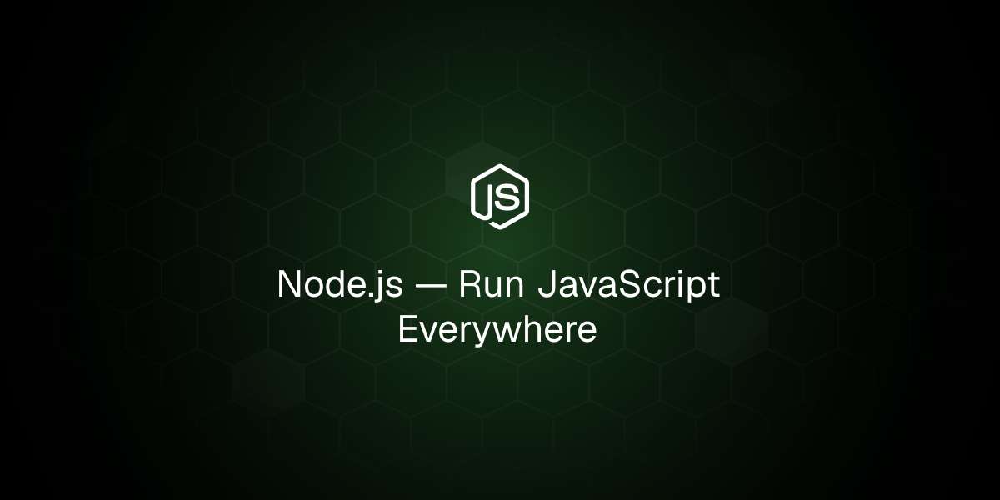](https://nodejs.org/)

[Node.js — Run JavaScript Everywhere](https://nodejs.org/)

Node.js® is a free, open-source, cross-platform JavaScript runtime environment that lets developers create servers, web apps, command line tools and scripts.

### VS Code のインストール

HTML を書くときにはメモ帳でもなんとかできるかもしれませんが、それよりももっと便利なものがあります。**VS Code**というアプリを使えば、書いたコードにハイライトなどがついて**わかりやすく開発を行う**ことができます。また、VS Code は**拡張機能**を導入することができ、公式から Astro 向けのものが公開されているため、そちらからのインストールも行います。
以下のリンクからインストールを行い、手順に従ってインストールを行います。言語設定などは、ほかのサイトで説明されているので、そちらを参照してください。（めんどく s…)

[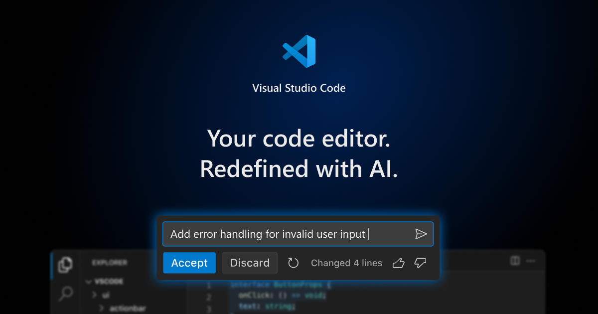](https://code.visualstudio.com/)

[Visual Studio Code - The open source AI code editor | Your home for multi-agent development](https://code.visualstudio.com/)

Visual Studio Code is a free, open source AI code editor. Build with AI agents that plan, code, and debug for you. Manage multi-agent workflows across environments on Linux, macOS, and Windows.

インストールしたら、アプリを開いて、拡張機能の導入を行います。

[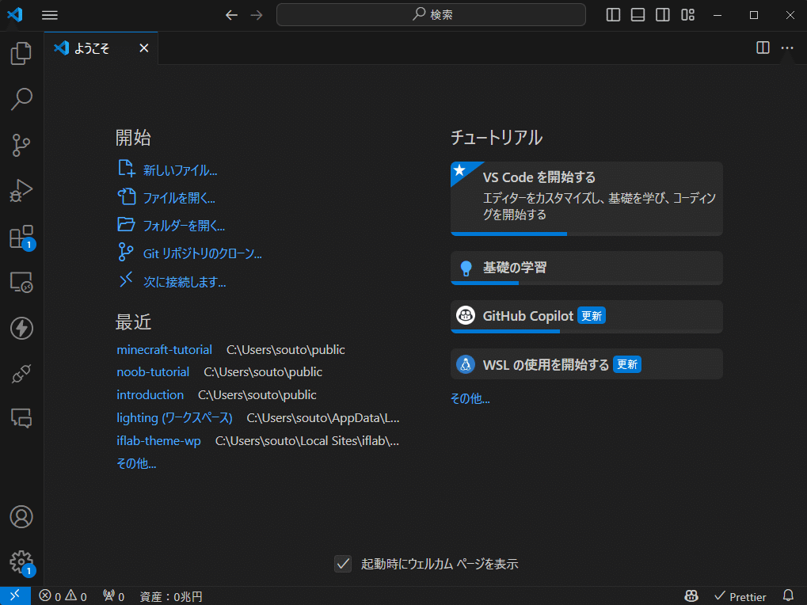](../../media/37f04bf1a80a9b4e96e5f47612ed4ff312ca21ad007dbe85011daa760efa7223.png)

_起動するとこんな感じの画面が出ます。_

画面の左側のサイドバーにある、拡張機能のボタンを押して開いたタブにある検索窓に、「Astro」と入力して検索してください。

[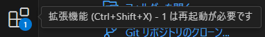](../../media/653b469da843f8e0850d8c5dbcc81a7c39d320da0374e835072be5ee808598f3.png)

_拡張機能を選択_

[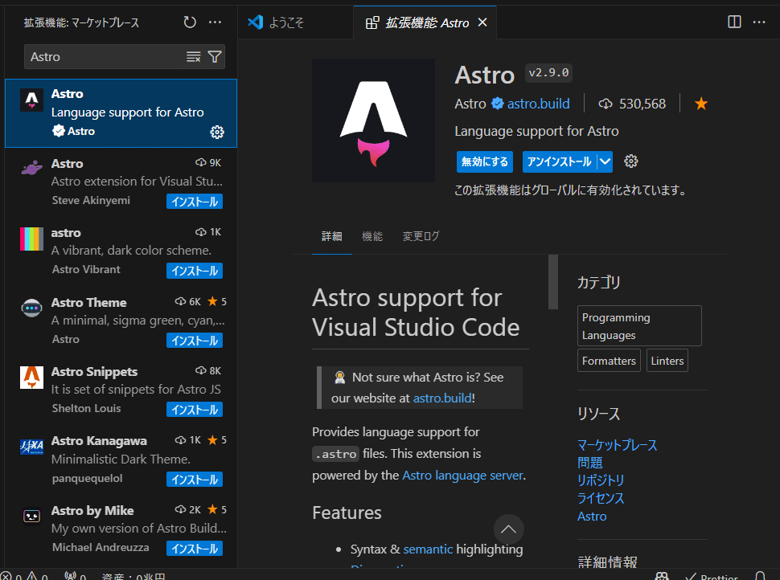](../../media/a940a0d969f094c93f0b2d4de7a30ffb3847b18ad4a33b8211dd44c7b53d8e0a.png)

_インストール！_

出てきたら、インストールを行います。これで Vs Code の準備は完了です。

### GitHub の準備

> こちらの作業はサイトが完成した後でも問題ありませんが、今回は先に説明します。

今回は、サイトの内容を保管したりする際に GitHub を使用します。これは、プログラムのコードを保存したり公開することができたりするツールで、これを使うことでバージョン管理や、サイトの公開が簡単に行うことができます。こちらにアカウント登録を行ってください。（やり方は割愛します。めんど k…殴）

[](https://github.com/)

[GitHub · Change is constant. GitHub keeps you ahead.](https://github.com/)

Join the world's most widely adopted, AI-powered developer platform where millions of developers, businesses, and the largest open source community build software that advances humanity.

GitHub に登録/ログインすると、このような画面になります。

[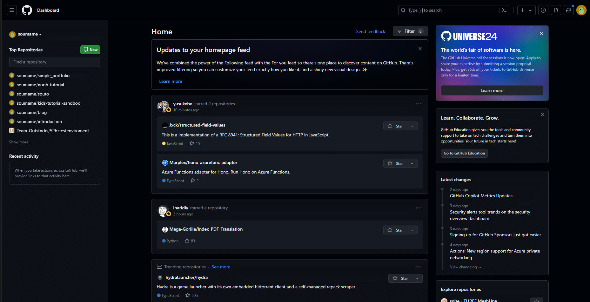](../../media/5d84c928c1e8954c76c7ac8701391aaa634c787197bb85034006edbd35f0eac4.png)

画面の左側のこの緑色の New というボタンから新しいリポジトリの作成を行います。保管場所のようなものだと思ってください。

[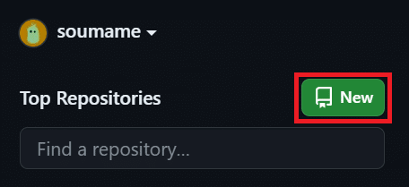](../../media/9505d4ed8121620a730fa108734eb0e566e6a93c5aa00e07e6941b1361a9879e.png)

作成画面はこのようになります。赤枠のところで、リポジトリ名（プロジェクト名）と、公開設定（公開か非公開か）を選択することができます。公開にすると、自分のつくったものがすべて公開されますので、注意してください。ウェブサイト自体の公開設定には影響しません。それ以外の項目では、リポジトリの説明や、README の設定、ライセンス（著作権関連）などの設定を行うことができます。設定ができたら、ページ下部の「Create repository」をクリックしましょう。

[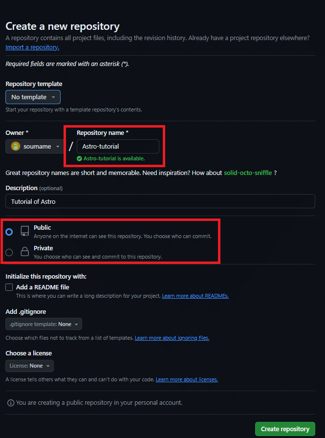](../../media/af40d0f3adbcb3e55a3cc0b97477b150e4a2a3b2479eda64799e68ebbd8d614e.png)

するとこのような画面が出てきます。これで、準備は完了です。

[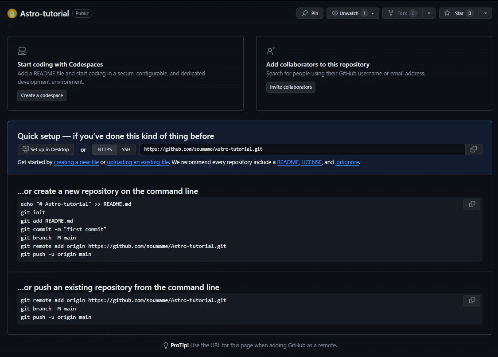](../../media/faadf7a219526231901a3bf5995daf29e0b01244d47f002d980bc2b26975c052.png)

_リポジトリの作成が完了！_

## ウェブサイトをローカル環境で開発

### リポジトリの読み込み

では、早速作成したリポジトリを読み込みましょう。
リポジトリの画面に表示されているリンクをコピーして、VS Code の「Git リポジトリのクローン」に貼り付けます。（VS Code に GitHub アカウントでログインされている場合は、そちらから複製を行うこともできます。）

[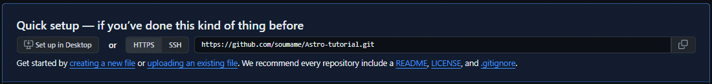](../../media/5432108b140cd06bac38904e6f51452949deb6fd229006bfe8b5183366b21554.png)

_画面の真ん中あたりに表示されているリンクをコピーして…_

[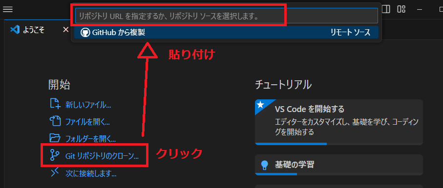](../../media/fe02adc4b95d94714a11eaa61f30ddd11f7efc1a91abe5ff18b488ead460e20a.png)

_上に入力欄が出てくるので、そこに張り付ける_

複製するフォルダー（ローカル環境での保存場所）を聞かれるので、好きな場所に設定しておきましょう。GitHub のフォルダーを作って、そこに保存するのがおすすめです。

### Astro をインストールする

複製したら、このような画面が出てくるはずです。基本的に開発はこの画面で行います。

[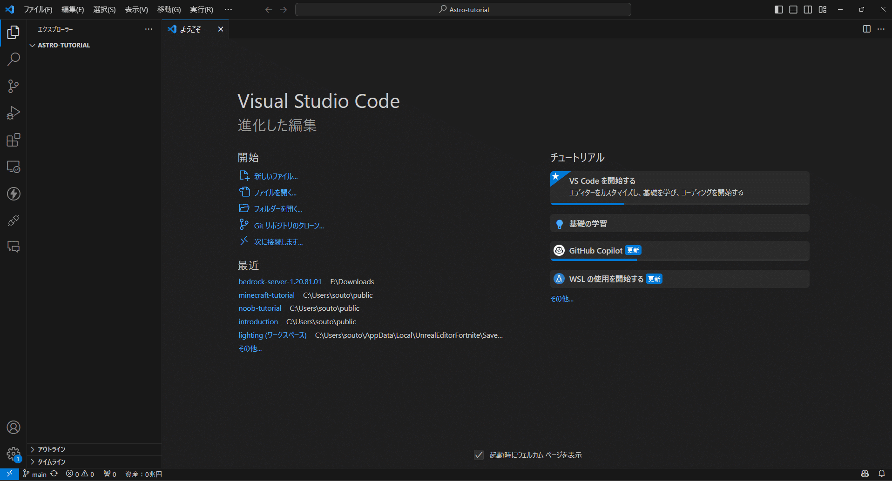](../../media/1cfc3b02b3c6fda8a22bb48e6ca025d22f015b601ad10723470ed8ee12b35e6a.png)

画面が開けたら、ターミナルを使用して、Astro のインストールを行います。
画面上部の「ターミナル」から、「新しいターミナル」を選択します。Mac の場合は、メニューバーにあります。

[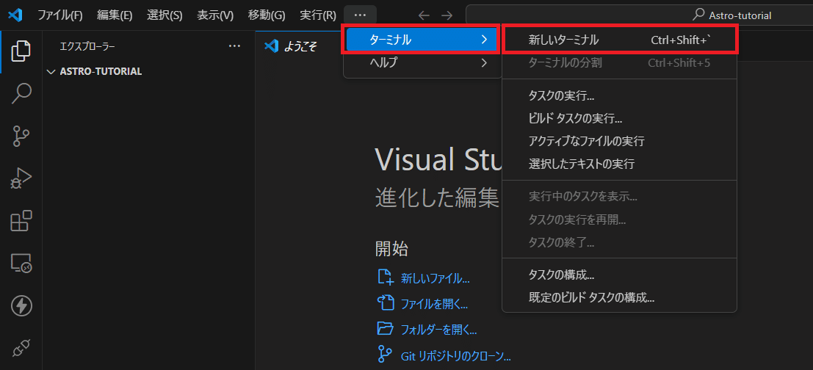](../../media/7ff8aa1497fe102f27867a982137545e4ed414100695712743a81f7d1cf9ee56.png)

ターミナルが開けたら、表示された自分の居場所を確認します。私の場合は、このようなディレクトリでしたので、今いるディレクトリ（フォルダの位置）にそのままインストールしていきます。もし違う場合は、cd コマンドを使って移動します。

```
フォルダ一覧 ls フォルダにに移動する cd フォルダ名 一つ上の階層に移動する cd .. インストールする位置を決める。 C:\Users\souto\public\Astro-tutorial>
```

場所が確定したら、そこに **npm create astro\@latest ./** と入力して Enter を押しましょう。これは、Astro の最新版を ./（今いる場所）にインストールするという意味のコマンドです。

```
npmコマンドを使用して今いるフォルダ内にインストールする npm create astro@latest ./ 今いるフォルダ内に新しいフォルダを作成し、そこにインストールする npm create astro@latest [フォルダ名]
```

上手くいけば、こんな感じの選択肢が画面に現れます。**矢印キーで操作**を行って、選択していきます。今回は、ブログを作るので。下へ移動して、「use blog template」を選択します。

[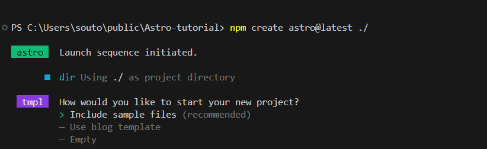](../../media/75c37ef48750fa6c79003bc59618c1c7a7e1ac4ce7bec98120f2cf6c9b95dd69.png)

その後は、すべて Enter を押して大丈夫です。

```
tmpl How would you like to start your new project? Use blog template ts Do you plan to write TypeScript? Yes use How strict should TypeScript be? Strict deps Install dependencies? Yes しばらくするとインストールが完了する next Liftoff confirmed. Explore your project! Run npm run dev to start the dev server. CTRL+C to stop. Add frameworks like react or tailwind using astro add. Stuck? Join us at https://astro.build/cat npm run devでサーバーを起動すると...? astro v4.8.2 ready in 243 ms ┃ Local http://localhost:4321/ ┃ Network use --host to expose 22:50:46 watching for file changes...
```

インストールが完了したら、アクセスしてみましょう。Astro の開発モードを起動するには、\*\*「npm run dev」\*\*とコンソールにに入力します。表示された URL にアクセスしてみましょう。

[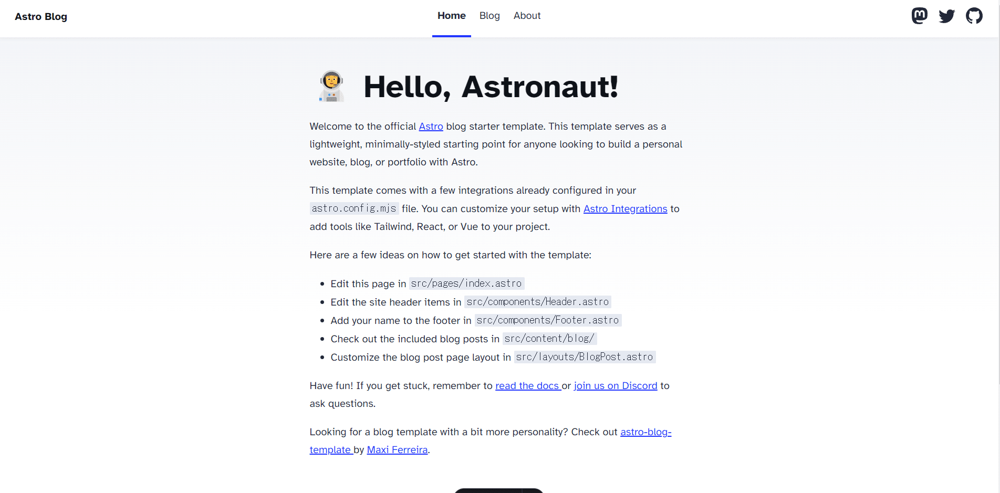](../../media/943b02380c9152d445f006fbe35bb81a90cc52bf7512f9d7bbb9526151588f6f.png)

_できた！簡単！_

### Astro の仕組み

ファイル一覧を見るとたくさんファイルがあって驚きますが、実際に開発でメインでいじるのは、public と src 内のファイルだけです。

Astro は、それ自体がウェブサイトになるわけではなく、**.astro ファイルに書かれた内容をもとに HTML ファイルを生成**します。src ディレクトリにある内容は、レンダリング設定を変えない限りページの生成時に javascript などは自動的に HTML に変換されます。

つまり、ページ内でブログの記事一覧を取得するプログラムを書くと、サイトとして公開する（**ビルド**と呼びます）タイミングで取得され、その後、HTML に変換されます。Astro ではこれを**事前レンダリング**と呼んでいます。この仕様は、ページが高速になる反面、\*\*リアルタイムで更新を行うことができません。\*\*ここは注意する必要があります。一方で、Astro はページにアクセスされるたびに情報を読み込みなおすオンデマンドレンダリングも提供していますが、今回は、前者の事前レンダリングを使います。個人ブログならこの程度で十分。

[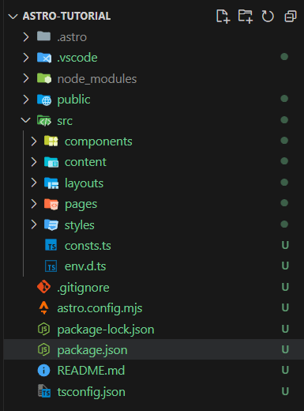](../../media/4388099487581d6d18895835aa6fce2b9bbc7ab27f79d6afe73398331c7d2a73.png)

### コンポーネントの概念

Astro では、コンポーネントの思想を用いています。これは、いわゆる部品の使い回し的なことができるやつで、例えば「メニューバー」のコンポーネントを作ったら、それをすべてのページで使い回すことができます。また、コンポーネントの中にコンポーネントを入れることもできるので、入れ子式で大きい箱の中に小さいものを入れていき、作った小さい箱を使い回す、みたいな感じでウェブサイトを作成することができます。

下のコードはその例です。レイアウトのファイルでメニューやフッターなどを読み込んだうえで、そのレイアウトをほかのページで読み込むと、すべてのページでメニューやフッターがついたまま読み込まれます。
いちいちメニューやフッターなどを書かなくても、レイアウトを読み込むだけで全部持ってくることができるわけです。メニューの内容が変えたくなっても、そのファイルだけ変更すれば、サイト全体に適用できるってわけです。

```
//レイアウトファイル(Layout.astro) import Header from 'Header.astro'; import Footer from 'Footer.astro'; <html> <head> <Header/> </head> <body> <slot> //スロットを使用して、内容をここに埋め込む <Footer/> </body> </html>
```

```
//ページのファイル(index.astro) import Layout from 'Layout.astro'; <Layout> ...ページの内容 </Layout>
```

```
//ブログ一覧 import Layout from 'Layout.astro'; <Layout> ...ブログ一覧 </Layout>
```

### src フォルダ

基本的に src フォルダの中身の構造は自由ですが、このテンプレートではコンポーネント、コンテンツ、レイアウト、ページ、スタイルの 5 つが用意されています。それぞれ詳しく見ていきましょう。

<figure name="f5a67263-2138-44cc-bd01-86c0f7ce0588" id="f5a67263-2138-44cc-bd01-86c0f7ce0588">

> このガイドでは、Astro コミュニティでよく使われている慣習について説明していますが、Astro が予約しているディレクトリは src/pages/と src/content/だけです。その他のディレクトリは、自分にとって最適な方法で、自由に名前を変更したり再編成しても構いません。

<figcaption>Astro公式Docs</figcaption>

</figure>

**/pages(必須、予約済み)**
Pages は、Astro のシステムが予約している必須のディレクトリとなります。これは特別なフォルダとなっており、サイト上に作成するページはすべてここの中に入れる必要があります。

**/content(予約済み)**
こちらは予約されたディレクトリですが、必須ではありません。コンテンツコレクションという Astro に備わっている機能を利用してブログなどの記事の内容を入れておくことができます。今回のプロジェクトではこちらを使用してブログの記事の管理などを行います。

\*\*/Components
\*\*コンポーネントは、先ほど説明したコンポーネントとして作成した Astro ファイルを置くときに使える場所です。必要な時に、ほかの Astro ファイルから呼び出したりするときに使います。必須ではないので、別に名前が違ったりしても問題ありません。

**/layouts**
レイアウトは、複数のページ間で使用するようなテンプレートを定義するのに使用します。こちらも必須ではありません。

**/styles**
CSS などのファイルを格納するのに使います。こちらも必須ではありません。

### Public フォルダ

Public ディレクトリに格納したファイルは、Astro が HTML を生成したりする際に処理がスキップされるようになります、ここにフォントやサイトのアイコン、robots.txt(必要な場合)などを格納しておくことで、そのままサイトをビルド（生成）したときに使うことができます。
CSS や Javascript などを格納してそのまま読み込むこともできますが、最適化の対象外になるので公式としては非推奨のようです。

### 少しいじってみよう

全部作り変えるとものすごく長くなってしまうので、少しいじって公開するところまで説明します。まずは、ユーザーが初めに訪れるページを編集してみましょう。VS Code で index.astro を開いてください。

[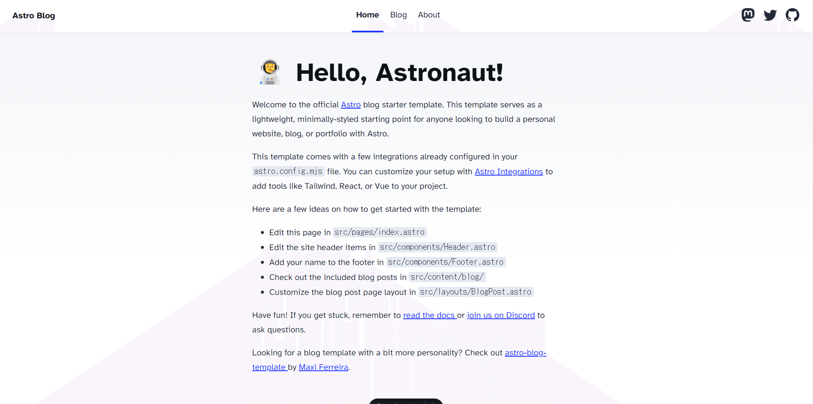](../../media/ba436f3b92fbd89def4cc221b8d22abb84f2eb4834035774499ae5f837c07f6a.png)

_index.astro_

```
--- import BaseHead from '../components/BaseHead.astro'; import Header from '../components/Header.astro'; import Footer from '../components/Footer.astro'; import { SITE_TITLE, SITE_DESCRIPTION } from '../consts'; --- <!doctype html> <html lang="en"> <head> <BaseHead title={SITE_TITLE} description={SITE_DESCRIPTION} /> </head> <body> <Header /> <main> <h1>🧑‍🚀 Hello, Astronaut!</h1> <p> Welcome to the official <a href="https://astro.build/">Astro</a> blog starter template. This template serves as a lightweight, minimally-styled starting point for anyone looking to build a personal website, blog, or portfolio with Astro. </p> <p> This template comes with a few integrations already configured in your <code>astro.config.mjs</code> file. You can customize your setup with <a href="https://astro.build/integrations">Astro Integrations</a> to add tools like Tailwind, React, or Vue to your project. </p> <p>Here are a few ideas on how to get started with the template:</p> <ul> <li>Edit this page in <code>src/pages/index.astro</code></li> <li>Edit the site header items in <code>src/components/Header.astro</code></li> <li>Add your name to the footer in <code>src/components/Footer.astro</code></li> <li>Check out the included blog posts in <code>src/content/blog/</code></li> <li>Customize the blog post page layout in <code>src/layouts/BlogPost.astro</code></li> </ul> <p> Have fun! If you get stuck, remember to <a href="https://docs.astro.build/" >read the docs </a> or <a href="https://astro.build/chat">join us on Discord</a> to ask questions. </p> <p> Looking for a blog template with a bit more personality? Check out <a href="https://github.com/Charca/astro-blog-template" >astro-blog-template </a> by <a href="https://twitter.com/Charca">Maxi Ferreira</a>. </p> </main> <Footer /> </body> </html>
```

ファイルの構造はこのようになっています。私の自己紹介のページにするので、以下のように書き換えてみました。

```
--- import BaseHead from "../components/BaseHead.astro"; import Header from "../components/Header.astro"; import Footer from "../components/Footer.astro"; import { SITE_TITLE, SITE_DESCRIPTION } from "../consts"; --- <!doctype html> <html lang="en"> <head> <BaseHead title={SITE_TITLE} description={SITE_DESCRIPTION} /> </head> <body> <Header /> <main> <h1>そうまめのサイト</h1> <p> そうまめのサイトへようこそ！このページはAstroのblogテンプレートを使用して作成しました。 </p> </main> <Footer /> </body> </html>
```

書き換えて、保存するとこんな感じに自動的に更新されるはずです。これが Astro でウェブサイトを作る方法となります。書き方は HTML と同じなので、普段使われている方はあまり抵抗なく書けるかと思います。

[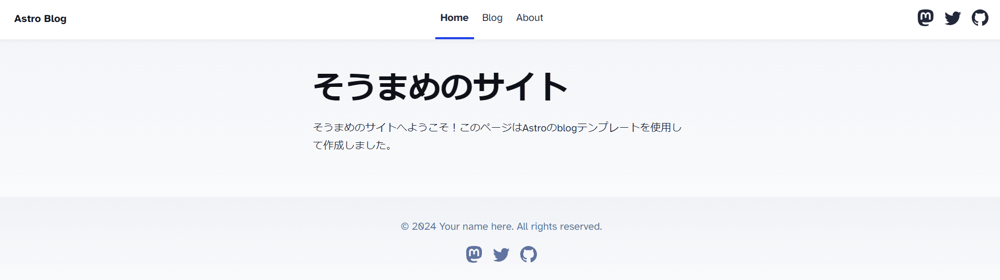](../../media/ee439c8ea6ba71e833f765832cef7aee232adc61a02e274926ea7b752cc6b006.png)

では、今度はブログ一覧を更新してみましょう。/src/content/blog ディレクトリに移動します。

[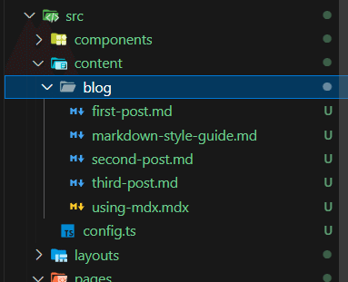](../../media/ac5ff1886598b61de8d02a5349d1918471e76f61eaa2ecdedda84427c2484318.png)

_/src/content/blog_

.md で終わるファイルにブログが格納されいます。開いてみましょう。

[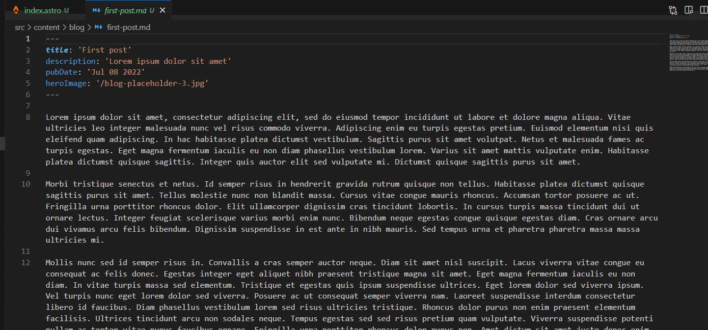](../../media/cf2fab671f762d7e1129d994b532e06b91e1dbac9fb75ba112c130a9b2fae586.png)

このように上にメタデータが書かれた Markdown ファイルが開けるはずです。Astro では、これをフロントマターと呼んでおり、/content ディレクトリ内に配置されたブログの記事などは、このフロントマターを使用してデータの管理を行うことができます。
この Astro のブログのテンプレートでは、タイトル、説明、投稿日時、画像が設定できます。フロントマターを以下のように変えてみましょう。

```
--- title: '初めてのAstroブログ！' description: 'AstroとVercelを利用して、簡単に無料のサイトを作成！' pubDate: 'May 12 2024' heroImage: '/blog-placeholder-3.jpg' ---
```

画像に関しては、public ディレクトリなどに入れた画像を呼び出すことで使用することができますが、今回は割愛します。

[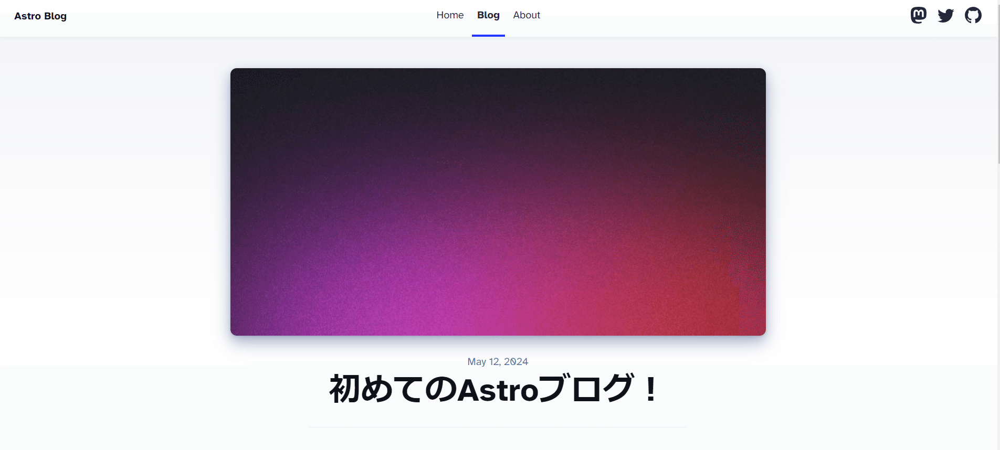](../../media/04d88ad12b62e5e883b9dac7d40c9789200598e5c7e24793b0f55773f44ee043.png)

このように内容が変更できるはずです。
ここまでできれば、あとは必要なところを変更するだけで自分のサイトを作ることができます！

### Tailwind CSS を導入して CSS をカスタマイズする

また、このプロジェクトでは通常の CSS を使用して見た目を変更していますが、Tailwind CSS というものを導入してより分かりやすい見た目の編集を行うことができます。Astro ではこれらをインテグレーションと呼んでおり、追加で様々な機能を追加することができるので、必要な方は各自追加を行ってください。

[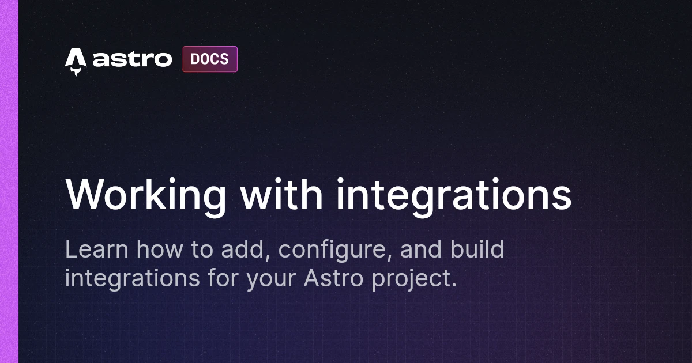](https://docs.astro.build/ja/guides/integrations-guide/)

[Working with integrations](https://docs.astro.build/ja/guides/integrations-guide/)

Learn how to add, configure, and build integrations for your Astro project.

## ウェブサイトを公開してみる

自分のサイトが完成したら、それを公開してみましょう。今回は、Vercel を、GitHub と連携したうえで公開してみましょう。

### GitHub とローカルの同期

まずは、ローカル環境で開発したものをいったん GitHub と同期する必要があります。VS Code の「ソース管理」タブからコミットをクリックして、その後、同期します。また、同期する際に、変更を加えて点などをメッセージとして残しておいてください。入力せずにコミットすることはできないので、空のままコミットを押すと入力が求められます。

[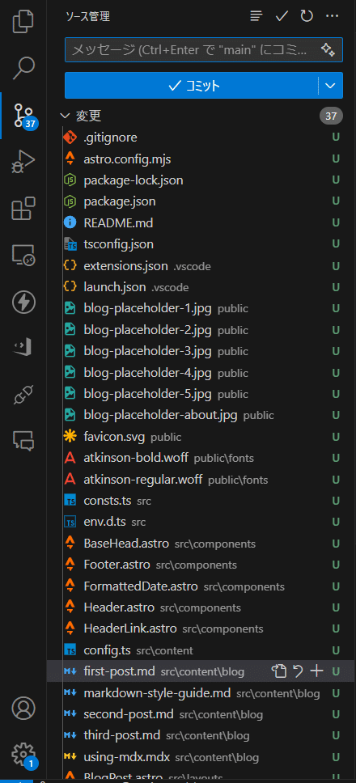](../../media/5a08929c4fb7906a195afacf10a4c7770854dfe57d13bc804a6cc2f7f899b964.png)

_コミット前の画面。変更を加えたファイルなどが表示される。初回はすべてのファイルをアップロードする。_

コミットした後、プッシュという動作を行うと、GitHub にそれが反映されます。プッシュした後、GitHub を確認すると、ファイルが閲覧できるようになっているはずです。

[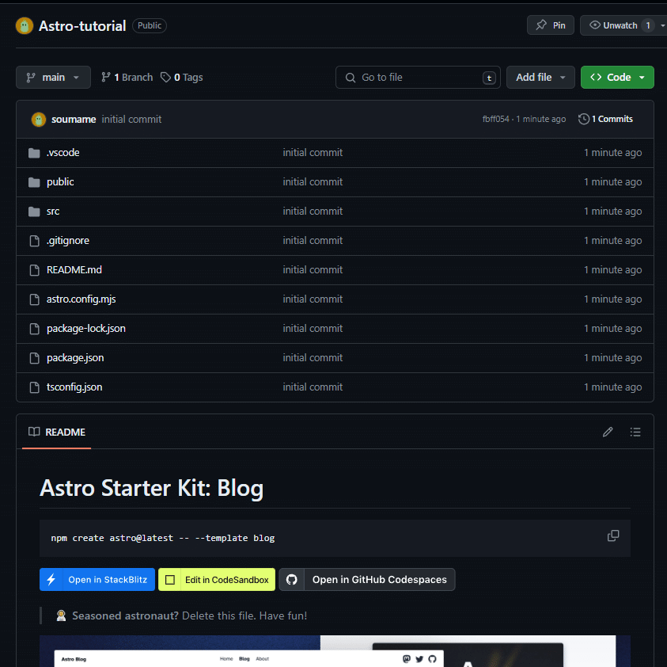](../../media/fe37b8e3be46ab7490f138b4bdef471799cb8c9656367346fe9d4be639668a05.png)

### Vercel を使用して無料でホストする

Vercel を使用して、ウェブサイトのホストを行います。Vercel は、GitHub などと連携を行うことで簡単にウェブアプリなどを公開することができるサービスです。Vercel のサイトにアクセスして、登録を行ってください。**登録には、GitHub アカウントを使用してください。**

[](https://vercel.com/)

[Agentic Infrastructure - Vercel](https://vercel.com/)

The autonomous stack for every app and agent.

[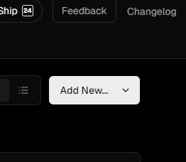](../../media/50041d274e326594d913d6dddb500a1a4a10f36311f488b8124bbdbab39187fe.png)

登録を行うと、ダッシュボードにアクセスできるので、そちらにある「Add new…」をクリックして、Project を選択します。選択すると、紐づけた GitHub アカウントにあるリポジトリが一覧として表示されるので、作成した Astro のリポジトリを選択します。

[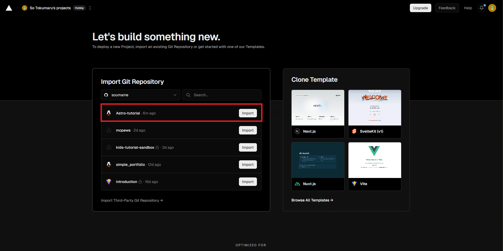](../../media/caeb9e137620027b93943a45a1a77fcf107a3406ccb0a1d0a44215cd150a81fc.png)

特に追加で行う設定はないので、そのまま「Deploy」を押してください。これだけでサイトを公開することができます。簡単！

[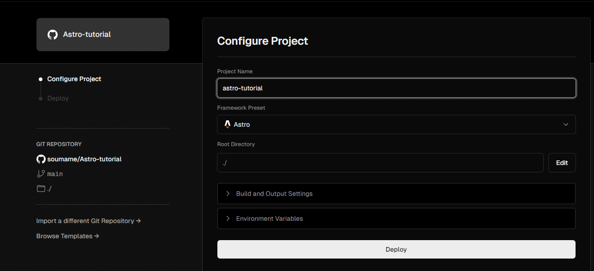](../../media/96a42ee8226dae15fa0e43fcd20a55ab25453d36d77f5609fb240ed49e5ee32f.png)

サイトが公開できたら、アクセスしてみましょう。

[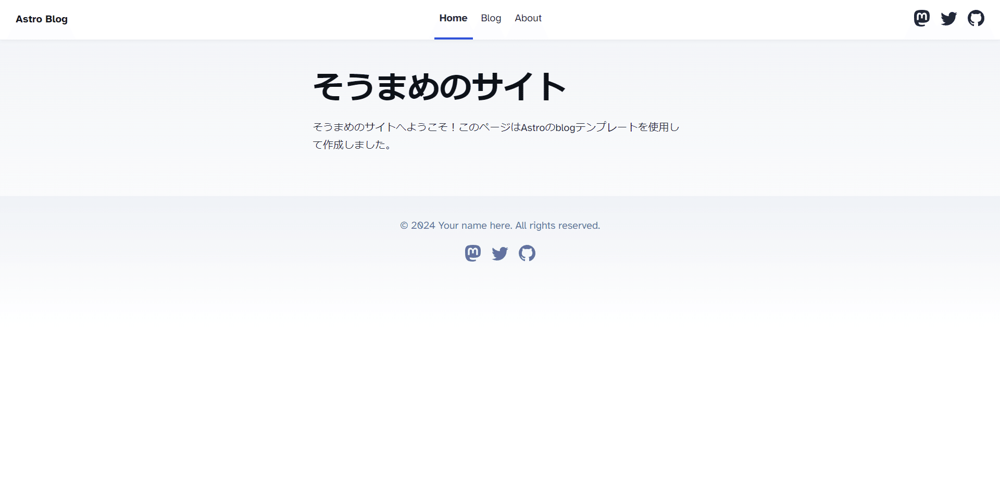](../../media/5e9cd4b7e62eadfa272a3658f5571bf95634fe2f11a6aa65fc2b5f236136f495.png)

[Astro Blog](https://astro-tutorial-six-peach.vercel.app/)

Welcome to my website!

これで、サイト制作を一通りすることができました。ご自身の造りたい内容に合わせてカスタマイズしてみてください！

### Vercel に独自ドメインを追加する

ドメイン(example.com のようなサイト名)をすでに持っている方であれば、Vercel に追加することができます。Vercel のダッシュボードからプロジェクトを選択し、Domains をクリックします。

[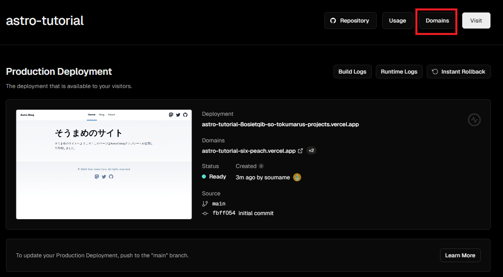](../../media/02306d88c9b92f4ca7a7d2455c1331e5f29202b85f650795dcfd7300a5a118e1.png)

そうすると、検索窓のようなところがありますので、そちらをクリックして所有するドメインを入力すると、ドメインを接続するためのガイドが表示されます。こちらの手順にしたがい、ドメインを追加してください。

[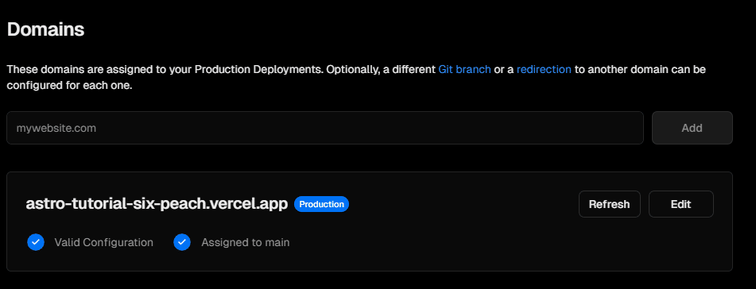](../../media/49cc4f626c3d6129e3a9ae5fcf4f2b4cd7992cd61dcea54d158ec6a02d74832b.png)

## おわりに

一応これでウェブサイトを一通り作ることができたはずです。Astro だけでなく、Next.js などのような様々なフレームワーク等もこれと似たようなやり方でできますので、ぜひ色々試してみて、ご自身にあった方法でウェブサイトを作ってみてください！ぜひ SNS 等フォローお願いします！（あ、ちなみにこの下のサイトも Astro 製です。）

<https://so-bean.work/ja>
