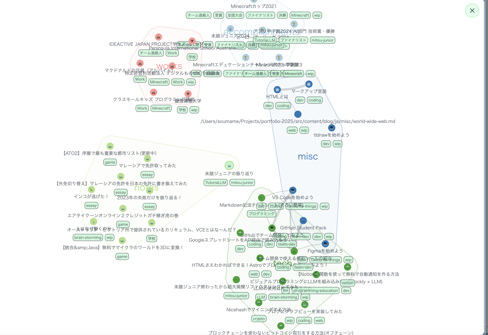
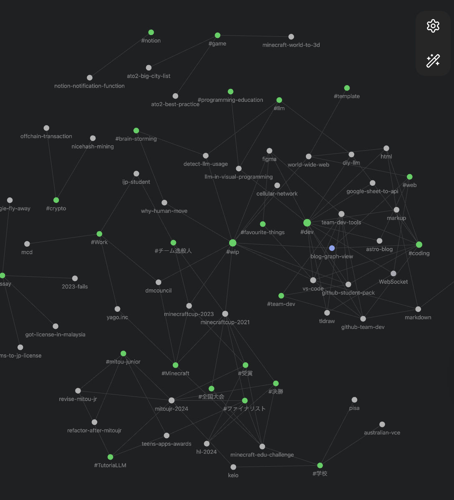
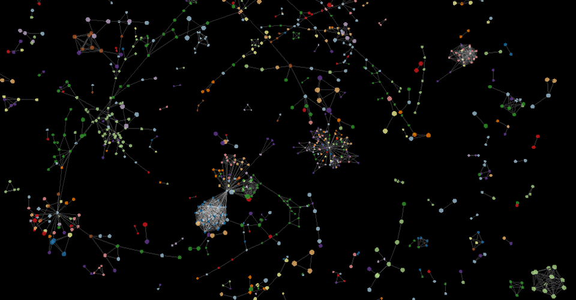

## グラフビューってなに

&#xA;グラフビューでは、このように、相関図のようなグラフでアイテム間の関係性を表すことができる。

ブログを書くのに使っている[[ja/misc/obsidian|Obsidian]]というエディターに同様の機能が搭載されている。Obsidianの記事をwebで公開する、Obsidian Publishにもこのグラフビューが搭載されていて、グラフビューと同じレンダリングエンジンを使っていると言っている。

[Reddit](https://www.reddit.com/r/ObsidianMD/comments/1mhujgy/what_does_obsidian_use_to_create_their_graph_view/)

&#xA;Obsidian ではどうやら自前で実装しているようだけど、ソースコードが公開されていないので、仕方なく自前で実装する。

記事数もそこまで多くないし、パフォーマンスについてはそこまで考えなくて良かったので、先程挙げたredditで言及されていたd3.js というライブラリを内包した、React-Force-Graph というパッケージを使って、力のシミュレーションとかを微調整している。

[GitHub - vasturiano/react-force-graph: React component for 2D, 3D, VR and AR force directed graphs](https://github.com/vasturiano/react-force-graph)

React component for 2D, 3D, VR and AR force directed graphs - vasturiano/react-force-graph

類似のもので、vis.js というものもあるが、d3.js の方がより複雑な操作ができるのでそっちを選択（なお、導入しやすさで言ったら vis.js）。モバイルでの閲覧が多いようなので、ホバー操作などをせずにすべての機能が利用できるようにした。

パッケージ名の通りグラフビューは React で動作している。このサイトはほとんどが Static で、Astro を使っているので、グラフビューのコンポーネント以外は全て事前にビルドしている。

ビルド時に、全ての記事と、その関係性を記述した JSON を作成し、ページ読み込み時にそれをロードしている。

これ、ページ数が増えまくったら結構厳しい気もするので、しばらくこれで使ってみて、ダメそうだったら別の方法を考えようと思う。
