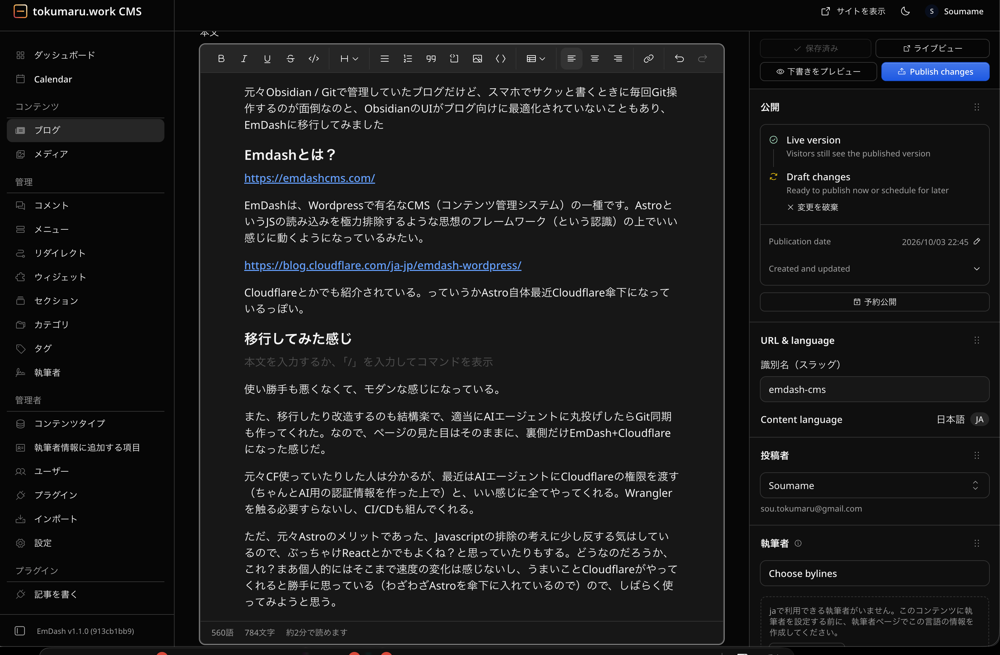

元々Obsidian / Gitで管理していたブログだけど、スマホでサクッと書くときに毎回Git操作するのが面倒なのと、ObsidianのUIがブログ向けに最適化されていないこともあり、EmDashに移行してみました

### Emdashとは？

[EmDash CMS](https://emdashcms.com/)

An open source Astro CMS built for humans and agents.

EmDashは、Wordpressで有名なCMS（コンテンツ管理システム）の一種です。AstroというJSの読み込みを極力排除するような思想のフレームワーク（という認識）の上でいい感じに動くようになっているみたい。

[プラグインセキュリティを解決するWordPressの精神の後継、EmDashの紹介](https://blog.cloudflare.com/ja-jp/emdash-wordpress/)

本日、Astro 6.0上に構築されたフルスタックのサーバーレスJavaScript CMSであるEmDashのベータ版の提供を開始します。従来のCMSの機能と最新のセキュリティを組み合わせ、サンドボックス化されたWorker Isolatesでプラグインを実行します。

Cloudflareとかでも紹介されている。っていうかAstro自体最近Cloudflare傘下になっているっぽい。

### 移行してみた感じ

使い勝手も悪くなくて、モダンな感じになっている。

また、移行したり改造するのも結構楽で、適当にAIエージェントに丸投げしたらGit同期も作ってくれた。なので、ページの見た目はそのままに、裏側だけEmDash+Cloudflareになった感じだ。

元々CF使っていたりした人は分かるが、最近はAIエージェントにCloudflareの権限を渡す（ちゃんとAI用の認証情報を作った上で）と、いい感じに全てやってくれる。Wranglerを触る必要すらないし、CI/CDも組んでくれる。

ただ、元々Astroのメリットであった、Javascriptの排除の考えに少し反する気はしているので、ぶっちゃけReactとかでもよくね？と思っていたりもする。どうなのだろうか、これ？まあ個人的にはそこまで速度の変化は感じないし、うまいことCloudflareがやってくれると勝手に思っている（わざわざAstroを傘下に入れているので）ので、しばらく使ってみようと思う。
