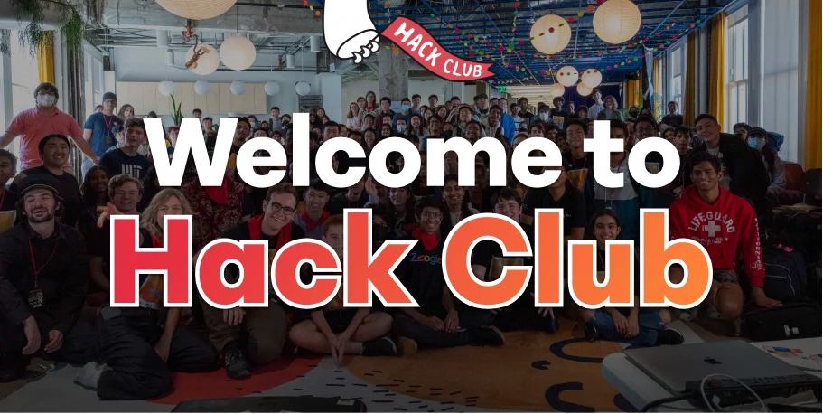

## Hack Clubとは

> Hack Clubは、世界中の高校生を対象としたプログラミングおよびメイカースクール（ものづくり）の非営利団体が運営するネットワークです。Hack Clubは現在世界中に多くの参加者(2024年11月時点)がおり、その数は８万人を超えており、毎週数千人の学生が多様なプロジェクトに取り組んでいます。

[Hack Club — Where teens make cool stuff.](https://hackclub.com)

Hack Club is the world's largest nonprofit movement of teenagers making cool projects.

- Slack上で活動している
- 18歳以下対象
- 時々イベントやっていて、いろいろもらえたりする
