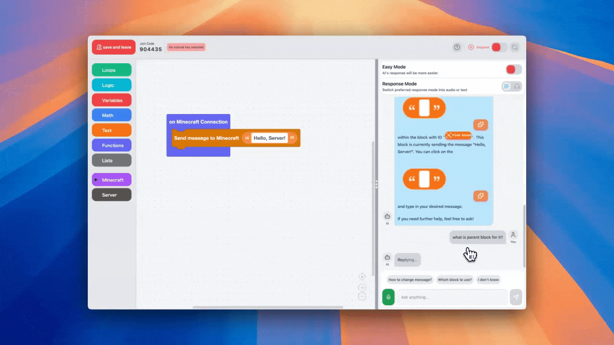
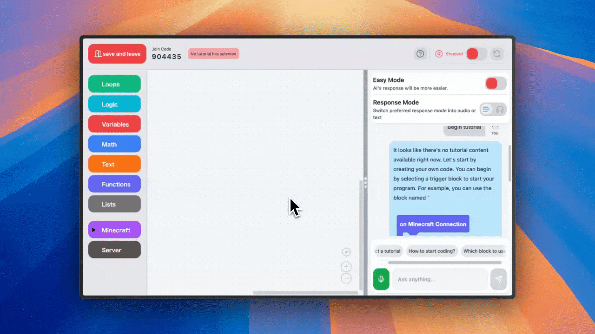
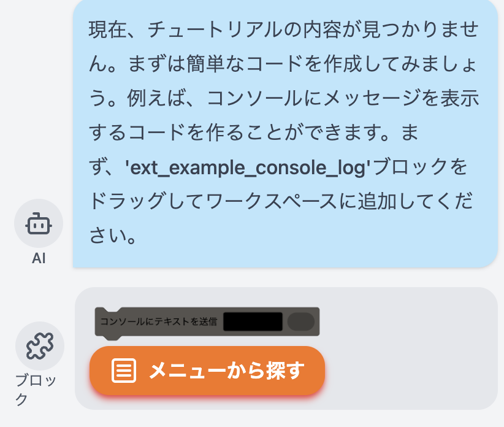
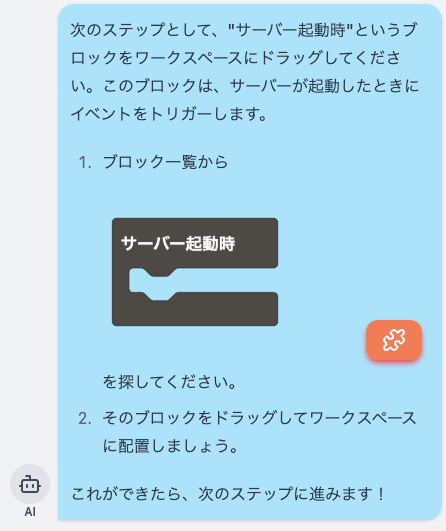
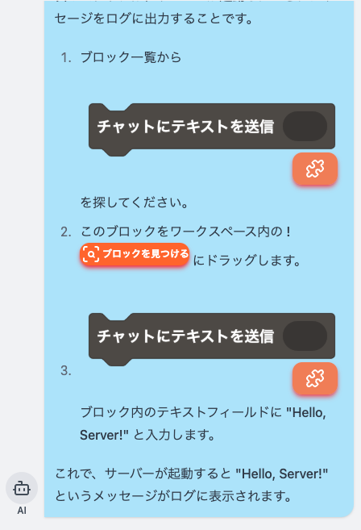
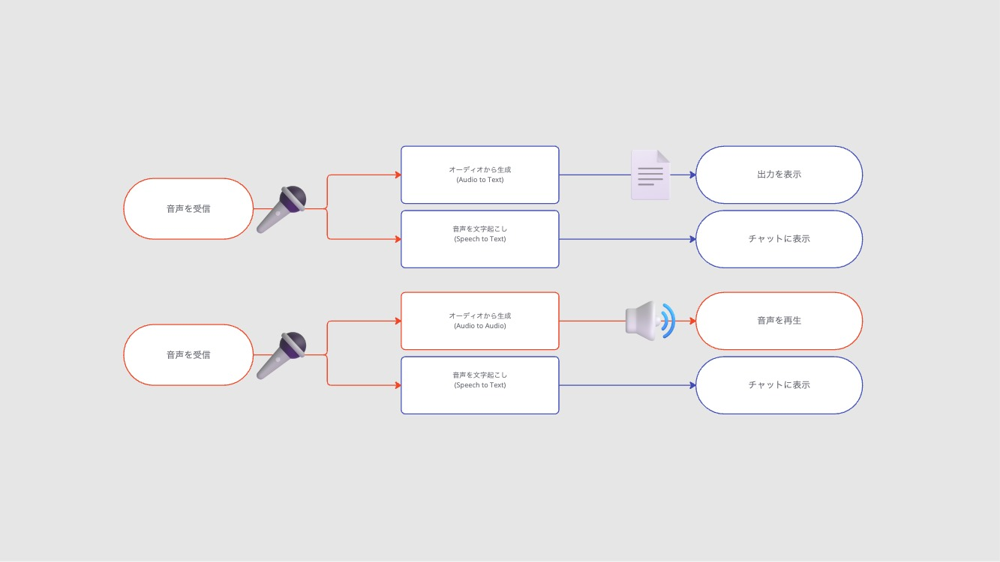
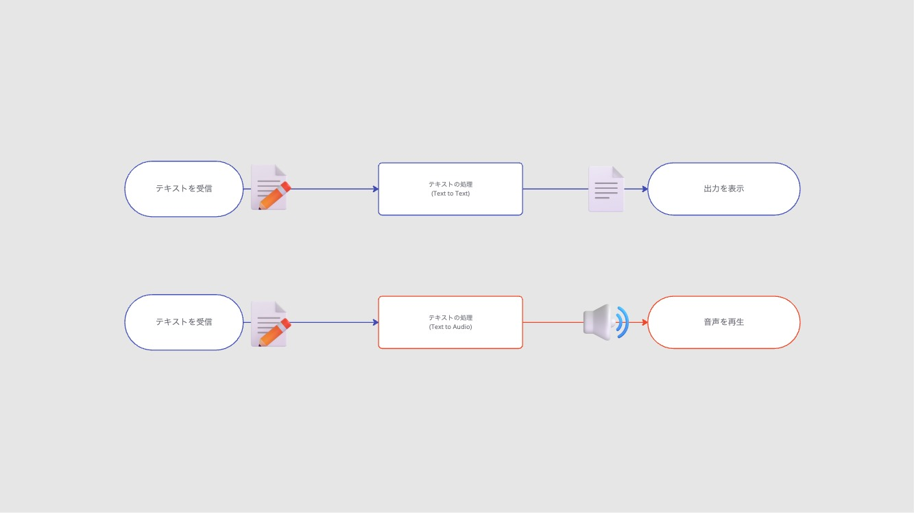

初めまして。そうまめこと得丸創生と申します。
1 年ほど前から Typescript / React の Web アプリ開発にどハマりして、現在は[「TutoriaLLM」](https://tutoriallm.com)というビジュアルプログラミングと AI による対話、そして、リアルタイムのコード実行の機能などを組み込んだ Web アプリケーションを作っています。

[TutoriaLLMへようこそ](https://tutoriallm.com)

Scratchのようなブロックプログラミングのチュートリアルを簡単に作成し、AIを利用して提供することができるセルフホスト型のソフトウェアです。

[「TutoriaLLM」](https://tutoriallm.com)は、今年の頭から開発していて、初めてまともに作ったアプリではあるのですが、嬉しいことに[未踏ジュニア 2024](https://jr.mitou.org/projects/2024/tutoriallm)に採択していただいたり、[アプリ甲子園 2024](https://applikoshien.jp/)の AI 開発部門で優勝したりしています。

ただ、色々外部のコンテストとかに出してはいるのですが、１つ１つの機能について詳しく説明する機会はあまりなかったので、今日はこのブロックプログラミングを用いたプログラミング教育における LLM の組み込みにおいて、色々考えてみようと思います。

多くの人に見てもらいたいので、プログラムの記述などは省きます。詳しいことが気になる場合は私に直接聞くか、GitHub のリポジトリを参照していただけると助かります。（需要があればさらに掘り込んだことも書こうかなと思っています。）
<https://github.com/TutoriaLLM/TutoriaLLM>

## VPL への LLM の組み込み

VPL（ビジュアルプログラミング言語）はよくプログラミング初学者の教育に用いられることが多いイメージがあるかと思います。そして、最近は LLM の精度も向上してきて、VPL に LLM を組み込もうと考える人もいるのではないかと思います。
<https://zenn.dev/yutakobayashi/articles/blockly-openai>
たとえば、yuta さんが開発したこのデモでは、Google が開発した[Blockly](https://developers.google.com/blockly?hl=ja)という VPL のワークスペース内に直接プログラムを作成することを実現しています。今日ご紹介する TutoriaLLM の VPL×AI の部分のシステムはかなりここからインスパイアされています。

## 問題点があった

しかし、先述のデモは、一般的な開発者にはかなりウケが良いのです（自分もそのうちの 1 人です）が、実際にユーザーテストなどを行うと、子供たちが使うとあまり効果がないことがわかりました。GitHub Copilot などもそうですが、LLM はプログラムを直接作成ということは、人間はプログラムを書くことが少なくなり、特に子供たちはそれに頼りっきりになってしまうため、「自分より良いプログラムが書けるなら、もう全部 AI にやって貰えばいいや！」と丸投げになってしまいます。私も Copilot に頼りまくっている人間なので、否定するわけにもいきませんが、ここでは、子供が思考停止して AI に全部タスクを丸投げする事は良くない事として扱います。

## ユーザーに手を動かしてもらう

そこで、TutoriaLLM では、このように、ブロックをハイライトしたり、使うブロックを直接提案するシステムで、ユーザーに実際に手を動かしてもらいながら、AI がそれを補助するというシステムを開発しました。
[*AI によるブロックハイライト*](../../media/5ebf367da44130fd94159e5e0ffca38df7ff2f65989a9700022d0d6067c2d122.gif)

[*AI によるブロックの提案*
](../../media/c23805505c7b94cf5912202d041d4015c337e9cd8d192faa915d9062e3a45bcf.gif)

まだ大勢に対してテストはできていませんが、これならユーザーは少なくとも自分で手を動かす必要が出てきますよね。実際、私はプログラミング教室で先生をやっていたことがあるのですが、その際も、このようにプログラムの作り方をステップごとに教えていました。LLM は人間の行動、言動を真似することがとても上手なので、このようにステップバイステップで教える際も、ちゃんと動いてくれます。

## どうやって実装したのか

このブロックハイライトとブロックの提案は、どちらも Blockly というビジュアルプログラミングを提供するためのフレームワークに少し手を加えたものを使っています。Blockly では、ワークスペースの内容を動的に取得することができます。また、ツールバーの内容なども、ちょっと手を加えれば簡単に取得することができます。

Blockly ワークスペースの内容は、[シリアル化](https://developers.google.com/blockly/guides/configure/web/serialization)することができ、JSON または XML での保存が可能です。TutoriaLLM では、この JSON を用いて、処理を行っています。
ハイライト方法に関しては、ワークスペース内に SVG を直接描画することで対応しています。こちらに関しては調べたら出てくると思います。

ツールボックスは Blockly から用意されている方法で読み取ることができます。折りたたみ可能なツールボックスは、一番下の階層まで全て調べて、一致するカテゴリを発見したらそこまでの経路を全てハイライトすることで処理しました。

そして、これらの技術を使った上で、LLM からの応答を解析し、ブロックのハイライトやブロックの提案などがあれば、フロントエンド側でそれをユーザーが使える形にして応答します。

### 初期段階

初期段階では、画像のような応答が返ってきていました。１つのメッセージにつき、１つのブロックを AI が指定できます。
[*ブロック名をチャット内に書いてしまっているのは良くないですね*](../../media/40ea305806d4c82b28a9aaf5f316acfaa6ed52ffe1070137ac697727a0edae36.png)
これを実現するために、OpenAI の API からの構造化出力を用いました。確かこの機能を作っている途中に、JSON モードに代わる新しい構造化出力モードが発表されて、エラーが起きる確率が大幅に減った気がします。
うろ覚えではあるのですが、こんな感じの応答が gpt から返ってきていました

```json
{
content: "現在、チュートリアルが..."
block: "ext_example_console_log"
toolbar: null
}
```

### 現在の仕様

しかし、この仕様には問題がありました、**ブロックが１つしか選べない**のです。しかも、文章が長くなりがちなので、**小学生程度の子だと、全部読んでくれません。**
そこで、**若干の確実性と引き換え**に、新しいシステムを導入しました。&#xA;

[](../../media/548a2f141e7ae4af817fc9ce3e4f588986ce60ba3eef5feb2999830d05241c6a.png)

&#xA;このシステムは、LLM から出力された Markdown を含む文章をフロントエンド側で解析して、ブロック名やワークスペース内のブロック ID が含まれていたら、それを適切なフォーマットに置き換えてレンダリングします。ブロック名や ID が間違っている場合はそのまま文字として表示されてしまうのが現状の問題点ではあるのですが、これのおかげで不要な文字情報を大幅に削減し、よりわかりやすい応答が返せるようになりました。
LLM はただユーザーのワークスペースを文字列として認識し、それを文字列として返していますが、ユーザーはそれが視覚的な情報に変換されて見えるため、結構コスパの良い方法かなと思います。&#xA;

[](../../media/06dccb95ea682b6829f67394c7b1ae39d003906eb486df9f5afa07ff24becc4f.png)

&#xA;こんな感じで、インラインで複数のブロック、ワークスペースの指示ができるようになりました。

これなら、先生がいちいち画面を指差して「ここだよ、ほら、ここ！」と言わなくても、AI が全部代わりにやってくれるので、とてもわかりやすいですよね。

### 音声モード

また、これらを音声で実装するという取り組みも行なっています。
ちょうどこの前出た gpt4o-audio-preview（だったかな？）というモデルでは、これらの入力と出力を音声に置き換えることができます。
巷では Realtime API の方が話題になってはいましたが、Realtime は一度切断するとコンテキストを全て忘れてしまうという致命的な欠点があったのに（今は分かりませんが）加え、voice to voice しか利用できないため、使いませんでした。
audio-preview は、構造化出力はまだサポートしていないので、たまに壊れた JSON とかを返してしまったりすることはある（ちゃんとしたエラー処理が必要）のですが、ユーザーの指定した通りの方法で対話を行うことができます。たとえば、音声で入力したら、テキストで出力する〜みたいな流れでも全然使えます。
[*音声での入力の場合*](../../media/48751b3a329a6f8204d6f2d81464b13ba95983ba4e77f71a7e024bfc991c75a8.jpg)

[*テキストでの入力の場合*
](../../media/2d1044c054a7f0288a7238b919b9eb3b09bfa96072ee31b24deca2fcd07eca9c.jpg)
とはいえまだ実用的か？と言われるとそうでもない気もするので、よかったら[demo.tutoriallm.com](https://demo.tutoriallm.com)で試してみてください。

## 終わりに

ということで
TutoriaLLM は現在開発段階で、毎日のようにクラッシュするレベルで不安定...なのですが、すでにデモ版を公開しています。また、全てオープンソース＆絶賛コントリビューター募集中ですので、汚いコードにはなってしまいますが、よければ覗いて行ってみてください。
<https://github.com/TutoriaLLM/TutoriaLLM>

ご興味ありましたら SNS 等フォローもしていただけると嬉しいです！
<https://tokumaru.work/ja>
