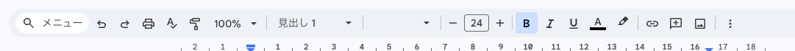
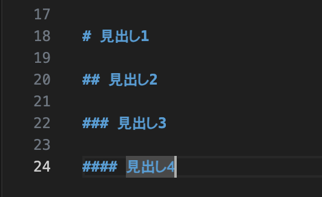

Google DocsやWordとかを使ったことあると、

[](../../media/aae82d737abd7d18b18d59cb73520e1d467c86aea99344130906af22a9771786.png)

&#xA;こんな感じで、太字とか、斜体とか、見出しとかを選択することができますよね。

でも、コードを書くエディタとかを使う時などでは、こういったボタンはないことが多かったり、マウスで文字を選択することができない場合があります。

Markdownでは、文字に簡単な記号を加えることで、簡単に見出しや強調、箇条書きを表現することができる言語（[[ja/misc/markup|マークアップ言語]]）です。

[[ja/misc/vs-code|VS Code]]みたいなエディタとかを使っていたり、Notion, Obsidianなどのエディタを使っている場合でも結構使うので、チートシート的なものを作ってみました（こう言ったものは結構ネットにあるんですけどもうちょっと簡単なの欲しいなと思って。

## 見出しについて

見出しは`#`を使います。

```
## タイトル
```

みたいな感じで入力します&#xA;

[](../../media/4e8f7c759927ff3c2510d0357bd4ab2bdaedbca5e60632d9b368739f59d6014f.png)

***

# 見出し1

## 見出し2

### 見出し3

#### 見出し４

***

## 文字の装飾

### 太字

```md
**太字にしたい文字**
```

***

## **太字になります**

### 斜体

```md
_斜体にしたい文字_
```

***

## _斜体になります_

### 箇条書き

```md
- `-`を入れた後にスペースを入れると
- 箇条書きになります
```

***

- `-`を入れた後にスペースを入れると
- 箇条書きになります

***

## リンク

```md
[リンクテキスト](https://example.com)
```

***

## [リンクテキスト](https://example.com)

***

これ以外にもいろんな記法があるんですけど、とりあえずこの辺網羅してたらあとは必要な時に調べとけば良いかなと思います。
