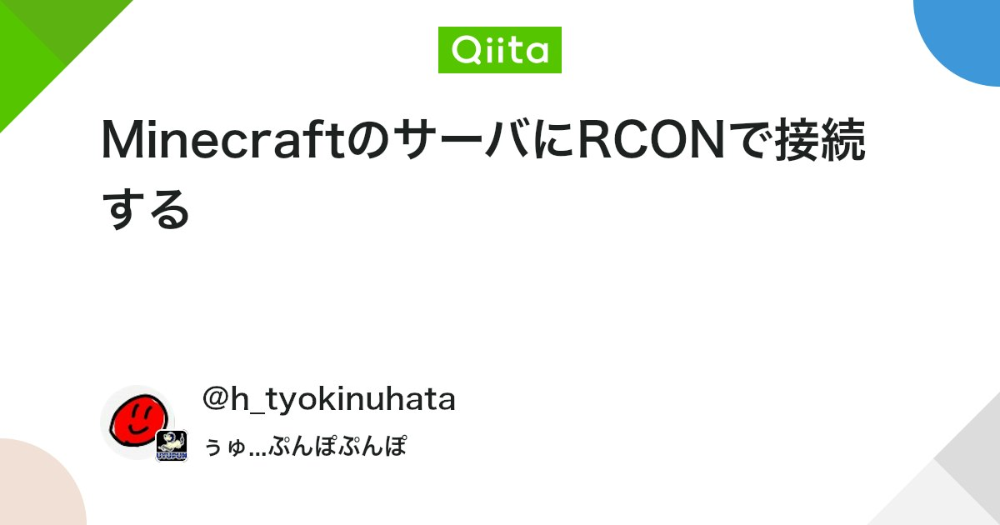

## マイクラサーバー建てるのめんどい

昔はForgeだのJavaだのなんかいろいろやっていた時代が懐かしいですよね。ありがたいことに、今では`docker compose up`だけでマイクラサーバー、バックアップ、その他機能を動かせるようになりました。サクッとサーバー立てるとかならこれでいいと思います。

## Orbstacksを入れる

いきなり聞いたことない単語出てきましたが、Dockerだと思っておいてください

[](https://orbstack.dev)

[OrbStack · Fast, light, simple Docker & Linux](https://orbstack.dev)

Say goodbye to slow, clunky containers and VMs. The fast, light, and easy way to run containers and Linux. Develop at lightspeed with our Docker Desktop alternative.

MacOSとかで使える、Docker Desktopの代替だと思ってください。

## Docker composeを作成する

Docker composeを作成します

```yaml
version: "3.8"
networks:
  mc-network:
    name: mc-network
    driver: bridge
services:
  mc:
    image: itzg/minecraft-server:latest
    tty: **true**
    stdin_open: **true**
    ports:
      - "25565:25565"
      - "25575:25575"
    environment:
      EULA: "TRUE"
      TYPE: "FABRIC"
      VERSION: "1.20.1"
      
      # 各種設定。サーバーの設定を、環境変数で記述する。公式ドキュメント参照
      FABRIC_LOADER_VERSION: "0.16.10"
      MEMORY: "16G"
      MAX_PLAYERS: "100"
      MOTD: "{サーバー名}"
      ICON: "{任意のアイコン}"
      OVERRIDE_ICON: "true"
      ONLINE_MODE: "true"
      USE_AIKAR_FLAGS: "true"
      TZ: "Asia/Tokyo"
      FORCE_GAMEMODE: "true"
      SIMULATION_DISTANCE: "32"
      VIEW_DISTANCE: "32"
      SPAWN_PROTECTION: "0"
      PREVIEWS_CHAT: "true"
      ALLOW_FLIGHT: "true"
      RCON_PASSWORD: "admin"
    volumes:
      - "./data:/data"
    networks:
      - mc-network
  rcon-web:
      image: itzg/rcon
      restart: "always"
      ports:
        - "4336:4326"
        - "4337:4327"
      environment:
        RWA_USERNAME: admin
        RWA_PASSWORD: admin
        RWA_ADMIN: "TRUE"
        # is referring to the hostname of 'mc' compose service below
        RWA_RCON_HOST: mc
        # needs to match the RCON_PASSWORD configured for the container
        RWA_RCON_PASSWORD: "admin"
      networks:
        - mc-network
  backups:
    image: itzg/mc-backup
    restart: "always"
    environment:
      INITIAL_DELAY: "1m"
      BACKUP_INTERVAL: "3h"
      RCON_HOST: mc
      RCON_PORT: "25575"
      RCON_PASSWORD: "admin"
    volumes:
       - ./data/world:/data
       - ./backups:/backups
    networks:
      - mc-network
# ボリュームの設定(特に気にしなければ変えなくても良い)
volumes:
  mc: {}
```

### サンプルのyamlで使っているイメージ

あくまで一例なので、これにいろいろ足したり、逆にサーバーだけでも良いかも。

#### itzg/minecraft-server:latest

- マイクラサーバーがこれ1つで動く。
  <https://docker-minecraft-server.readthedocs.io/en/latest/#using-docker-compose>

#### itzg/mc-backup

- バックアップを一定間隔でやってくれる。RCON(Remote Console)というマイクラの独自形式の通信？があるので、それを使って勝手にワールドをセーブしたりしてくれる

[](https://qiita.com/h_tyokinuhata/items/85d855f88d5d33c21949)

[MinecraftのサーバにRCONで接続する - Qiita](https://qiita.com/h_tyokinuhata/items/85d855f88d5d33c21949)

RCONとは RCONはRemote Consoleの略称 ゲームサーバをリモートで管理するための機能全般を指す用語 Minecraft以外でも、ARK: Survival EvolvedやBattlefield、Call of Duty、Rust等、ユーザ自身がサーバ...

#### itzg/rcon

- rconをwebで使えるようにするやつ
- webからコマンドを送ったり、いろいろ操作できたりするので、すげー便利。
- サーバー管理とかが楽になる。cloudflare tunnel入れてもいいかもね。
