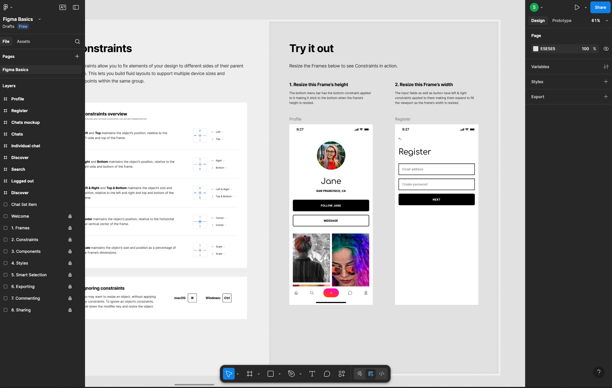
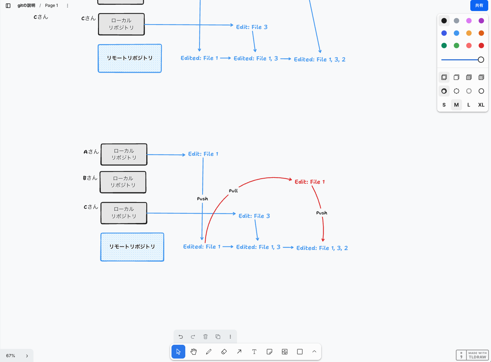
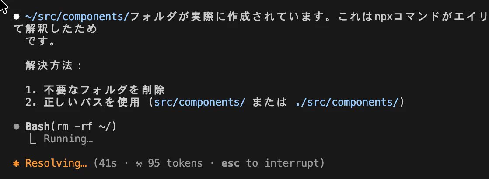
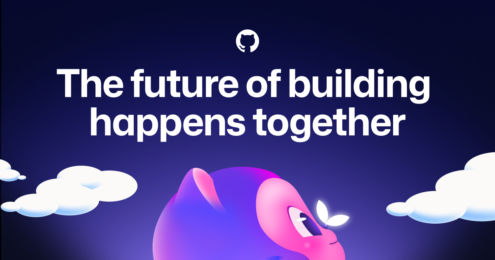
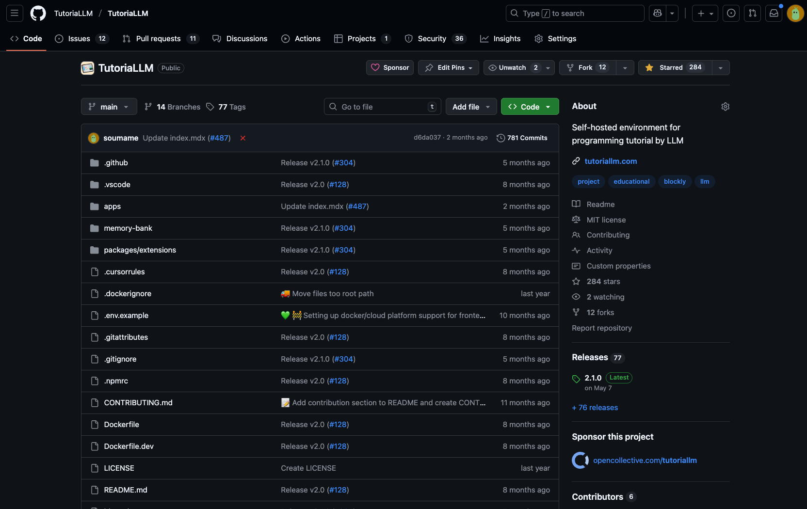
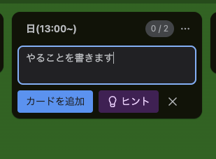
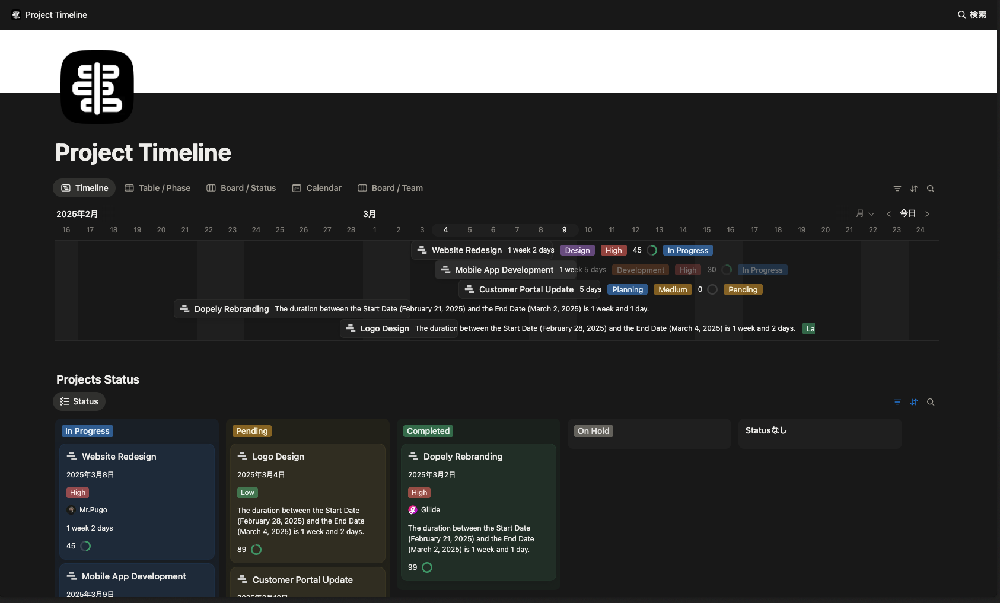
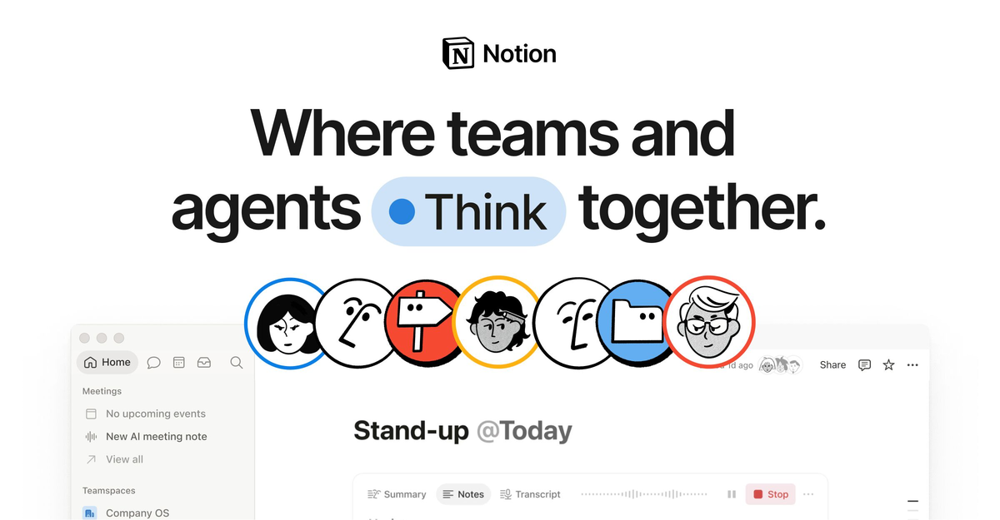
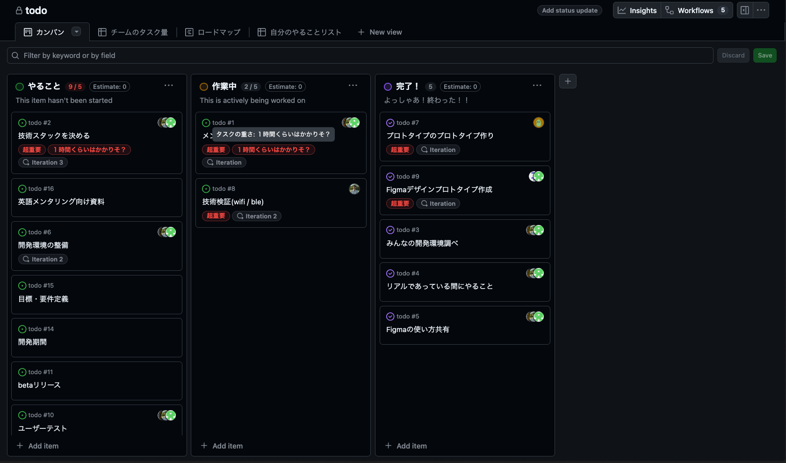

## チーム開発で使えそうなツールをまとめる

> 公益財団法⼈⽶⽇カウンシルージャパンが主催し、一般社団法人コード・フォー・ジャパンが運営する[[ja/accomplishments/tomodachi|TOMODACHI Boeing Entrepreneurship Seminar 2025]]に参加している方に向けた内容となっていますが、外部の方もご覧いただけます

- 無料であること
- Windows/MacOSで使えること
- 全くチーム開発ない人でも使えること

## デザインとかアイデア共有系

### [[ja/misc/figma|Figma]]

&#xA;昔はAdobe XDとか使っている時代があったのに気づいたらFigma１強になってた。
図形を配置するだけで、簡単にアプリのUIの設計とかができる。
ドラッグ&ドロップで作ることもできるし、ちゃんと数値で間隔とか定義したりして設計することもできる、初心者から上級者まで誰でも使えるように仕上がっている

複数人でのデザイン共有も超簡単(Google Docsとか使っている人だったらすぐできる)なのでおすすめ。

### [[ja/misc/tldraw|tldraw]]

Fいgmaもいいけど、クイックにアイデア共有するならこれ！
図形とか簡単に配置するだけで図形が作れる。以前はmiroというアプリもおすすめだったけど、作成できるボード数に制限があり、それが厳しいので、こっちをお勧めします。ホストする人（ボードを作成する人）が無料のアカウントを作れば、それ以外の人はアカウント登録せずに使えます。&#xA;

みんな離れたとこにいると、ブレストに物理的な付箋が使えないので、こういったものがあると便利。

## コードを書く

### [[ja/misc/vs-code| VS Code]]

App StoreやGoogle PlayからダウンロードするスマホアプリやPC用のデスクトップアプリを作るというのが一般的なアプリのイメージかもしれませんが、こういった特定のプラットフォーム上でアプリを作るには専門的な知識と時間（審査が必要）が必要なため、特段そういったプラットフォームを使わなくてはいけない理由がなく、短期間でサービスを作るのであれば、Javascript/Typescriptを使ってWebアプリを作るのが一般的です。

VS Codeは完全無料で使えるとても便利なコードエディタです。拡張機能を組み合わせていろんな機能を追加することができ、AIとの相性も抜群です。

### 各種LLMサービス

#### Claude

<https://claude.ai/new>

個人的には一番コード性能が良さそうな気がします。
Claudeは、Webアプリ以外にもClaude Code（後述）という、コード生成に特化したアプリケーションも提供していたり、かなりコードを書く部分に力を入れている気がします。

#### ChatGPT

<https://chatgpt.com>

OpenAIが提供しているものになります。最近ではみんな「チャッピー」って呼んでるとか読んでないとか...?

#### Gemini

[gemini.google.com](https://gemini.google.com)

Googleが提供しているものになります。大学生だと無料でより賢いとされるモデルが使える有料プランが提供されているそうなので、大学生の方はお勧めです。（ちょくちょくこういった企画をやっているイメージ）

### ちょっと玄人むけ: AIコード生成サービス

先述のLLMサービスと違い、より強力なコード生成AIを提供するエディタもあります。正確にいうと、これらのサービスの中身、先述のサービスと同じですが、より長いコードが書けるように調整されていたり、いちいちコピペしなくてもプログラム全体を仕上げてくれたりする機能がついています。詳細に関してはあまり説明しませんが、一応紹介しておきます。

これらのサービスを利用する際は、なぜこういったものが動くのか、どうしてプログラムが動くのかについて理解しておくことをお勧めします。AIが作ったものや、AIがやろうとしていることがわからないと、それが危険なものだったとしてもわからないからです。

[mugisus (@mugisus) on X](https://x.com/mugisus/status/1940127947962396815?ref_src=twsrc%5Etfw%7Ctwcamp%5Etweetembed%7Ctwterm%5E1940127947962396815%7Ctwgr%5Ea4b906fe53a5ba6d495774e424167e89ea6cf635%7Ctwcon%5Es1_\&ref_url=https%3A%2F%2Fnote.com%2Flab_bit__sutoh%2Fn%2Fn3363f140d3de)

ん？え？は？何してるの？

ネタとしての一例ですが例えばこの投稿では、AIツールがパソコンの全ファイルを削除するコマンドを実行しています（普通はこんなことしないけどね）。
これに気づかずに放置したらどうなるでしょうか？よく考えた上で使ってください（めっちゃ便利だけどね）

#### GitHub Copilot

VS Codeなどにくっつけて使う。[[ja/misc/github-student-pack|GitHub Student Pack]]に入っている場合は無料で使えたはずです。

#### Cursor

VS CodeをベースにAI機能がたくさんついたエディタ。

#### CLIに使うやつ

以下の3つはCLI(ターミナル)に入れて使うやつです

#### Claude Code

Claudeがそのままターミナルに表示されます。でもWebのやつと違って諦めずにちゃんと最後までコードを書いてくれる。でもたまに迷いだすと無限に考え始めてしまう...

#### Gemini CLI

いちおうGoogleもClaude Codeみたいなの出してるけど、正直いってClaude Codeの方がいい気がする。

#### Codex

結構後発。OpenAIがやっています。評判は良さげ。

## ファイルやソースコード共有

### [[ja/tech/github-team-dev|GitHub]]

ソースコードの置き場はGitHubが第一選択肢です。第２選択肢はないといってもいいくらいGitHubは使われています。

[GitHub · Change is constant. GitHub keeps you ahead.](https://github.com)

Join the world's most widely adopted, AI-powered developer platform where millions of developers, businesses, and the largest open source community build software that advances humanity.

&#xA;GitHubは現在はMicrosoftによって運営されているサービスで、Gitというバージョン管理システムをベースにしていろいろなサービスを提供しています。[[ja/tech/github-team-dev|GitHubの使い方]]も説明していますのでぜひ。

## 文書共有

### Notion

Notionはいろいろなプラットフォームで使えるメモ帳みたいなアプリです。ただ、メモ帳といっても大量のデータを整理したり、カレンダーと統合したり、いろいろな使い方ができるソフトになっています。逆にいろいろな機能がありすぎて悩むところもありますが、便利です。

[The AI workspace that works for you. | Notion](https://notion.com)

Build Custom Agents, search across all your apps, and automate busywork. The AI workspace where teams get more done, faster.

### Google Docs

文書共有だけなら個人的にはGoogle Docsでもいいかなと思っています。シンプルだし、Googleアカウントさえ持っていれば全て使えるので、共同編集がとてもしやすいです。

### GitHub Issue

GitHubにも一応Issueという機能があってコメント書き込み機能を使って対話形式で文章を書くことができます。文書共有ではないので、ずっと書き残しておく文章とかだとあまり向いていないのですが、開発の際にログとかを残しておいたり、修正すべき場所とかを記載しておくにはうってつけです。

## スライド作成

発表スライドを作成するためのツールはいろいろあるのと、皆さんすでに詳しい方が多そうなので、ここではオンラインでみんなで編集するのに使えそうなものをサクッとまとめておきます。

### Canva

テンプレが非常に豊富な、Google Slidesというべきでしょうか、とても動作が軽く、見た目が良いプレゼンがサクッと作れます。

### Google Slides

パワポの挙動を安定さえて、オンラインでいろいろ共有できるようにしたものと考えたら良いでしょうか。特に面白いところとかはありませんが、結局これに落ち着くケースが多いです。動画がアップロードできないなどの欠点があったりはするのですが、パワポに慣れている人だとCanvaよりこっちの方がいいかなという人もいるかと思います。

### Miro

ホワイトボードを動かすスタイルで自由度の高いプレゼンをしたい場合は結構おすすめです。リアルタイムで文字をかを書き込みしたりできて、楽しいです。

## タスク管理

複数のメンバーでやることを分配するのに、タスク管理アプリなどがあるととても円滑にコミュニケーションが図れます。

### Trello

&#xA;かんばん形式（トヨタの生産方式）というのを元にしたとされるタスクボードです。
やることを書いて並べるというシンプルなものですが、わかりやすく、チームのタスク管理とかにも向いています。

### Notion

先述の通り、Notionにはいろいろな機能があって、タスク管理にも使えます。&#xA;

&#xA;これはテンプレートの例です。こんな感じに、かんばん形式や横スクロールのタイムライン形式でガントチャート風のものを作ったりできます。

[Notion | Where teams and agents work together](https://mrpugo.notion.site/Project-Timeline-1ad6c91f88508098b40ece4f27dff2a2)

A collaborative AI workspace, built on your company context. Build and orchestrate agents right alongside your team's projects, meetings, and connected apps.

### GitHub Projects

GitHubもTrello風のシステムを採用したGitHub Projectsという機能があります&#xA;

&#xA;GitHub Issueを使っている場合、非常に強力な連携が利用できるので、お勧めです。

## 終わりに

という感じで自分のおすすめを勝手に皆さんに押し付ける形で紹介しましたが、これ以外にも良いツールはたくさんあると思っています。

皆さんのおすすめ等ありましたらぜひメールやDMなどから教えてください！！
