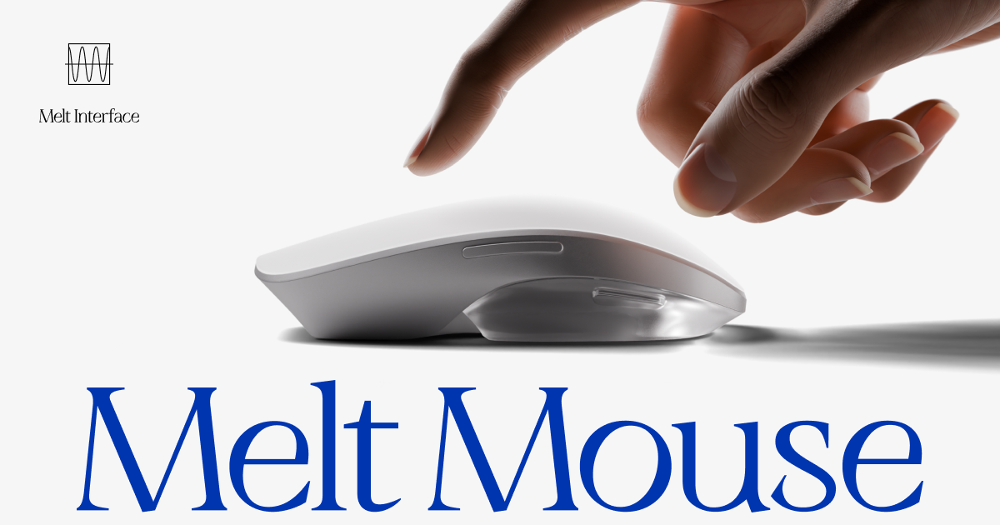

## 何をしてるの

HIDデバイスを作ったり、その技術を使った受託開発をしていたりしています。

HID = 人と、コンピューターがやりとり（通信）をするための方法、というふうに捉えても良いかもしれません

[[ja/works/keio|大学]]に通いながらアルバイトとして、お手伝いしています。

### 関わっているプロダクト

[Melt Mouse - Redefining the creative experience](https://www.melt-interface.com/melt-mouse)

Coming soon on Kickstarter — subscribe for early access to a revolutionary interface experience.

Melt InterfaceというブランドのMelt Mouseを開発しています。
パソコンをよく使うクリエーターなどをターゲットとしたマウスを作っています

マウス本体の設計、技術、マウスのファームウェア、ユーザーが触るGUI、マウスの制御など、いろいろな部分を完璧に仕上げて「私たちが考えた最強のマウス」世に出すことを目指ています

ソフトウェア開発の経験を活かしつつ、ハードウェアについての知見も深めています。

事業内容：
XR関連機器の開発・製造販売 及びそれを用いたエンタープライズ向け 製造工程改善ソリューション
